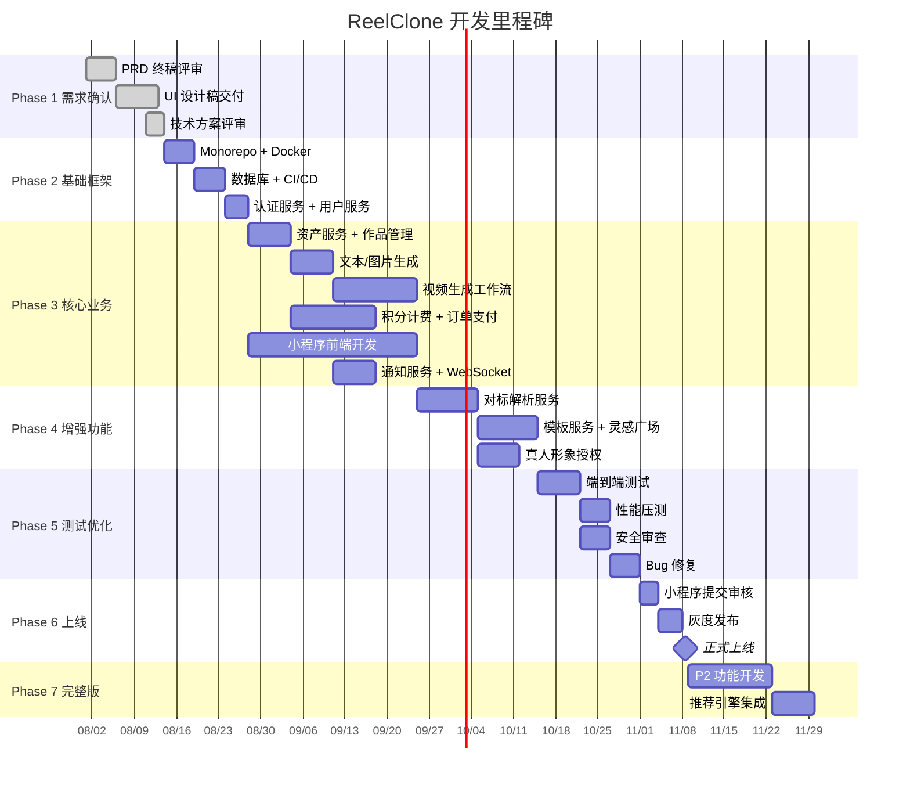

# ReelClone 项目开发与部署计划

> **文档编号**: RC-PLAN-001
> **版本**: v1.0
> **日期**: 2026-07-29
> **编制**: 开发团队
> **适用**: 甲方交付用

---

## 目录

- [一、项目概述](#一项目概述)
- [二、产品需求功能清单](#二产品需求功能清单)
- [三、开发架构设计](#三开发架构设计)
- [四、项目开发周期](#四项目开发周期)
- [五、工作量分配](#五工作量分配)
- [六、部署执行计划](#六部署执行计划)
- [七、交付标准](#七交付标准)
- [八、运维服务内容与范围（1年期）](#八运维服务内容与范围1年期)
- [九、风险管控](#九风险管控)
- [十、头脑风暴补充建议](#十头脑风暴补充建议)

---

## 一、项目概述

### 1.1 项目基本信息

| 项目       | 内容                                           |
| ---------- | ---------------------------------------------- |
| 项目名称   | ReelClone（WouwouAI 智能视频创作带货平台复刻） |
| 产品形态   | 微信小程序 + 后端微服务集群 + AI 任务流水线    |
| ICP 备案号 | 粤ICP备2026062569号                            |
| 交付范围   | 全栈开发 + 部署上线 + 1年运维保障              |
| 开发模式   | TDD + 敏捷迭代（2 周 Sprint）                  |

### 1.2 项目目标

| 目标           | 指标                                         |
| -------------- | -------------------------------------------- |
| 功能完整度     | 129 个功能点（FR）全覆盖，31 张截图 1:1 复刻 |
| 系统可用性     | ≥ 99.9%                                      |
| 首屏加载       | ≤ 2 秒                                       |
| 生成任务成功率 | ≥ 95%                                        |
| 支付成功率     | ≥ 99.5%                                      |
| 数据备份 RPO   | ≤ 1 小时                                     |
| 故障恢复 RTO   | ≤ 2 小时                                     |

### 1.3 交付物清单

| 序号 | 交付物                      | 形态                                |
| ---- | --------------------------- | ----------------------------------- |
| 1    | 微信小程序                  | 用户使用入口，通过微信审核          |
| 2    | 后端微服务集群（10 个服务） | NestJS + TypeScript                 |
| 3    | AI 任务流水线               | Seedance 视频生成 + 对标解析        |
| 4    | 运维基础设施                | K8s/Docker + 监控 + CI/CD           |
| 5    | 源代码                      | Git 仓库（含文档、测试、运维脚本）  |
| 6    | 技术文档集                  | 11 份技术文档 + API 文档 + 部署指南 |
| 7    | 运维手册                    | 部署/回滚/备份/排查完整手册         |

---

## 二、产品需求功能清单

### 2.1 功能模块总览

共 **11 个功能模块、129 个功能点（FR）**，按优先级分三批交付：

| 优先级 | 模块              | 功能点数 | 交付批次         |
| ------ | ----------------- | -------- | ---------------- |
| **P0** | FR1 首页          | 5        | 第一批（MVP）    |
| **P0** | FR2 生成工作台    | 30+      | 第一批（MVP）    |
| **P0** | FR5 个人中心      | 9        | 第一批（MVP）    |
| **P0** | FR6 设置          | 16       | 第一批（MVP）    |
| **P0** | FR8 我的作品      | 7        | 第一批（MVP）    |
| **P0** | FR10 套餐与积分   | 11       | 第一批（MVP）    |
| **P1** | FR3 对标解析      | 5        | 第二批（增强）   |
| **P1** | FR7 我的资产      | 16       | 第二批（增强）   |
| **P1** | FR9 我的模板      | 3        | 第二批（增强）   |
| **P2** | FR4 灵感广场/推荐 | 12       | 第三批（完整版） |
| **P2** | FR11 关于         | 4        | 第三批（完整版） |

### 2.2 核心功能清单（P0 — MVP 必须）

#### FR1 首页（5 个 FR）

| FR 编号 | 功能名称         | 核心逻辑                                          |
| ------- | ---------------- | ------------------------------------------------- |
| FR-1.1  | 底部 TabBar 导航 | 5 个 Tab：首页、推荐、对标解析、创作、我的        |
| FR-1.2  | 八宫格快捷入口   | 文生视频/图生视频/3D建模等快捷入口，渐变 SVG 图标 |
| FR-1.3  | 推荐卡片横滑     | 推荐视频模板卡片横滑展示                          |
| FR-1.4  | 搜索入口         | 搜索跳转到灵感广场                                |
| FR-1.5  | 下拉刷新         | 首页内容刷新                                      |

#### FR2 生成工作台（30+ 个 FR）

| 子模块   | FR 编号范围    | 核心能力                                                      |
| -------- | -------------- | ------------------------------------------------------------- |
| 文本生成 | FR-2.1 ~ 2.6   | 对话模式、一键改写、行业标签、积分消耗                        |
| 图片生成 | FR-2.7 ~ 2.12  | 反推提示词、图生图、分辨率选择、生成数量                      |
| 视频生成 | FR-2.13 ~ 2.24 | 文生视频、图生视频（首帧/首尾帧）、3D建模、编辑视频、延长视频 |
| 通用能力 | FR-2.25 ~ 2.32 | 生成预览、下载、分享、历史记录、批量操作                      |

#### FR5 个人中心（9 个 FR）

| FR 编号 | 功能名称                            |
| ------- | ----------------------------------- |
| FR-5.1  | 用户信息展示（头像/昵称/积分）      |
| FR-5.2  | 快捷创作菜单                        |
| FR-5.3  | 积分余额展示                        |
| FR-5.4  | 套餐状态展示                        |
| FR-5.5  | 我的作品入口                        |
| FR-5.6  | 我的资产入口                        |
| FR-5.7  | 我的模板入口                        |
| FR-5.8  | 设置入口                            |
| FR-5.9  | 微信登录（wx.login + code2session） |

#### FR6 设置（16 个 FR）

| 子模块   | FR 编号范围    | 核心功能                                 |
| -------- | -------------- | ---------------------------------------- |
| 账户管理 | FR-6.1 ~ 6.5   | 微信登录、绑定手机号、修改密码、退出登录 |
| 内容管理 | FR-6.6 ~ 6.10  | 隐私协议、用户协议、关于我们             |
| 套餐积分 | FR-6.11 ~ 6.16 | 套餐入口、积分记录、消费记录、订单列表   |

#### FR8 我的作品（7 个 FR）

| FR 编号 | 功能名称     |
| ------- | ------------ |
| FR-8.1  | 作品列表展示 |
| FR-8.2  | 作品状态筛选 |
| FR-8.3  | 作品预览播放 |
| FR-8.4  | 作品下载     |
| FR-8.5  | 作品删除     |
| FR-8.6  | 作品分享     |
| FR-8.7  | 空状态引导   |

#### FR10 套餐与积分（11 个 FR）

| FR 编号  | 功能名称       | 核心逻辑                        |
| -------- | -------------- | ------------------------------- |
| FR-10.1  | 订阅计划展示   | 体验包/基础版/专业版/企业版     |
| FR-10.2  | 套餐详情说明   | 功能对比表                      |
| FR-10.3  | 微信支付购买   | wx.requestPayment               |
| FR-10.4  | 积分消耗规则   | 文本5/图片60/对标300/视频依类型 |
| FR-10.5  | 积分冻结与结算 | Formance Ledger 原子操作        |
| FR-10.6  | 积分流水记录   | balance_after 实时记录          |
| FR-10.7  | 套餐到期提醒   | WebSocket + 订阅消息            |
| FR-10.8  | 积分不足提示   | 余额检查 + 充值引导             |
| FR-10.9  | 消费记录展示   | 按时间/类型筛选                 |
| FR-10.10 | 订单列表       | 支付状态、退款状态              |
| FR-10.11 | 订单详情       | 支付时间、金额、积分到账明细    |

### 2.3 第二批功能（P1 — 增强版）

#### FR3 对标解析（5 个 FR）

| FR 编号 | 功能名称     | 核心逻辑                              |
| ------- | ------------ | ------------------------------------- |
| FR-3.1  | 视频链接输入 | 支持抖音/小红书/B站/快手/微博         |
| FR-3.2  | 解析任务提交 | 下载→镜头切分→ASR→OCR→VLM→LLM汇总     |
| FR-3.3  | 解析报告展示 | 四维度报告（场景/口播/文字/视觉描述） |
| FR-3.4  | 解析历史记录 | 历史解析列表，可查看/删除             |
| FR-3.5  | 一键套用解析 | 基于解析结果一键生成新视频            |

#### FR7 我的资产（16 个 FR）

| 子模块     | FR 编号范围   | 核心功能                                           |
| ---------- | ------------- | -------------------------------------------------- |
| 素材管理   | FR-7.1 ~ 7.5  | 上传/预览/删除/分类/搜索                           |
| 真人形象组 | FR-7.6 ~ 7.16 | 创建形象组、授权状态管理、素材上传弹窗、多格式支持 |

#### FR9 我的模板（3 个 FR）

| FR 编号 | 功能名称     |
| ------- | ------------ |
| FR-9.1  | 收藏模板列表 |
| FR-9.2  | 一键套用模板 |
| FR-9.3  | 取消收藏     |

### 2.4 第三批功能（P2 — 完整版）

#### FR4 灵感广场/推荐（12 个 FR）

| 子模块   | FR 编号范围   | 核心功能                               |
| -------- | ------------- | -------------------------------------- |
| 行业偏好 | FR-4.1 ~ 4.3  | 行业标签选择、偏好绑定、标签管理       |
| 模板推荐 | FR-4.4 ~ 4.8  | 分类筛选、热度排序、平台筛选、行业筛选 |
| 模板详情 | FR-4.9 ~ 4.12 | 模板预览、收藏、套用、分享             |

#### FR11 关于（4 个 FR）

| FR 编号 | 功能名称     |
| ------- | ------------ |
| FR-11.1 | 关于弹窗     |
| FR-11.2 | 版本号展示   |
| FR-11.3 | 隐私协议链接 |
| FR-11.4 | 用户协议链接 |

---

## 三、开发架构设计

### 3.1 技术栈总览

| 层面         | 技术选型                             | 说明                           |
| ------------ | ------------------------------------ | ------------------------------ |
| **Monorepo** | Nx                                   | 统一管理前端、后端、共享库     |
| **前端**     | Taro 3.x + React + TypeScript        | 微信小程序，支持跨端扩展       |
| **状态管理** | Zustand                              | 轻量级，适合小程序             |
| **UI 组件**  | Vant Weapp + 自定义深色主题          | 蓝紫渐变品牌色                 |
| **后端框架** | NestJS + TypeScript                  | 模块化、DI/IoC、TypeORM        |
| **数据库**   | PostgreSQL 16                        | JSONB 存动态参数，4 库分库     |
| **缓存**     | Redis 7                              | 会话、限流、分布式锁           |
| **工作流**   | Temporal                             | 异步任务编排，耐久执行         |
| **积分账本** | Formance Ledger                      | 原子复式记账                   |
| **对象存储** | 阿里云 OSS                           | 素材/成品存储，STS 直传        |
| **视频 AI**  | 火山 Seedance                        | 文生视频/图生视频，多 Key 轮询 |
| **LLM**      | OpenAI 兼容协议                      | 提示词引擎、文案生成、分析汇总 |
| **ASR**      | FunASR                               | 语音识别                       |
| **OCR**      | PaddleOCR                            | 文字识别                       |
| **VLM**      | Qwen3-VL                             | 视频理解                       |
| **视频下载** | lux + yt-dlp                         | 5 平台视频下载                 |
| **支付**     | 微信支付 V3                          | 套餐购买                       |
| **短信**     | 阿里云 SMS                           | 手机号绑定验证码               |
| **容器化**   | Docker + K8s                         | 生产环境部署                   |
| **CI/CD**    | GitHub Actions                       | 自动构建、测试、部署           |
| **监控**     | Prometheus + Grafana + Loki + Jaeger | 指标/日志/追踪                 |

### 3.2 系统架构（六层）

```
┌─────────────────────────────────────────────────────────┐
│  ① 客户端层：微信小程序（Taro 3.x + React）             │
├─────────────────────────────────────────────────────────┤
│  ② 接入层：Nginx（SSL终止） + 限流 + 反向代理           │
├─────────────────────────────────────────────────────────┤
│  ③ 业务服务层：                                          │
│     auth / user / asset / workbench / benchmark /       │
│     template / billing / order / notification (9 服务)   │
├─────────────────────────────────────────────────────────┤
│  ④ 异步任务层：Temporal 工作流引擎 + media-worker       │
├─────────────────────────────────────────────────────────┤
│  ⑤ AI 能力层：Seedance / FunASR / PaddleOCR /           │
│     Qwen3-VL / LLM / FFmpeg                             │
├─────────────────────────────────────────────────────────┤
│  ⑥ 存储层：PostgreSQL(4库) + Redis + 阿里云 OSS         │
└─────────────────────────────────────────────────────────┘
```

### 3.3 微服务拆分

| 服务                 | 端口 | 职责                                   | 核心实体                     |
| -------------------- | ---- | -------------------------------------- | ---------------------------- |
| auth-service         | 3001 | 微信登录、JWT 签发、Refresh Token      | SMS_CODE                     |
| user-service         | 3002 | 用户信息、手机号绑定、偏好设置         | USER                         |
| asset-service        | 3003 | 素材上传/管理、真人形象组              | ASSET, AVATAR_GROUP          |
| workbench-service    | 3007 | 文本/图片/视频生成入口、作品管理       | WORK, GENERATION_TASK        |
| benchmark-service    | 3004 | 对标解析提交/查询、报告管理            | BENCHMARK                    |
| template-service     | 3005 | 模板/灵感广场、收藏、推荐              | TEMPLATE, FAVORITE           |
| billing-service      | 3006 | 积分余额、冻结、结算、流水             | POINT_TRANSACTION            |
| order-service        | 3009 | 套餐管理、微信支付、订单、Webhook      | ORDER, PACKAGE, USER_PACKAGE |
| notification-service | 3008 | WebSocket 推送、订阅消息               | -                            |
| media-worker         | 3010 | Temporal Worker，执行视频生成/解析任务 | -                            |

### 3.4 Monorepo 目录结构

```
reelclone-monorepo/
├── apps/
│   ├── miniprogram/          # Taro 小程序前端
│   ├── auth-service/         # 认证服务
│   ├── user-service/         # 用户服务
│   ├── asset-service/        # 资产服务
│   ├── workbench-service/    # 创作工作台
│   ├── benchmark-service/    # 对标解析
│   ├── template-service/     # 模板服务
│   ├── billing-service/      # 积分计费
│   ├── order-service/        # 订单支付
│   ├── notification-service/ # 通知服务
│   └── media-worker/         # Temporal Worker
├── libs/
│   ├── common/               # DTO、守卫、过滤器、拦截器
│   ├── database/             # TypeORM 实体、迁移脚本
│   ├── ai/                   # Seedance、LLM、FFmpeg 适配器
│   ├── temporal/             # 工作流定义
│   └── oss/                  # 阿里云 OSS 客户端
├── docker/                   # Docker Compose 编排
├── scripts/                  # 部署/回滚/备份脚本
├── docs/                     # API 文档 + 部署指南
├── tests/                    # 集成测试 + E2E 测试
└── .github/                  # CI/CD 流水线
```

---

## 四、项目开发周期

### 4.1 整体时间线

| 阶段                          | 时间           | 周期    | 核心交付                        |
| ----------------------------- | -------------- | ------- | ------------------------------- |
| **Phase 1：需求确认与设计**   | 第 1~2 周      | 2 周    | PRD 终稿、UI 设计稿、技术评审   |
| **Phase 2：基础框架搭建**     | 第 3~4 周      | 2 周    | Monorepo、Docker、CI/CD、数据库 |
| **Phase 3：核心业务开发**     | 第 5~10 周     | 6 周    | 全部 P0 功能                    |
| **Phase 4：增强功能开发**     | 第 11~16 周    | 6 周    | P1 功能（对标解析、资产、模板） |
| **Phase 5：集成测试与优化**   | 第 17~20 周    | 4 周    | 端到端测试、性能优化、安全审查  |
| **Phase 6：小程序审核与上线** | 第 21~22 周    | 2 周    | 提交审核、灰度发布、正式上线    |
| **Phase 7：完整版迭代**       | 第 23~26 周    | 4 周    | P2 功能（灵感广场、推荐）       |
| **Phase 8：运维保障期**       | 上线后 12 个月 | 12 个月 | 7×24 监控、Bug 修复、性能优化   |

**总计：开发周期 6 个月（26 周） + 运维保障 12 个月**

### 4.2 里程碑定义



### 4.3 Sprint 划分（2 周一迭代）

| Sprint    | 周次    | 核心目标                                 |
| --------- | ------- | ---------------------------------------- |
| Sprint 0  | W1~W2   | 需求确认、UI 设计、技术评审              |
| Sprint 1  | W3~W4   | Monorepo 搭建、Docker、CI/CD、数据库迁移 |
| Sprint 2  | W5~W6   | 认证服务、用户服务、微信登录、手机号绑定 |
| Sprint 3  | W7~W8   | 资产服务、作品管理、素材上传             |
| Sprint 4  | W9~W10  | 文本生成、图片生成、积分计费             |
| Sprint 5  | W11~W12 | 视频生成工作流（Temporal）、订单支付     |
| Sprint 6  | W13~W14 | 小程序前端全部页面对接、WebSocket 通知   |
| Sprint 7  | W15~W16 | 对标解析服务、模板服务                   |
| Sprint 8  | W17~W18 | 真人形象授权、灵感广场推荐               |
| Sprint 9  | W19~W20 | 端到端测试、性能压测、安全审查           |
| Sprint 10 | W21~W22 | Bug 修复、小程序审核提交、灰度发布       |
| Sprint 11 | W23~W24 | 正式上线、P2 功能开发                    |
| Sprint 12 | W25~W26 | 推荐引擎集成、完整版收尾                 |

---

## 五、工作量分配

### 5.1 团队配置

| 角色              | 人数      | 月薪估算(元)    | 核心职责                          |
| ----------------- | --------- | --------------- | --------------------------------- |
| 项目经理/产品经理 | 1         | 25,000          | 需求管理、甲方对接、进度把控      |
| UI/UX 设计师      | 1         | 18,000          | 界面设计、设计规范、切图标注      |
| 前端工程师        | 2         | 22,000/人       | Taro 小程序开发、组件库、接口对接 |
| 后端工程师        | 3         | 25,000/人       | 微服务开发、API、数据库、工作流   |
| AI/算法工程师     | 2         | 30,000/人       | Seedance Provider、视频拆解、LLM  |
| 测试工程师        | 1         | 18,000          | 功能测试、自动化、压测            |
| DevOps 工程师     | 1         | 22,000          | K8s 部署、CI/CD、监控             |
| **合计**          | **11 人** | **~249,000/月** |                                   |

### 5.2 各阶段人力投入

| 阶段             | 周次      | 产品经理 | UI   | 前端 | 后端 | AI   | 测试 | DevOps | 人天            |
| ---------------- | --------- | -------- | ---- | ---- | ---- | ---- | ---- | ------ | --------------- |
| Phase 1 需求确认 | W1~W2     | 100%     | 100% | 20%  | 20%  | 20%  | 10%  | 10%    | ~110            |
| Phase 2 基础框架 | W3~W4     | 20%      | 30%  | 40%  | 80%  | 10%  | 20%  | 100%   | ~154            |
| Phase 3 核心业务 | W5~W10    | 30%      | 20%  | 100% | 100% | 80%  | 60%  | 40%    | ~594            |
| Phase 4 增强功能 | W11~W16   | 20%      | 10%  | 80%  | 80%  | 100% | 60%  | 30%    | ~440            |
| Phase 5 测试优化 | W17~W20   | 20%      | 10%  | 60%  | 60%  | 40%  | 100% | 50%    | ~308            |
| Phase 6 上线     | W21~W22   | 50%      | 10%  | 40%  | 40%  | 20%  | 80%  | 100%   | ~132            |
| Phase 7 完整版   | W23~W26   | 30%      | 20%  | 60%  | 60%  | 60%  | 50%  | 30%    | ~231            |
| **合计**         | **26 周** |          |      |      |      |      |      |        | **~1,969 人天** |

### 5.3 费用估算

| 费用项                   | 金额（元）     | 说明                               |
| ------------------------ | -------------- | ---------------------------------- |
| **人力成本**             | ~1,476,750     | 11 人 × 26 周 × 5 天/周 × 平均日薪 |
| **基础设施（开发环境）** | ~30,000        | Docker 开发环境                    |
| **基础设施（生产环境）** | ~85,200        | 月 7,100 × 12 个月                 |
| **第三方服务（开发期）** | ~20,000        | API 测试额度                       |
| **第三方服务（运营期）** | ~111,600       | 月 9,300 × 12 个月                 |
| **微信认证/域名/SSL**    | ~5,000         | 域名年费 + SSL + 微信认证          |
| **合计（开发期）**       | **~1,531,750** | 6 个月开发                         |
| **合计（含 1 年运维）**  | **~1,728,550** | 含运维基础设施和第三方服务         |

> 注：以上为人力 + 基础设施 + 服务费用估算，不含甲方内部管理成本和利润。

---

## 六、部署执行计划

### 6.1 环境规划

| 环境       | 用途          | 服务器配置    | 部署方式             |
| ---------- | ------------- | ------------- | -------------------- |
| 开发环境   | 本地开发联调  | 开发者本地 PC | Docker Compose       |
| 测试环境   | 功能/集成测试 | 4 核 8GB      | Docker Compose       |
| 预发布环境 | 灰度验证      | 8 核 16GB     | Docker Compose / K8s |
| 生产环境   | 线上服务      | 8 核 16GB     | Docker Compose / K8s |

### 6.2 生产环境服务器配置

| 资源     | 最低配置         | 推荐配置         |
| -------- | ---------------- | ---------------- |
| CPU      | 4 核             | 8 核             |
| 内存     | 8 GB             | 16 GB            |
| 磁盘     | 50 GB SSD        | 100 GB SSD       |
| 操作系统 | Ubuntu 22.04 LTS | Ubuntu 22.04 LTS |
| 带宽     | 5 Mbps           | 10 Mbps          |

**总资源需求**：约 6.5 GB 内存、8.25 核 CPU（所有服务合计）

### 6.3 部署执行步骤

#### 第 1 步：服务器初始化

```bash
# 1. 安装 Docker
curl -fsSL https://get.docker.com | sudo sh
sudo usermod -aG docker $USER

# 2. 安装 Docker Compose
# Docker Engine 24+ 已内置 compose 插件

# 3. 验证
docker --version    # >= 24.0
docker compose version  # v2+
```

#### 第 2 步：域名与 SSL 证书

```bash
# 1. 域名解析
# A 记录：api.your-domain.com → 服务器 IP
# C 记录：miniprogram → 前端 CDN（如有）

# 2. 申请 SSL 证书（Let's Encrypt）
sudo apt install certbot
sudo certbot certonly --manual --preferred-challenges dns -d api.your-domain.com

# 3. 放置证书
mkdir -p docker/nginx/ssl
sudo cp /etc/letsencrypt/live/api.your-domain.com/fullchain.pem docker/nginx/ssl/
sudo cp /etc/letsencrypt/live/api.your-domain.com/privkey.pem docker/nginx/ssl/
```

#### 第 3 步：配置环境变量

```bash
cd docker
cp .env.production.example .env.production
vim .env.production
```

**关键配置项**（必须修改）：

| 配置项              | 说明             | 获取方式               |
| ------------------- | ---------------- | ---------------------- |
| `DATABASE_PASSWORD` | 数据库强密码     | `openssl rand -hex 16` |
| `REDIS_PASSWORD`    | Redis 强密码     | `openssl rand -hex 16` |
| `JWT_SECRET`        | JWT 签名密钥     | `openssl rand -hex 32` |
| `WECHAT_APPID`      | 小程序 AppID     | 微信公众平台           |
| `WECHAT_SECRET`     | 小程序 Secret    | 微信公众平台           |
| `WECHAT_PAY_MCHID`  | 微信支付商户号   | 微信商户平台           |
| `WECHAT_PAY_KEY`    | 支付 API V3 密钥 | 微信商户平台           |
| `OSS_ACCESS_KEY`    | 阿里云 OSS Key   | 阿里云控制台           |
| `OSS_BUCKET`        | OSS Bucket 名    | 阿里云控制台           |
| `SEEDANCE_API_KEY`  | Seedance API Key | 火山引擎控制台         |
| `LLM_API_KEY`       | LLM API Key      | OpenAI/通义千问        |
| `SMS_ACCESS_KEY`    | 阿里云短信 Key   | 阿里云控制台           |

**所有 Mock 模式必须设为 `false`**：

```bash
TEMPORAL_MOCK_MODE=false
WECHAT_MOCK_MODE=false
WECHAT_PAY_MOCK_MODE=false
SMS_MOCK_MODE=false
OSS_MOCK=false
```

#### 第 4 步：一键部署

```bash
cd /path/to/ReelClone
bash scripts/deploy.sh
```

部署脚本自动执行：

1. 前置检查（Docker、配置文件）
2. 拉取最新代码
3. 构建所有 Docker 镜像
4. 运行数据库迁移
5. 启动所有服务
6. 等待健康检查通过
7. 输出部署状态

#### 第 5 步：验证部署

```bash
# 健康检查
curl https://api.your-domain.com/health
# 期望: {"status":"ok","service":"nginx"}

# 查看所有服务状态
docker compose -f docker/docker-compose.prod.yml ps

# 查看日志
docker compose -f docker/docker-compose.prod.yml logs --tail=100
```

### 6.4 小程序提交审核

| 步骤 | 操作              | 说明                                        |
| ---- | ----------------- | ------------------------------------------- |
| 1    | 微信公众平台提交  | 上传代码包、填写版本描述                    |
| 2    | 选择服务类目      | AI 服务-深度合成-AI 问答 + AI 绘画          |
| 3    | 提交算法备案证明  | 火山引擎（Seedance）算法备案截图 + 服务合同 |
| 4    | 隐私协议/用户协议 | 设置页内可查看                              |
| 5    | ICP 备案号展示    | 设置页底部：粤ICP备2026062569号             |
| 6    | 等待审核          | 通常 1~7 个工作日                           |
| 7    | 灰度发布          | 审核通过后，5% 灰度放量                     |
| 8    | 正式上线          | 灰度验证通过后全量发布                      |

### 6.5 回滚方案

```bash
# 查看可用版本
bash scripts/rollback.sh --list

# 回滚到上一个版本
bash scripts/rollback.sh

# 回滚到指定版本
bash scripts/rollback.sh <commit-hash>
```

**回滚策略**：

- 代码回滚：自动 `git reset --hard` + 重新构建镜像
- 数据库回滚：**不自动执行**，需手动从备份恢复
- 回滚前自动备份当前数据库

---

## 七、交付标准

### 7.1 交付物验收标准

| 交付物         | 验收标准                              |
| -------------- | ------------------------------------- |
| **小程序**     | 通过微信审核上线，核心流程跑通        |
| **功能完整度** | 129 个 FR 全覆盖，P0 功能 100% 通过   |
| **UI 还原度**  | 与 31 张截图视觉一致性 ≥ 95%          |
| **性能指标**   | 首屏 ≤ 2s，API P99 ≤ 500ms            |
| **可用性**     | ≥ 99.9%                               |
| **测试覆盖**   | 单元测试 ≥ 80%，核心接口集成测试 100% |
| **安全**       | 无 CRITICAL/HIGH 级别安全漏洞         |
| **文档**       | 11 份技术文档 + API 文档 + 部署手册   |

### 7.2 验收流程

```
开发完成
    ↓
单元测试通过（Jest ≥ 80%）
    ↓
集成测试通过（Supertest 关键接口 100%）
    ↓
E2E 测试通过（主流程 ≥ 5 条）
    ↓
安全扫描通过（OWASP ZAP，无 CRITICAL/HIGH）
    ↓
性能压测通过（k6/Locust）
    ↓
代码审查通过（所有 PR 1~2 人 Review）
    ↓
测试环境验证（甲方确认）
    ↓
预发布灰度验证
    ↓
正式上线
    ↓
甲方终验签字
```

### 7.3 质量门禁

| Phase     | 门禁条件                           | 未通过处理   |
| --------- | ---------------------------------- | ------------ |
| Phase 1→2 | PRD 终稿 + 设计稿评审通过          | 重新评审     |
| Phase 2→3 | CI 流水线绿灯、数据库迁移成功      | 修复后重跑   |
| Phase 3→4 | P0 功能全部通过、核心接口测试 100% | 补充测试     |
| Phase 4→5 | P1 功能全部通过、对标解析流程跑通  | 补充测试     |
| Phase 5→6 | 安全扫描无 CRITICAL、性能达标      | 修复后重测   |
| Phase 6→7 | 小程序审核通过、灰度无异常         | 重新提交审核 |

---

## 八、运维服务内容与范围（1年期）

### 8.1 运维服务概览

| 项目     | 内容                                               |
| -------- | -------------------------------------------------- |
| 服务期限 | 自正式上线之日起 12 个月                           |
| 服务时间 | 7×24 小时监控，工作日 9:00~18:00 技术支持          |
| 响应级别 | P0 15 分钟 / P1 1 小时 / P2 4 小时 / P3 1 个工作日 |

### 8.2 基础设施运维

| 服务项      | 内容                                         | 频率      |
| ----------- | -------------------------------------------- | --------- |
| 服务器监控  | CPU/内存/磁盘/网络实时监控                   | 7×24 持续 |
| 数据库运维  | PostgreSQL 主从监控、慢查询优化、备份恢复    | 每日      |
| Redis 运维  | 内存监控、持久化策略、过期清理               | 每日      |
| 对象存储    | OSS 空间管理、生命周期策略、CDN 配置         | 每周      |
| 域名/SSL    | 证书续期（Let's Encrypt 自动续期）、域名续费 | 按需      |
| Docker 镜像 | 镜像清理、漏洞扫描                           | 每月      |

### 8.3 应用运维

| 服务项     | 内容                                | 频率      |
| ---------- | ----------------------------------- | --------- |
| 服务发布   | 代码更新部署、蓝绿/金丝雀发布       | 按需      |
| 数据库迁移 | TypeORM 脚本执行、数据迁移          | 按需      |
| 配置管理   | ConfigMap/Secret 更新、敏感信息轮换 | 按需      |
| 定时任务   | 对账脚本、数据清理、统计报表        | 每日/每周 |
| 备份验证   | 数据库备份完整性验证、恢复演练      | 每月      |

### 8.4 监控与告警

| 监控项     | 工具                 | 告警阈值                         |
| ---------- | -------------------- | -------------------------------- |
| 服务可用性 | Prometheus + Grafana | 5xx 错误率 > 1% 持续 2 分钟 → P1 |
| 生成任务   | Temporal UI          | 失败率 > 10% 持续 5 分钟 → P1    |
| 支付回调   | Prometheus           | 延迟 > 5 分钟 → P0               |
| 数据库连接 | Prometheus           | 连接数 > 80% → P2                |
| 磁盘使用   | Node Exporter        | 使用率 > 85% → P2                |
| 日志异常   | Loki                 | ERROR 级别日志突增 → P2          |
| 分布式追踪 | Jaeger               | 链路超时 > 5s → P2               |

**告警通道**：企业微信/钉钉 + 短信 + 电话（P0/P1）

### 8.5 安全运维

| 服务项   | 内容                                   | 频率   |
| -------- | -------------------------------------- | ------ |
| 漏洞扫描 | 服务器 + Docker 镜像漏洞扫描           | 每月   |
| 安全补丁 | 操作系统、Node.js、依赖包更新          | 每月   |
| 密钥轮换 | 数据库密码、OSS Key、支付密钥、API Key | 每季度 |
| 访问审计 | 异常登录、API 调用异常检测             | 每日   |
| 备份加密 | 数据库备份加密存储                     | 每日   |
| 合规检查 | ICP 备案、隐私协议、内容安全           | 每季度 |

### 8.6 Bug 修复服务

| 优先级 | 定义           | 响应时间   | 修复时间 | 示例                               |
| ------ | -------------- | ---------- | -------- | ---------------------------------- |
| **P0** | 核心流程不可用 | 15 分钟    | 4 小时   | 登录失败、支付异常、生成完全不可用 |
| **P1** | 重要功能异常   | 1 小时     | 24 小时  | 对标解析失败、作品下载异常         |
| **P2** | 一般功能问题   | 4 小时     | 72 小时  | UI 显示问题、统计偏差              |
| **P3** | 优化建议       | 1 个工作日 | 排期处理 | 性能优化、新需求                   |

### 8.7 应急预案

| 场景             | 应急方案                                    | 恢复目标 |
| ---------------- | ------------------------------------------- | -------- |
| Seedance 不可用  | 切换备用 Provider、暂停新任务、批量返还积分 | 30 分钟  |
| 视频下载失效     | 切换 yt-dlp、降级为仅文本分析               | 1 小时   |
| 微信支付回调异常 | 人工对账、补偿积分                          | 4 小时   |
| 数据库主库故障   | 切换从库、恢复备份                          | 2 小时   |
| 小程序被封       | 准备备用小程序账号、紧急申诉                | 24 小时  |
| 服务器宕机       | 备份恢复、切换备用服务器                    | 2 小时   |

### 8.8 运维交付物

| 序号 | 交付物       | 说明                           |
| ---- | ------------ | ------------------------------ |
| 1    | 运维手册     | 部署/回滚/备份/排查完整手册    |
| 2    | 监控大盘     | Grafana 可视化仪表盘           |
| 3    | 告警配置     | Prometheus 告警规则            |
| 4    | 备份策略     | 自动备份 + 恢复演练            |
| 5    | 月度运维报告 | 系统可用性、Bug 统计、性能趋势 |
| 6    | 季度安全报告 | 漏洞扫描、安全事件、补丁更新   |

---

## 九、风险管控

### 9.1 项目风险

| 风险                     | 可能性 | 影响 | 应对措施                                     |
| ------------------------ | ------ | ---- | -------------------------------------------- |
| 微信审核被拒             | 中     | 高   | 提前准备合规文档、预留审核时间、准备备用方案 |
| Seedance API 限流/不稳定 | 中     | 高   | 多 Key 轮询、备用 Provider、降级策略         |
| 视频下载被平台封禁       | 高     | 中   | lux + yt-dlp 双适配、Cookie 池、定期更新     |
| 人员流动                 | 低     | 高   | 完善文档、代码规范化、知识共享               |
| 需求变更                 | 高     | 中   | 敏捷迭代、变更控制流程、甲方签字确认         |
| 第三方服务涨价           | 低     | 中   | 评估替代方案、锁定长期合同                   |
| 数据安全事件             | 低     | 高   | 定期安全审计、数据加密、备份验证             |

### 9.2 技术风险

| 风险                  | 影响         | 应对措施                              |
| --------------------- | ------------ | ------------------------------------- |
| Temporal 工作流复杂度 | 视频生成流程 | 完整的补偿事务、重试策略、监控        |
| 积分账本一致性        | 资金安全     | Formance Ledger + 定时对账 + 人工核对 |
| 小程序包大小超限      | 审核不通过   | 分包加载、资源动态化、Tree Shaking    |
| 长视频生成超时        | 用户体验     | 异步任务 + WebSocket 推送 + 轮询兜底  |

---

## 十、头脑风暴补充建议

> 以下内容基于对项目的深度分析，建议补充到项目计划中。

### 10.1 项目管理补充

| 建议项           | 说明                                               | 优先级 |
| ---------------- | -------------------------------------------------- | ------ |
| **变更控制流程** | 任何需求变更需走书面变更单，评估影响后甲方签字确认 | 高     |
| **周报机制**     | 每周提交开发进度报告，含本周完成、下周计划、风险项 | 高     |
| **里程碑评审会** | 每个 Phase 结束时召开评审会，甲方参与验收          | 高     |
| **代码仓库权限** | 源代码归甲方所有，提供只读权限副本                 | 高     |
| **知识转移**     | 运维期结束前进行 2 次知识转移培训                  | 中     |

### 10.2 合规与法务补充

| 建议项                  | 说明                                                         | 优先级 |
| ----------------------- | ------------------------------------------------------------ | ------ |
| **算法备案**            | 火山引擎（Seedance）+ 阿里云（通义）的算法备案证明需提前获取 | 高     |
| **内容安全协议**        | 与甲方签署内容安全责任划分协议                               | 高     |
| **数据处理协议（DPA）** | 用户数据处理合规，符合《个人信息保护法》                     | 高     |
| **知识产权归属**        | 明确源代码、文档、设计稿的知识产权归属甲方                   | 高     |
| **保密协议（NDA）**     | 开发团队签署保密协议                                         | 高     |
| **微信支付合规**        | 虚拟商品支付合规、退款政策、发票                             | 中     |

### 10.3 技术补充

| 建议项           | 说明                                                        | 优先级 |
| ---------------- | ----------------------------------------------------------- | ------ |
| **灾备方案**     | 生产环境数据库主从 + 异地备份                               | 高     |
| **限流策略**     | API 层面限流（通用 10 req/s、认证 1 req/s、短信 1 req/min） | 高     |
| **灰度发布**     | 小程序审核通过后 5% 灰度放量，观察 3 天再全量               | 中     |
| **AB 测试框架**  | 灵感广场推荐算法 AB 测试能力                                | 低     |
| **数据分析埋点** | 核心页面和操作的埋点，用于后续产品优化                      | 中     |
| **性能基线**     | 上线前建立性能基线，后续回归对比                            | 中     |

### 10.4 运营补充

| 建议项           | 说明                                          | 优先级 |
| ---------------- | --------------------------------------------- | ------ |
| **用户反馈渠道** | 小程序内客服按钮 + 邮箱反馈                   | 中     |
| **数据看板**     | 运营数据日报/周报（注册、活跃、付费、生成量） | 中     |
| **模板审核流程** | 灵感广场模板上线前需人工审核                  | 中     |
| **积分预算**     | 新用户赠送积分策略、活动积分预算              | 低     |
| **内容合规审核** | 生成内容的 AI 审核 + 人工抽检                 | 高     |

### 10.5 交付后运营建议

| 阶段              | 建议                                             |
| ----------------- | ------------------------------------------------ |
| 上线第 1 个月     | 重点关注系统稳定性、用户反馈收集、紧急 Bug 修复  |
| 上线第 2~3 个月   | 基于数据优化推荐算法、调整积分策略、内容安全优化 |
| 上线第 4~6 个月   | 评估 P2 功能优先级、考虑团队权限等企业级功能     |
| 上线第 7~9 个月   | 评估是否需要扩容、评估替代 AI 模型（成本优化）   |
| 上线第 10~12 个月 | 评估续约运维服务、评估下一步产品规划             |

### 10.6 甲方需配合事项

| 序号 | 事项                          | 时间节点        | 说明                                   |
| ---- | ----------------------------- | --------------- | -------------------------------------- |
| 1    | 提供微信小程序 AppID/Secret   | Phase 2 开始前  | 开发阶段可用测试号                     |
| 2    | 提供微信支付商户号/证书       | Phase 3 开始前  | 需提前申请                             |
| 3    | 提供阿里云 OSS/短信 AccessKey | Phase 2 开始前  | 需提前开通服务                         |
| 4    | 提供火山引擎 Seedance API Key | Phase 3 开始前  | 需提前申请                             |
| 5    | 提供 LLM API Key              | Phase 2 开始前  | OpenAI/通义千问                        |
| 6    | ICP 备案通过                  | Phase 5 开始前  | 粤ICP备2026062569号                    |
| 7    | 算法备案证明                  | Phase 5 开始前  | 火山引擎/阿里云算法备案截图 + 服务合同 |
| 8    | 微信支付虚拟商品类目开通      | Phase 3 开始前  | 商户平台后台开通                       |
| 9    | 甲方验收签字                  | 每个 Phase 结束 | 里程碑评审会后签字确认                 |

---

## 附录：文档版本记录

| 版本 | 日期       | 变更说明                         |
| ---- | ---------- | -------------------------------- |
| v1.0 | 2026-07-29 | 初始版本，完整覆盖开发+部署+运维 |

---

> **文档结束**
