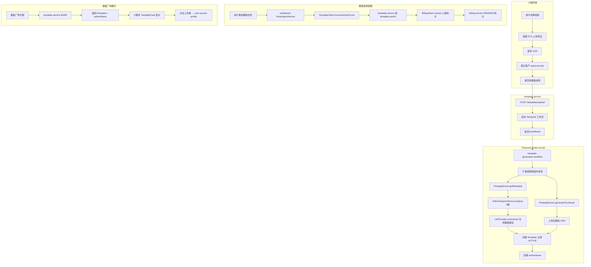

# Spec: 用户上传视频转模板功能

> 质量节拍 Phase 0.3 PRD + Phase 1.1 技术方案
> 创建时间：2026-07-30

---

## 一、需求边界（Phase 0.3 PRD）

### 1.1 功能概述

用户在小程序端上传一段视频，系统自动分析视频的元数据（分辨率、时长、镜头切分、运镜方式、风格标签、文案结构），生成可复用的"创作模板"。模板生成后直接显示在模板广场，供其他用户基于此模板创作新视频。模板广场展示上传者基础信息 + 统计数据。

### 1.2 用户决策记录

| 决策点     | 选择                                   | 影响                               |
| ---------- | -------------------------------------- | ---------------------------------- |
| 转模板含义 | 元数据抽取模板（风格复刻）             | 走视频分析链路，不走素材共享       |
| 审核流程   | MVP 先直接公开，后续加审核             | P0 状态直接 ACTIVE，P1 补审核      |
| 积分机制   | 被使用奖励积分（上传不消耗）           | 需接入 billing-service REWARD 类型 |
| 上传者展示 | 基础+统计（昵称+头像+上传数+被使用数） | 需 user-service 公开主页 API       |

### 1.3 功能需求（FR）

| 编号  | 需求                                                             | 优先级         |
| ----- | ---------------------------------------------------------------- | -------------- |
| FR-01 | 用户通过小程序上传视频文件（复用 asset-service STS 直传）        | P0             |
| FR-02 | 系统分析视频元数据：分辨率/时长/编码/镜头切分/运镜/风格标签/文案 | P0             |
| FR-03 | 系统截取视频封面图                                               | P0             |
| FR-04 | 系统生成结构化模板数据（modelConfig + prompt + tags）            | P0             |
| FR-05 | 模板创建后状态为 ACTIVE，直接显示在模板广场                      | P0             |
| FR-06 | 模板广场卡片显示上传者头像 + 昵称                                | P0             |
| FR-07 | 模板广场卡片显示上传者上传数 + 被使用数                          | P0             |
| FR-08 | 模板被使用时（incrementUseCount），奖励上传者 N 积分             | P0             |
| FR-09 | 用户可在"我的上传"页查看自己上传的模板列表                       | P0             |
| FR-10 | 上传失败时显示错误原因，支持重试                                 | P0             |
| FR-11 | 视频格式限制：mp4/mov，大小 ≤ 100MB，时长 3-60s                  | P0             |
| FR-12 | 审核流程（PENDING_REVIEW → ACTIVE）                              | P1（后续迭代） |

### 1.4 非功能需求（NFR）

| 编号   | 需求                                                                           |
| ------ | ------------------------------------------------------------------------------ |
| NFR-01 | 视频分析异步执行（Temporal 工作流），不阻塞上传响应                            |
| NFR-02 | 分析失败时模板状态标记为 ANALYSIS_FAILED，允许用户重试                         |
| NFR-03 | 积分奖励幂等（idempotencyKey = `reward:template:{templateId}:use:{useCount}`） |
| NFR-04 | 上传者统计字段采用聚合查询（不冗余存储，避免一致性问题）                       |
| NFR-05 | 公开用户主页 API 限流（10 次/秒）                                              |

### 1.5 不做什么

- ❌ 不做视频内容审核（P1 迭代）
- ❌ 不做上传消耗积分（用户决策：被使用才奖励）
- ❌ 不做盗用检测（P2）
- ❌ 不做创作者完整主页（P2，仅基础+统计）

---

## 二、技术架构（Phase 1.1）

### 2.1 整体架构图



### 2.2 数据库变更

#### 2.2.1 template 库 — 新增迁移 0003_add_template_upload_fields.ts

```sql
-- 扩展状态枚举（新增分析中/分析失败）
ALTER TYPE templates_status_enum ADD VALUE IF NOT EXISTS 'ANALYZING';
ALTER TYPE templates_status_enum ADD VALUE IF NOT EXISTS 'ANALYSIS_FAILED';

-- 新增字段
ALTER TABLE templates ADD COLUMN IF NOT EXISTS source_asset_id VARCHAR(36);
ALTER TABLE templates ADD COLUMN IF NOT EXISTS video_meta JSONB DEFAULT '{}';
ALTER TABLE templates ADD COLUMN IF NOT EXISTS analysis_report JSONB DEFAULT '{}';
ALTER TABLE templates ADD COLUMN IF NOT EXISTS workflow_id VARCHAR(64);
ALTER TABLE templates ADD COLUMN IF NOT EXISTS failure_reason TEXT;

-- 索引：按上传者查询
CREATE INDEX IF NOT EXISTS idx_templates_source_asset_id ON templates(source_asset_id);
```

#### 2.2.2 billing 库 — 扩展 PointTransactionType

```typescript
// point-transaction.entity.ts
export enum PointTransactionType {
  FREEZE = 'FREEZE',
  SETTLE = 'SETTLE',
  RELEASE = 'RELEASE',
  GRANT = 'GRANT',
  CONSUME = 'CONSUME',
  REWARD = 'REWARD', // 新增：模板被使用奖励
}
```

```sql
-- billing 库迁移
ALTER TYPE point_transaction_type_enum ADD VALUE IF NOT EXISTS 'REWARD';
ALTER TABLE point_transactions ADD COLUMN IF NOT EXISTS template_id VARCHAR(36);
CREATE INDEX IF NOT EXISTS idx_point_transactions_template_id ON point_transactions(template_id);
```

#### 2.2.3 main 库 — 不新增字段

上传数/被使用数通过聚合查询获取：

- 上传数：`SELECT COUNT(*) FROM templates WHERE user_id = ? AND status IN ('ACTIVE','ANALYZING')`
- 被使用数：`SELECT SUM(use_count) FROM templates WHERE user_id = ?`

### 2.3 API 设计

#### 2.3.1 template-service 新增端点

| 方法 | 路径                                          | 鉴权 | 说明               |
| ---- | --------------------------------------------- | ---- | ------------------ |
| POST | `/api/v1/templates/upload`                    | JWT  | 提交视频转模板请求 |
| GET  | `/api/v1/templates/upload/:workflowId/status` | JWT  | 查询转模板进度     |
| GET  | `/api/v1/templates/my-uploaded`               | JWT  | 我上传的模板列表   |

**POST /api/v1/templates/upload 请求体：**

```typescript
class UploadTemplateDto {
  assetId: string // 已上传的视频资产 ID
  title: string // 模板标题（最长 128）
  description?: string // 模板描述
  category?: string // 分类
  industry?: string // 行业
  platform?: string // 平台 DOUYIN/XIAOHONGSHU/...
  tags?: string[] // 标签
}
```

**响应：**

```typescript
{
  templateId: string // 预创建的模板 ID（状态 ANALYZING）
  workflowId: string // Temporal 工作流 ID
  status: 'ANALYZING'
}
```

#### 2.3.2 billing-service 新增端点

| 方法 | 路径                    | 鉴权        | 说明                 |
| ---- | ----------------------- | ----------- | -------------------- |
| POST | `/api/v1/points/reward` | InternalApi | 模板被使用奖励上传者 |

**请求体：**

```typescript
class RewardPointsDto {
  userId: string
  amount: number
  templateId: string
  idempotencyKey: string // reward:template:{templateId}:use:{useCount}
  description?: string
}
```

#### 2.3.3 user-service 新增端点

| 方法 | 路径                        | 鉴权   | 说明             |
| ---- | --------------------------- | ------ | ---------------- |
| GET  | `/api/v1/users/:id/profile` | Public | 公开用户主页信息 |

**响应：**

```typescript
{
  userId: string
  nickname: string
  avatarUrl: string
  templateUploadCount: number // 上传模板数
  templateUsedCount: number // 模板被使用总数
}
```

> 注意：templateUploadCount / templateUsedCount 需跨库查询 template 库。user-service 需引入 template 库的 Template 实体做聚合查询。

### 2.4 Temporal 工作流设计

#### 2.4.1 template-generation.workflow.ts

```typescript
@Workflow()
export class TemplateGenerationWorkflow {
  @WorkflowSignal()
  async run(input: TemplateGenerationInput): Promise<TemplateGenerationResult> {
    // 1. 下载视频
    const videoPath = await Workflow.executeActivity(downloadAssetVideo, input.assetId)

    // 2. 提取元数据 + 截取封面（并行）
    const [meta, thumbnailPath] = await Promise.all([
      Workflow.executeActivity(extractVideoMeta, videoPath),
      Workflow.executeActivity(generateThumbnail, videoPath),
    ])

    // 3. 视频分析（4 维度并行）
    const analysisReport = await Workflow.executeActivity(analyzeVideo, videoPath)

    // 4. LLM 生成模板建议
    const templateSuggestion = await Workflow.executeActivity(summarizeTemplate, analysisReport)

    // 5. 上传封面到 OSS
    const coverKey = await Workflow.executeActivity(uploadThumbnail, {
      thumbnailPath,
      userId: input.userId,
      templateId: input.templateId,
    })

    // 6. 创建/更新 Template 记录
    await Workflow.executeActivity(finalizeTemplate, {
      templateId: input.templateId,
      meta,
      analysisReport,
      templateSuggestion,
      coverKey,
    })

    return { templateId: input.templateId, status: 'ACTIVE' }
  }
}
```

#### 2.4.2 新增 Activities（libs/temporal/src/activities/template.activities.ts）

| Activity           | 依赖                        | 功能                        |
| ------------------ | --------------------------- | --------------------------- |
| downloadAssetVideo | OSSService                  | 从 OSS 下载视频到临时目录   |
| extractVideoMeta   | FfmpegService               | 提取分辨率/时长/编码        |
| generateThumbnail  | FfmpegService               | 截取封面（第 1 秒）         |
| analyzeVideo       | VideoAnalyzerService        | 4 维度分析                  |
| summarizeTemplate  | LlmProvider                 | 生成结构化模板建议          |
| uploadThumbnail    | OSSService                  | 上传封面到 OSS              |
| finalizeTemplate   | TemplateService（via HTTP） | 更新 Template 状态为 ACTIVE |

### 2.5 改造点清单

| 模块              | 文件                                      | 改动                                                                                                       |
| ----------------- | ----------------------------------------- | ---------------------------------------------------------------------------------------------------------- |
| template-service  | template.controller.ts                    | 新增 upload/status/my-uploaded 端点                                                                        |
| template-service  | template.service.ts                       | 新增 submitUpload/getUploadStatus/findMyUploaded；改造 incrementUseCount 触发奖励                          |
| template-service  | billing.client.ts（新增）                 | 调用 billing-service /reward                                                                               |
| template-service  | template.module.ts                        | 引入 HttpModule 注册 BillingClient                                                                         |
| template-service  | app.module.ts                             | 接入可观测性（已有）                                                                                       |
| billing-service   | point-transaction.entity.ts               | 新增 REWARD 枚举值 + templateId 字段                                                                       |
| billing-service   | ledger.service.ts                         | 新增 reward 方法                                                                                           |
| billing-service   | billing.controller.ts                     | 新增 /reward 端点                                                                                          |
| billing-service   | dto/reward-points.dto.ts（新增）          | 奖励 DTO                                                                                                   |
| billing-service   | 迁移 0002                                 | 扩展枚举 + 新增 template_id 列                                                                             |
| user-service      | user.controller.ts                        | 新增 /users/:id/profile 公开端点                                                                           |
| user-service      | user.service.ts                           | 新增 findPublicProfile（聚合查询 template 库）                                                             |
| user-service      | user.module.ts                            | 引入 Template 实体（template 库）                                                                          |
| libs/database     | template.entity.ts                        | 新增 sourceAssetId/videoMeta/analysisReport/workflowId/failureReason 字段 + ANALYZING/ANALYSIS_FAILED 状态 |
| libs/database     | point-transaction.entity.ts               | 新增 REWARD + templateId                                                                                   |
| libs/database     | 迁移 template/0003                        | 新增字段 + 扩展枚举                                                                                        |
| libs/database     | 迁移 billing/0002                         | 扩展枚举 + 新增列                                                                                          |
| libs/temporal     | template-generation.workflow.ts（新增）   | 转模板工作流                                                                                               |
| libs/temporal     | activities/template.activities.ts（新增） | 7 个 Activity                                                                                              |
| apps/media-worker | activities.container.ts                   | 装配新 Activity                                                                                            |
| apps/media-worker | worker.bootstrap.ts                       | 注入依赖                                                                                                   |
| 小程序            | pages/template/upload（新增）             | 上传视频转模板页                                                                                           |
| 小程序            | services/api/template.api.ts              | 新增 uploadTemplate/getUploadStatus/listMyUploaded                                                         |
| 小程序            | components/TemplateCard                   | 显示上传者头像+昵称+统计                                                                                   |
| 小程序            | types/index.ts                            | Template 类型增加 authorAvatar/authorId/uploadCount/usedCount                                              |

### 2.6 关键设计决策

1. **异步工作流**：上传后立即返回 templateId（状态 ANALYZING），前端轮询 status 接口。分析完成后状态变 ACTIVE。
2. **积分奖励幂等**：idempotencyKey = `reward:template:{templateId}:use:{useCount}`，useCount 是自增前的值，保证每次使用只奖励一次。
3. **统计聚合查询**：上传数/被使用数不冗余存储，实时聚合查询 template 库。避免 User 表与 Template 表不一致。
4. **公开主页跨库查询**：user-service 引入 template 库的 Template 实体做 COUNT/SUM 聚合，不跨库调用 template-service HTTP。
5. **MVP 直接公开**：finalizeTemplate Activity 直接设状态为 ACTIVE，不走审核。P1 迭代时改为 PENDING_REVIEW。

---

## 三、任务拆解（Phase 1.3）

### 阶段 1：数据库 + 实体（基础设施）

- [ ] T1.1 template.entity.ts 新增字段 + 状态枚举
- [ ] T1.2 point-transaction.entity.ts 新增 REWARD + templateId
- [ ] T1.3 迁移 template/0003_add_template_upload_fields.ts
- [ ] T1.4 迁移 billing/0002_add_reward_type.ts

### 阶段 2：billing-service 积分奖励

- [ ] T2.1 reward-points.dto.ts
- [ ] T2.2 ledger.service.ts 新增 reward 方法
- [ ] T2.3 billing.controller.ts 新增 /reward 端点
- [ ] T2.4 单元测试

### 阶段 3：Temporal 工作流 + Activities

- [ ] T3.1 template.activities.ts（7 个 Activity）
- [ ] T3.2 template-generation.workflow.ts
- [ ] T3.3 activities.container.ts 装配
- [ ] T3.4 worker.bootstrap.ts 注入依赖
- [ ] T3.5 单元测试

### 阶段 4：template-service 后端

- [ ] T4.1 upload-template.dto.ts
- [ ] T4.2 billing.client.ts（调用 billing /reward）
- [ ] T4.3 template.service.ts 新增 submitUpload/getUploadStatus/findMyUploaded
- [ ] T4.4 template.service.ts 改造 incrementUseCount 触发奖励
- [ ] T4.5 template.controller.ts 新增端点
- [ ] T4.6 template.module.ts 引入 HttpModule
- [ ] T4.7 单元测试

### 阶段 5：user-service 公开主页

- [ ] T5.1 user.service.ts 新增 findPublicProfile
- [ ] T5.2 user.controller.ts 新增 /users/:id/profile
- [ ] T5.3 user.module.ts 引入 Template 实体
- [ ] T5.4 单元测试

### 阶段 6：小程序前端

- [ ] T6.1 types/index.ts 扩展 Template 类型
- [ ] T6.2 template.api.ts 新增 API
- [ ] T6.3 TemplateCard 组件显示上传者信息
- [ ] T6.4 pages/template/upload 上传页
- [ ] T6.5 pages/template/my-uploaded 我的上传页
- [ ] T6.6 pages/template/gallery 接入新字段

### 阶段 7：集成测试 + 发布

- [ ] T7.1 typecheck 全量
- [ ] T7.2 lint 全量
- [ ] T7.3 单元测试全量
- [ ] T7.4 小程序 build
- [ ] T7.5 /review 审查
- [ ] T7.6 /ship 发布

---

## 四、测试计划（Phase 1→2）

### 4.1 单元测试

| 模块                | 测试场景                                                                      |
| ------------------- | ----------------------------------------------------------------------------- |
| billing-service     | reward 幂等性 / 余额正确 / templateId 关联                                    |
| template-service    | submitUpload 创建 ANALYZING 记录 / getUploadStatus 轮询 / findMyUploaded 过滤 |
| template-service    | incrementUseCount 触发 reward 调用 / 幂等键正确                               |
| user-service        | findPublicProfile 聚合查询正确 / 不存在的用户返回 404                         |
| temporal activities | 每个 Activity Mock 模式行为验证                                               |

### 4.2 集成测试

| 场景                   | 验证点                                |
| ---------------------- | ------------------------------------- |
| 完整上传→分析→生成流程 | Mock 模式下端到端走通                 |
| 模板被使用→积分奖励    | useCount +1 + 上传者积分 +N           |
| 模板广场展示上传者信息 | 卡片显示头像/昵称/上传数/被使用数     |
| 分析失败               | 状态变 ANALYSIS_FAILED + 失败原因记录 |

### 4.3 视觉回归

| 页面     | 检查点                          |
| -------- | ------------------------------- |
| 模板广场 | TemplateCard 上传者信息展示     |
| 上传页   | 上传中/分析中/成功/失败状态切换 |
| 我的上传 | 列表展示 + 状态标签             |
