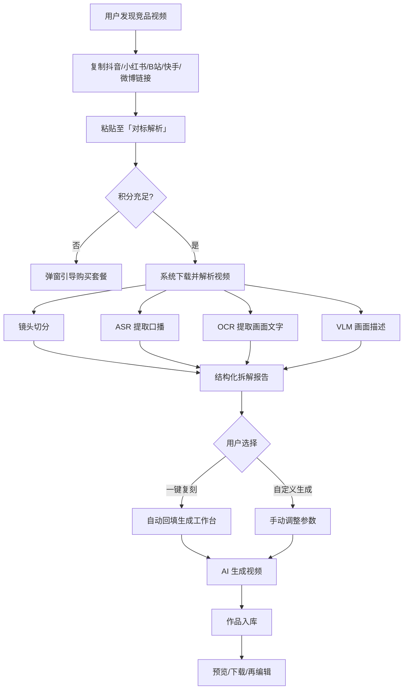
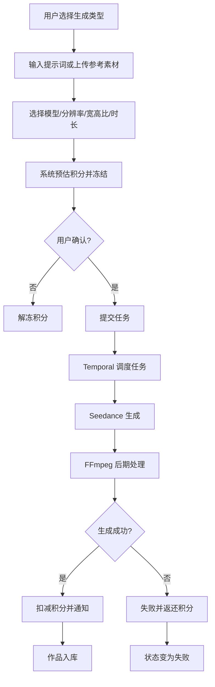
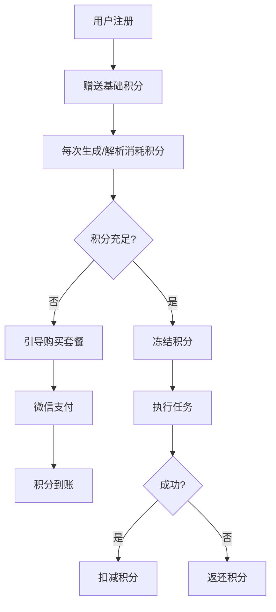
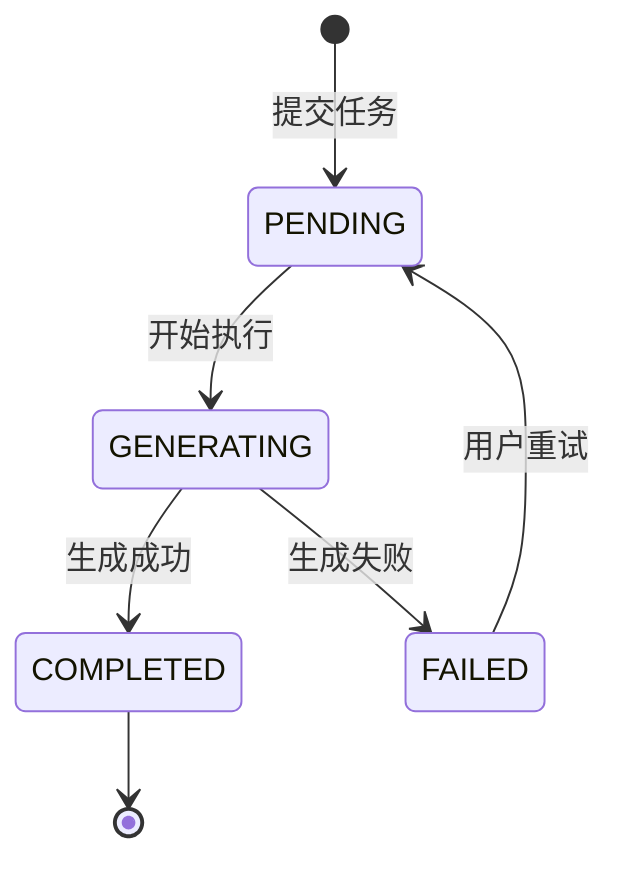
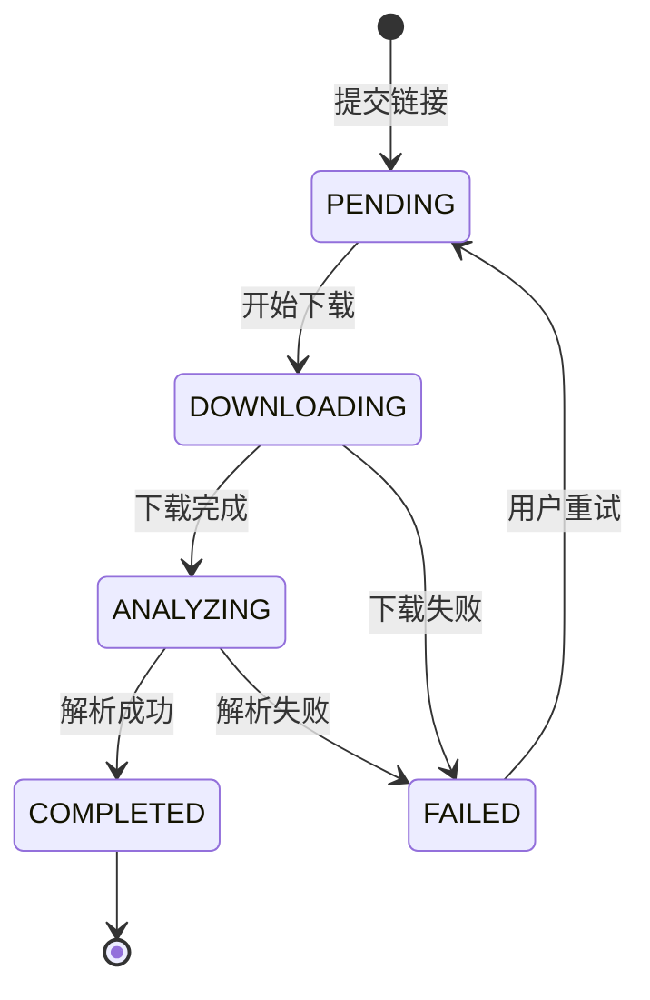
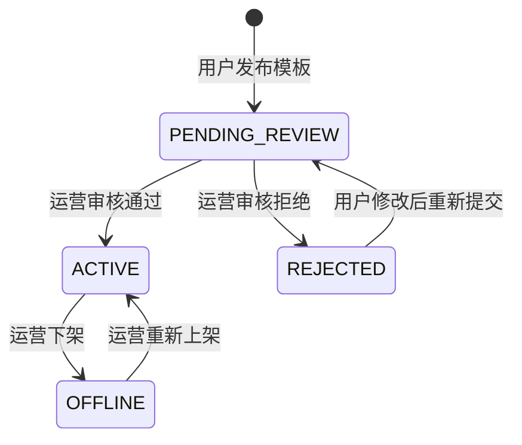

# ReelClone 产品需求文档（PRD）

> **版本**: v2.2（微信云托管版）
> **更新日期**: 2026-08-07
> **产品名称**: WouwouAI（智能视频创作带货平台）
> **产品形态**: 微信小程序（主） + H5 Web 版（按需，Taro 多端编译）
> **部署目标**: 微信云托管（WeChat Cloud Run）
> **配套文档**: [01-完整功能点列表和说明.md](01-完整功能点列表和说明.md)、[05-截图视觉审计报告.md](05-截图视觉审计报告.md)、[06-截图操作流程映射.md](06-截图操作流程映射.md)、[07-数据模型设计.md](07-数据模型设计.md)、[08-测试用例集.md](08-测试用例集.md)、[16-深度重构分析报告.md](16-深度重构分析报告.md)、[17-微信云托管部署影响分析.md](17-微信云托管部署影响分析.md)、[18-深度重构方案-微信云托管版.md](18-深度重构方案-微信云托管版.md)、[19-小程序与Web版代码复用分析.md](19-小程序与Web版代码复用分析.md)

---

## 一、文档概述

### 1.1 目的

本文档定义 ReelClone 项目（WouwouAI 1:1 复刻）的完整产品需求，基于 31 张目标产品截图的视觉审计结果编写。文档覆盖功能需求（FR）、非功能需求（NFR）、用户界面规范、业务流程、数据需求、集成需求及验收标准，作为设计、开发、测试、运维的统一依据。

### 1.2 读者

- 产品经理（需求确认）
- UI/UX 设计师（视觉与交互）
- 前端工程师（小程序实现）
- 后端工程师（API 与业务逻辑）
- 算法工程师（ASR/OCR/VLM/生成模型）
- 测试工程师（用例设计）
- 运维工程师（部署与监控）

### 1.3 术语表

| 术语            | 说明                             |
| --------------- | -------------------------------- |
| Seedance        | 火山引擎方舟视频生成模型         |
| VLM             | 视觉语言模型，用于画面理解与描述 |
| ASR             | 自动语音识别，提取口播文案       |
| OCR             | 光学字符识别，提取画面文字       |
| FFmpeg          | 音视频处理工具链                 |
| tus             | 断点续传上传协议                 |
| Formance Ledger | 原子复式记账与幂等冲正           |
| Temporal        | 耐久工作流编排                   |
| OpenFGA         | 细粒度权限授权                   |
| OpenMeter       | 用量计量与额度 Grant             |

### 1.4 版本记录

| 版本   | 日期          | 变更说明                                                                                                            |
| ------ | ------------- | ------------------------------------------------------------------------------------------------------------------- |
| v1.0   | 2026-07-28 前 | 初版 PRD                                                                                                            |
| v2.0   | 2026-07-28    | 基于 31 张截图审计，细化 FR 验收标准、补充 UI 规范 Token、对齐 01/05/06/07/08 文档                                  |
| v2.0.1 | 2026-07-28    | 交叉校验修复：新增 FR-5.9 微信登录；与 01/08 文档编号保持一致                                                       |
| v2.1   | 2026-07-29    | 新增 FR-12 模板发布与审核（UGC 上传功能）、FR-12.1~FR-12.4 完整功能定义；更新产品目标与成功指标；补充存储与带宽方案 |
| v2.2   | 2026-08-07    | 部署目标明确为微信云托管；新增多端编译策略（小程序为主 + H5 按需）；补充重构方案与微信云托管影响分析配套文档        |

---

## 二、产品背景与价值

### 2.1 市场背景

短视频带货与本地生活推广已成为商家获客的核心手段。爆款视频的规律（镜头节奏、口播文案、画面风格）可被结构化拆解并复用，但普通商家缺乏专业的拆解与再生产能力。

### 2.2 用户痛点

1. **不知道拍什么**：缺乏爆款灵感与行业模板。
2. **不会写文案**：口播脚本、卖点提炼困难。
3. **不会拍/剪视频**：拍摄、剪辑、配音成本高。
4. **想复刻竞品**：看到同行爆款视频，无法快速拆解并生成相似内容。
5. **版权与形象风险**：使用真人形象、商品素材时缺乏授权与合规管理。

### 2.3 产品价值

- **降低创作门槛**：通过 AI 文生视频、图生视频、数字人等技术，用户只需输入文字或上传参考图即可生成视频。
- **爆款复刻**：粘贴竞品链接即可自动拆解风格、镜头、文案，并基于拆解结果生成新视频。
- **行业模板库**：按行业、平台、热度聚合爆款模板，支持一键套用。
- **资产与合规管理**：素材库、真人形象授权组、积分与套餐体系，支撑商业化与合规运营。

---

## 三、目标用户与画像

| 用户类型     | 特征                             | 核心需求                             |
| ------------ | -------------------------------- | ------------------------------------ |
| 电商商家     | 有商品需要推广，缺乏视频制作能力 | 商品展示视频、种草文案、快速复刻竞品 |
| 本地生活商家 | 餐饮、美业、教培、健身等实体门店 | 同城 IP 视频、探店视频、活动促销     |
| 个人 IP/达人 | 需要持续产出内容                 | 口播脚本、人设视频、爆款复刻         |
| MCN/代运营   | 管理多个账号与大量素材           | 团队素材库、模板管理、批量生成       |

---

## 四、产品目标与成功指标

### 4.1 产品目标

1. **MVP 阶段（3 个月）**：实现首页、生成工作台、对标解析、个人中心、积分支付、作品/资产管理、模板 UGC 发布与审核。
2. **成长阶段（6 个月）**：完善灵感广场推荐、真人形象授权、3D 建模、团队权限、运营审核后台。
3. **成熟阶段（12 个月）**：建立模板审核与交易平台、企业级 SaaS 服务、多平台一键分发。

### 4.2 成功指标

| 指标类型 | 指标           | 目标值                  |
| -------- | -------------- | ----------------------- |
| 用户增长 | 注册用户数     | MVP 内测 1000+          |
| 活跃度   | 周活跃率       | ≥30%                    |
| 转化     | 付费转化率     | ≥5%                     |
| 生成效率 | 单视频生成耗时 | ≤5 分钟（不含模型排队） |
| 满意度   | NPS            | ≥30                     |

---

## 五、信息架构

### 5.1 底部 TabBar

| Tab      | 图标     | 标签     | 定位                           |
| -------- | -------- | -------- | ------------------------------ |
| 首页     | 房子     | 首页     | 品牌展示、核心入口、推荐瀑布流 |
| 推荐     | 摄像机   | 推荐     | 灵感广场 / 模板广场            |
| 创作     | 加号圆形 | 无文字   | 点击展开快捷创作浮层           |
| 对标解析 | 靶心     | 对标解析 | 竞品视频链接解析               |
| 我的     | 人物     | 我的     | 个人中心                       |

### 5.2 页面层级树

```
TabBar 首页
├── 搜索页
└── 推荐瀑布流 / 全部入口

TabBar 推荐
├── 行业偏好绑定弹窗（首次进入）
├── 灵感广场列表（平台/行业/热度筛选）
└── 分类模板推荐（DISCOVER）

TabBar 创作（+）
└── 底部浮层
    ├── 创作视频 → 视频生成-3D建模
    ├── 创作图片 → 图片生成
    ├── 创作文案 → 文本生成
    ├── 文生图生视频 → 视频生成
    ├── 编辑视频 → 视频生成-编辑视频
    ├── 延长视频 → 视频生成-延长视频
    └── 对标解析 → 对标解析

TabBar 对标解析
├── 竞品链接输入
├── 解析历史
└── 解析结果页

TabBar 我的
├── 个人主页
│   ├── 设置
│   │   ├── 账户信息（昵称/手机号/角色）
│   │   ├── 内容管理（作品/资产/模板/创作台/对标解析）
│   │   ├── 安全设置（修改密码）
│   │   ├── 套餐与积分
│   │   │   ├── 订阅计划
│   │   │   ├── 我的套餐
│   │   │   ├── 消费记录
│   │   │   └── 我的订单
│   │   └── 关于 WouwouAI
│   ├── 我的作品
│   │   └── 作品详情页
│   │       └── 发布为模板（FR-12.1 → FR-12.2 发布模板表单页）
│   ├── 我的资产
│   │   ├── 普通资产
│   │   └── 真人形象
│   └── 我的模板（收藏 + 我发布的模板）
└── 账号切换 / 退出登录

生成工作台
├── 文本生成
│   ├── 对话模式
│   └── 一键改写模式
├── 图片生成
│   ├── 反推提示词
│   └── 图生图
└── 视频生成
    ├── 文生视频
    ├── 图生视频-首帧
    ├── 图生视频-首尾帧
    ├── 3D建模
    ├── 编辑视频
    └── 延长视频
```

---

## 六、核心业务流程

### 6.1 爆款复刻流程



### 6.2 AI 视频生成流程



### 6.3 积分与付费流程



---

## 七、功能需求（FR）

### FR-1 首页

| 编号   | 需求描述                           | 验收标准                                | 关联截图                             |
| ------ | ---------------------------------- | --------------------------------------- | ------------------------------------ |
| FR-1.1 | 展示顶部标题栏与微信小程序胶囊菜单 | 标题显示「首页 - Wouwo…」，胶囊菜单可见 | FR1_首页_01_探索灵感与八宫格入口.jpg |
| FR-1.2 | 展示「探索灵感」品牌区             | 区域标题、搜索图标、品牌 Logo 可见      | FR1_首页_01_探索灵感与八宫格入口.jpg |
| FR-1.3 | 展示 8 个核心功能入口宫格          | 2×4 布局，图标与标签正确，点击跳转      | FR1_首页_01_探索灵感与八宫格入口.jpg |
| FR-1.4 | 展示「为你推荐」瀑布流             | 双列卡片，含封面/标题/播放量，支持加载  | FR1_首页_01_探索灵感与八宫格入口.jpg |
| FR-1.5 | 提供搜索入口                       | 点击进入搜索页，支持关键词搜索          | FR1_首页_01_探索灵感与八宫格入口.jpg |

### FR-2 生成工作台

| 编号   | 需求描述           | 验收标准                                              | 关联截图                           |
| ------ | ------------------ | ----------------------------------------------------- | ---------------------------------- |
| FR-2.0 | 生成工作台公共顶部 | 返回按钮、标题「生成工作台」、主页按钮、一级 Tab 正确 | FR2_文本生成_01_对话模式工作台.jpg |

#### FR-2.1 文本生成

| 编号     | 需求描述                    | 验收标准                                           | 关联截图                           |
| -------- | --------------------------- | -------------------------------------------------- | ---------------------------------- |
| FR-2.1.1 | 顶部 Tab 切换文本/图片/视频 | 文本生成 Tab 高亮                                  | FR2_文本生成_01_对话模式工作台.jpg |
| FR-2.1.2 | 子 Tab 切换对话/一键改写    | 当前子 Tab 蓝紫渐变背景                            | FR2_文本生成_01_对话模式工作台.jpg |
| FR-2.1.3 | 展示当前预设                | 显示「当前预设：未选择预设」                       | FR2_文本生成_01_对话模式工作台.jpg |
| FR-2.1.4 | 历史记录入口                | 点击可查看历史会话                                 | FR2_文本生成_01_对话模式工作台.jpg |
| FR-2.1.5 | 新建对话                    | 清空当前会话                                       | FR2_文本生成_01_对话模式工作台.jpg |
| FR-2.1.6 | 快捷行业标签                | 好物种草/本地生活/教育培训/IP 口播，点击填充提示词 | FR2_文本生成_01_对话模式工作台.jpg |
| FR-2.1.7 | 多模态输入                  | 支持文字/图片/视频/音频输入                        | FR2_文本生成_01_对话模式工作台.jpg |
| FR-2.1.8 | 发送与积分提示              | 按钮显示「发送 5积分」，消耗积分正确               | FR2_文本生成_01_对话模式工作台.jpg |

#### FR-2.2 图片生成

| 编号     | 需求描述           | 验收标准                                 | 关联截图                               |
| -------- | ------------------ | ---------------------------------------- | -------------------------------------- |
| FR-2.2.1 | 反推提示词图片上传 | 支持上传/拍摄 1 张图片                   | FR2_图片生成_01_反推提示词与图生图.jpg |
| FR-2.2.2 | 反推提示词按钮     | 按钮显示「反推提示词 · 5积分」，结果回填 | FR2_图片生成_01_反推提示词与图生图.jpg |
| FR-2.2.3 | 图生图参考图片     | 最多 14 张参考图                         | FR2_图片生成_01_反推提示词与图生图.jpg |
| FR-2.2.4 | 提示词输入         | 0-3000 字，占位文本正确                  | FR2_图片生成_01_反推提示词与图生图.jpg |
| FR-2.2.5 | 开始生成图片       | 按钮显示「开始生成图片 · 60积分」        | FR2_图片生成_01_反推提示词与图生图.jpg |
| FR-2.2.6 | 字数统计           | 实时显示「0/3000」                       | FR2_图片生成_01_反推提示词与图生图.jpg |

#### FR-2.3 视频生成公共参数

| 编号     | 需求描述          | 验收标准                              | 关联截图                             |
| -------- | ----------------- | ------------------------------------- | ------------------------------------ |
| FR-2.3.1 | 视频生成 Tab 结构 | 一级 Tab 与二级 Tab 正确展示          | FR2_视频生成_01_文生视频参数配置.jpg |
| FR-2.3.2 | 提示词输入        | 文生必填，图生可选，支持润色          | FR2_视频生成_01_文生视频参数配置.jpg |
| FR-2.3.3 | 模型选择          | 默认 seedance2 Pro                    | FR2_视频生成_01_文生视频参数配置.jpg |
| FR-2.3.4 | 分辨率选择        | 480p/720p 单选                        | FR2_视频生成_01_文生视频参数配置.jpg |
| FR-2.3.5 | 宽高比选择        | 16:9/4:3/1:1/3:4/9:16 单选，默认 9:16 | FR2_视频生成_01_文生视频参数配置.jpg |
| FR-2.3.6 | 时长滑块          | 4秒/5秒可选                           | FR2_视频生成_01_文生视频参数配置.jpg |
| FR-2.3.7 | 积分预估          | 根据配置实时计算                      | FR2_视频生成_01_文生视频参数配置.jpg |
| FR-2.3.8 | 开始生成视频      | 冻结积分并提交任务                    | FR2_视频生成_01_文生视频参数配置.jpg |

#### FR-2.4 图生视频-首帧

| 编号     | 需求描述     | 验收标准                       | 关联截图                         |
| -------- | ------------ | ------------------------------ | -------------------------------- |
| FR-2.4.1 | 首帧图片上传 | 必填，支持上传/拍摄/素材库选择 | FR2_视频生成_02_图生视频首帧.jpg |
| FR-2.4.2 | 提示词可选   | 标签显示「提示词（可选）」     | FR2_视频生成_02_图生视频首帧.jpg |
| FR-2.4.3 | 参数与生成   | 共用公共参数，以首帧为基础生成 | FR2_视频生成_02_图生视频首帧.jpg |

#### FR-2.5 图生视频-首尾帧

| 编号     | 需求描述       | 验收标准                     | 关联截图                           |
| -------- | -------------- | ---------------------------- | ---------------------------------- |
| FR-2.5.1 | 首帧图片上传   | 必填                         | FR2_视频生成_03_图生视频首尾帧.jpg |
| FR-2.5.2 | 尾帧图片上传   | 必填                         | FR2_视频生成_03_图生视频首尾帧.jpg |
| FR-2.5.3 | 提示词可选     | 标签显示「提示词（可选）」   | FR2_视频生成_03_图生视频首尾帧.jpg |
| FR-2.5.4 | 首尾帧过渡生成 | 在首帧与尾帧之间生成过渡视频 | FR2_视频生成_03_图生视频首尾帧.jpg |

#### FR-2.6 3D 建模

| 编号     | 需求描述     | 验收标准                            | 关联截图                           |
| -------- | ------------ | ----------------------------------- | ---------------------------------- |
| FR-2.6.1 | 参考图片     | 最多 9 张，支持素材库/作品/真人形象 | FR2_视频生成_04_3D建模参考输入.jpg |
| FR-2.6.2 | 参考视频     | 最多 3 个，总时长 ≤15s              | FR2_视频生成_04_3D建模参考输入.jpg |
| FR-2.6.3 | 参考音频     | 单段 2-15s，最多 3 个，总时长 ≤15s  | FR2_视频生成_04_3D建模参考输入.jpg |
| FR-2.6.4 | 3D 模型生成  | 共用公共参数，生成 3D 资产/视频     | FR2_视频生成_04_3D建模参考输入.jpg |
| FR-2.6.5 | 素材来源扩展 | 参考图片选择支持三类来源            | FR2_视频生成_04_3D建模参考输入.jpg |

#### FR-2.7 编辑视频

| 编号     | 需求描述             | 验收标准                         | 关联截图                     |
| -------- | -------------------- | -------------------------------- | ---------------------------- |
| FR-2.7.1 | 原始视频上传         | 必填，支持上传/拍摄/资产库选择   | FR2_视频生成_05_编辑视频.jpg |
| FR-2.7.2 | 参考图片（替换素材） | 可选                             | FR2_视频生成_05_编辑视频.jpg |
| FR-2.7.3 | 视频编辑生成         | 基于原视频结构 AI 重绘/替换/编辑 | FR2_视频生成_05_编辑视频.jpg |

#### FR-2.8 延长视频

| 编号     | 需求描述     | 验收标准                   | 关联截图                     |
| -------- | ------------ | -------------------------- | ---------------------------- |
| FR-2.8.1 | 原始视频上传 | 1-3 个，总时长 ≤15s        | FR2_视频生成_06_延长视频.jpg |
| FR-2.8.2 | 时长配置     | 默认 4 秒                  | FR2_视频生成_06_延长视频.jpg |
| FR-2.8.3 | 视频延长生成 | 在原有视频基础上做时间延续 | FR2_视频生成_06_延长视频.jpg |

### FR-3 对标解析

| 编号   | 需求描述         | 验收标准                                   | 关联截图                         |
| ------ | ---------------- | ------------------------------------------ | -------------------------------- |
| FR-3.1 | 竞品视频链接输入 | 支持抖音/小红书/B站/快手/微博链接          | FR3_对标解析_01_竞品链接输入.jpg |
| FR-3.2 | 支持平台展示     | 展示 5 大平台标签                          | FR3_对标解析_01_竞品链接输入.jpg |
| FR-3.3 | 开始分析         | 按钮显示「开始分析 · 300积分」             | FR3_对标解析_01_竞品链接输入.jpg |
| FR-3.4 | 解析历史列表     | 支持刷新、空状态                           | FR3_对标解析_01_竞品链接输入.jpg |
| FR-3.5 | 解析结果展示     | 展示风格/镜头/文案/节奏/卖点，支持一键复刻 | FR3_对标解析_01_竞品链接输入.jpg |

### FR-4 灵感广场 / 推荐

| 编号    | 需求描述             | 验收标准                                    | 关联截图                             |
| ------- | -------------------- | ------------------------------------------- | ------------------------------------ |
| FR-4.1  | 行业偏好绑定弹窗     | 首次进入弹出，标题「绑定行业偏好」          | FR4_灵感广场_01_行业偏好绑定弹窗.jpg |
| FR-4.2  | 行业标签选择         | 1-3 个行业，选中态蓝紫渐变                  | FR4_灵感广场_02_选择行业标签.jpg     |
| FR-4.3  | 暂不绑定与保存       | 两个底部按钮功能正确                        | FR4_灵感广场_01_行业偏好绑定弹窗.jpg |
| FR-4.4  | 灵感广场搜索         | 搜索栏含输入框与搜索按钮                    | FR4_灵感广场_03_模板卡片列表.jpg     |
| FR-4.5  | 平台筛选 Tab         | 全部/抖音/小红书/B站/视频号                 | FR4_灵感广场_03_模板卡片列表.jpg     |
| FR-4.6  | 二级筛选             | 我的行业/热度/最近一周                      | FR4_灵感广场_03_模板卡片列表.jpg     |
| FR-4.7  | 灵感广场模板卡片     | 双列瀑布流，含平台/IQ/播放量/标题/作者/收藏 | FR4_灵感广场_03_模板卡片列表.jpg     |
| FR-4.8  | 模板收藏             | 收藏后同步至「我的模板」                    | FR4_灵感广场_03_模板卡片列表.jpg     |
| FR-4.9  | 推荐页 DISCOVER 标题 | 英文标签 + 大标题「推荐」+ 收藏入口         | FR4_推荐_01_分类模板推荐.jpg         |
| FR-4.10 | 推荐页分类标签       | 全部/破播/人设/老乡情怀/种草/卖货等         | FR4_推荐_01_分类模板推荐.jpg         |
| FR-4.11 | 推荐页内容统计       | 显示当前分类与内容数量                      | FR4_推荐_01_分类模板推荐.jpg         |
| FR-4.12 | 推荐页模板卡片网格   | 网格展示，含封面/标签/标题/描述/收藏        | FR4_推荐_01_分类模板推荐.jpg         |

### FR-5 个人中心

| 编号   | 需求描述     | 验收标准                       | 关联截图                         |
| ------ | ------------ | ------------------------------ | -------------------------------- |
| FR-5.1 | 设置入口     | 右上角齿轮图标点击进入设置     | FR5_个人中心_01_用户主页.jpg     |
| FR-5.2 | 用户信息展示 | 头像/昵称/ID/手机号绑定状态    | FR5_个人中心_01_用户主页.jpg     |
| FR-5.3 | 统计数据展示 | 作品/图片/视频/积分四项统计    | FR5_个人中心_01_用户主页.jpg     |
| FR-5.4 | 账号切换     | 多账号切换入口                 | FR5_个人中心_01_用户主页.jpg     |
| FR-5.5 | 退出登录     | 二次确认后清除登录态           | FR5_个人中心_01_用户主页.jpg     |
| FR-5.6 | 作品分类 Tab | 图片/视频/我的资产切换         | FR5_个人中心_01_用户主页.jpg     |
| FR-5.7 | 空状态       | 无内容时展示对应提示           | FR5_个人中心_01_用户主页.jpg     |
| FR-5.8 | 快捷创作菜单 | 底部浮层，含 7 个创作入口      | FR5_个人中心_02_快捷创作菜单.jpg |
| FR-5.9 | 微信登录     | 新用户自动注册，登录后跳转首页 | 截图未覆盖，逻辑推导             |

### FR-6 设置

| 编号    | 需求描述       | 验收标准                                         | 关联截图                                                       |
| ------- | -------------- | ------------------------------------------------ | -------------------------------------------------------------- |
| FR-6.1  | 设置页导航     | 返回按钮 + 标题「设置」                          | FR6_设置_01_账户与内容管理.jpg                                 |
| FR-6.2  | 用户 ID 展示   | 展示不可修改 ID                                  | FR6_设置_01_账户与内容管理.jpg                                 |
| FR-6.3  | 昵称修改       | 点击进入编辑                                     | FR6_设置_01_账户与内容管理.jpg                                 |
| FR-6.4  | 手机号绑定     | 未绑定弹出绑定弹窗，已绑定支持换绑               | FR6_设置_01_账户与内容管理.jpg, FR6_设置_03_绑定手机号弹窗.jpg |
| FR-6.5  | 账户角色展示   | 展示角色徽章                                     | FR6_设置_01_账户与内容管理.jpg                                 |
| FR-6.6  | 内容管理入口   | 我的作品/资产/模板/创作台/对标解析               | FR6_设置_01_账户与内容管理.jpg                                 |
| FR-6.7  | 修改密码入口   | 点击进入修改密码弹窗                             | FR6_设置_02_套餐与积分入口.jpg, FR6_设置_04_修改密码弹窗.jpg   |
| FR-6.8  | 当前套餐展示   | 显示「未开通」或套餐名                           | FR6_设置_02_套餐与积分入口.jpg                                 |
| FR-6.9  | 我的套餐入口   | 跳转我的套餐页                                   | FR6_设置_02_套餐与积分入口.jpg                                 |
| FR-6.10 | 积分余额展示   | 显示当前积分数值                                 | FR6_设置_02_套餐与积分入口.jpg                                 |
| FR-6.11 | 积分明细入口   | 跳转消费记录页                                   | FR6_设置_02_套餐与积分入口.jpg                                 |
| FR-6.12 | 我的订单入口   | 跳转我的订单页                                   | FR6_设置_02_套餐与积分入口.jpg                                 |
| FR-6.13 | 关于 WouwouAI  | 弹出关于弹窗                                     | FR6_设置_02_套餐与积分入口.jpg, FR11_关于_01_关于弹窗.jpg      |
| FR-6.14 | ICP 备案展示   | 底部展示备案号                                   | FR6_设置_02_套餐与积分入口.jpg                                 |
| FR-6.15 | 绑定手机号弹窗 | 手机号 + 验证码 + 获取验证码 + 取消/绑定         | FR6_设置_03_绑定手机号弹窗.jpg                                 |
| FR-6.16 | 修改密码弹窗   | 验证码修改/原密码修改 Tab + 密码输入 + 取消/确认 | FR6_设置_04_修改密码弹窗.jpg                                   |

### FR-7 我的资产

| 编号              | 需求描述           | 验收标准                              | 关联截图                           |
| ----------------- | ------------------ | ------------------------------------- | ---------------------------------- |
| FR-7.1            | 普通资产 Tab       | 默认选中                              | FR7_我的资产_01_普通资产素材库.jpg |
| FR-7.2            | 素材库             | 显示数量，点击进入                    | FR7_我的资产_01_普通资产素材库.jpg |
| FR-7.3            | 成品库             | 点击进入                              | FR7_我的资产_01_普通资产素材库.jpg |
| FR-7.4            | 资产筛选           | 按类型/标签/时间筛选                  | FR7_我的资产_01_普通资产素材库.jpg |
| FR-7.5            | 录音上传           | 录制或选择音频                        | FR7_我的资产_01_普通资产素材库.jpg |
| FR-7.6            | 上传素材           | 弹窗，含文件/行业分类/标签/自定义标签 | FR7_我的资产_04_上传素材弹窗.jpg   |
| FR-7.7            | 真人形象 Tab       | 切换展示资产组                        | FR7_我的资产_02_真人形象资产组.jpg |
| FR-7.8            | 真人形象资产组列表 | 展示名称/数量/日期/删除               | FR7_我的资产_02_真人形象资产组.jpg |
| FR-7.9            | 新建真人形象资产组 | 输入名称 + 取消/创建                  | FR7_我的资产_03_新建真人形象组.jpg |
| FR-7.10           | 删除真人形象资产组 | 二次确认后删除                        | FR7_我的资产_02_真人形象资产组.jpg |
| FR-7.11 ~ FR-7.16 | 上传素材弹窗细节   | 见 01-完整功能点列表                  | FR7_我的资产_04_上传素材弹窗.jpg   |

### FR-8 我的作品

| 编号   | 需求描述       | 验收标准                | 关联截图                     |
| ------ | -------------- | ----------------------- | ---------------------------- |
| FR-8.1 | 我的作品页导航 | 返回 + 标题             | FR8_我的作品_01_作品列表.jpg |
| FR-8.2 | 作品统计       | 视频/图片/生成中/失败   | FR8_我的作品_01_作品列表.jpg |
| FR-8.3 | 创作新作品     | 跳转生成工作台          | FR8_我的作品_01_作品列表.jpg |
| FR-8.4 | 作品类型切换   | 图像/视频               | FR8_我的作品_01_作品列表.jpg |
| FR-8.5 | 作品状态筛选   | 全部/生成中/已完成/失败 | FR8_我的作品_01_作品列表.jpg |
| FR-8.6 | 作品列表空状态 | 按类型展示空状态        | FR8_我的作品_01_作品列表.jpg |
| FR-8.7 | 作品卡片操作   | 预览/下载/删除/再创作   | FR8_我的作品_01_作品列表.jpg |

### FR-9 我的模板

| 编号   | 需求描述       | 验收标准                   | 关联截图                   |
| ------ | -------------- | -------------------------- | -------------------------- |
| FR-9.1 | 我的模板页导航 | 返回 + 标题                | FR9_我的模板_01_空状态.jpg |
| FR-9.2 | 我的模板空状态 | 心形图标 + 提示文案        | FR9_我的模板_01_空状态.jpg |
| FR-9.3 | 我的模板列表   | 展示收藏模板，支持取消收藏 | FR9_我的模板_01_空状态.jpg |

### FR-10 套餐与积分

| 编号     | 需求描述         | 验收标准                      | 关联截图                      |
| -------- | ---------------- | ----------------------------- | ----------------------------- |
| FR-10.1  | 订阅计划页       | 展示套餐卡片，底部 ICP        | FR10_套餐积分_01_订阅计划.jpg |
| FR-10.2  | 套餐购买         | 调起微信支付，幂等到账        | FR10_套餐积分_01_订阅计划.jpg |
| FR-10.3  | 我的套餐空状态   | 「暂无有效套餐」+ 立即订阅    | FR10_套餐积分_02_我的套餐.jpg |
| FR-10.4  | 我的套餐列表     | 展示有效套餐                  | FR10_套餐积分_02_我的套餐.jpg |
| FR-10.5  | 消费记录页       | 本月已用 + 流水明细           | FR10_套餐积分_03_消费记录.jpg |
| FR-10.6  | 本月已用积分统计 | 蓝紫渐变统计卡片              | FR10_套餐积分_03_消费记录.jpg |
| FR-10.7  | 积分流水明细     | 时间/类型/金额/余额           | FR10_套餐积分_03_消费记录.jpg |
| FR-10.8  | 我的订单页       | 交易中心卡片 + 订单列表       | FR10_套餐积分_04_我的订单.jpg |
| FR-10.9  | 购买套餐快捷入口 | 购物车图标 + 购买套餐         | FR10_套餐积分_04_我的订单.jpg |
| FR-10.10 | 我的订单空状态   | 图标 + 标题 + 说明 + 浏览按钮 | FR10_套餐积分_04_我的订单.jpg |
| FR-10.11 | 我的订单列表     | 订单号/套餐/金额/状态/时间    | FR10_套餐积分_04_我的订单.jpg |

### FR-11 关于

| 编号    | 需求描述        | 验收标准                | 关联截图                  |
| ------- | --------------- | ----------------------- | ------------------------- |
| FR-11.1 | 关于弹窗        | 居中带圆角模态弹窗      | FR11_关于_01_关于弹窗.jpg |
| FR-11.2 | 产品名与 Slogan | 展示 WouwouAI 与 Slogan | FR11_关于_01_关于弹窗.jpg |
| FR-11.3 | 版本号          | 展示 v1.0.0             | FR11_关于_01_关于弹窗.jpg |
| FR-11.4 | 关闭弹窗        | 底部关闭按钮            | FR11_关于_01_关于弹窗.jpg |

### FR-12 模板发布与审核（UGC 上传）

| 编号    | 需求描述           | 验收标准                                                                                                                                                                                                                                    | 关联截图           |
| ------- | ------------------ | ------------------------------------------------------------------------------------------------------------------------------------------------------------------------------------------------------------------------------------------- | ------------------ |
| FR-12.1 | 作品发布为模板入口 | 已完成作品详情页显示"发布为模板"按钮；未完成作品不显示；点击跳转发布模板表单页                                                                                                                                                              | 新增页面，无截图   |
| FR-12.2 | 发布模板表单       | 表单包含：标题（必填，预填 prompt 前20字）、描述（可选）、适用平台（抖音/小红书/视频号/快手/B站）、分类（口播/剧情/测评/教程/Vlog/混剪）、行业（复用 IndustryPicker）、标签（最多5个）；提交调用 publishWorkAsTemplate；成功后 toast + 返回 | 新增页面，无截图   |
| FR-12.3 | 模板审核流程       | 用户提交后模板状态为 PENDING_REVIEW；运营通过 POST /api/v1/templates/:id/review 审核；通过状态变为 ACTIVE（上架到广场）；拒绝状态变为 REJECTED（附审核备注）；待审核模板不在广场曝光                                                        | 新增管理后台（P1） |
| FR-12.4 | 模板使用计数与热度 | 基于模板创作成功后 useCount +1；模板广场按 hotScore 排序（热度公式：useCount × 0.4 + favoriteCount × 0.3 + recency × 0.3）；用户可查看"我发布的模板"列表及审核状态                                                                          | 无                 |

---

## 八、业务规则

### 8.1 积分消耗规则

| 功能          | 积分消耗 | 说明                                                    |
| ------------- | -------- | ------------------------------------------------------- |
| 文本生成-发送 | 5        | 每轮对话/改写                                           |
| 文本生成-润色 | 5        | 单次润色                                                |
| 图片生成-反推 | 5        | 每张图片                                                |
| 图片生成      | 60       | 每次生成                                                |
| 视频生成      | 动态     | 基于模型、分辨率、时长计算，如 480p/9:16/5秒 = 450 积分 |
| 对标解析      | 300      | 每次分析                                                |

### 8.2 积分冻结与结算规则

1. 用户点击「开始生成/分析/发送」时，系统先校验积分余额。
2. 余额充足时，通过 Formance Ledger 将积分从 `available` 冻结到 `reserved`。
3. 任务执行成功后，根据 OpenMeter 实际用量结算到 `spent`，释放差额。
4. 任务失败、取消或超时时，对冻结事务做幂等冲正，返还积分。
5. 支付回调必须幂等，防止重复到账。

### 8.3 套餐设计（建议）

| 套餐   | 价格   | 内容              | 有效期 |
| ------ | ------ | ----------------- | ------ |
| 体验包 | 9.9 元 | 500 积分          | 30 天  |
| 基础版 | 49 元  | 3000 积分         | 30 天  |
| 专业版 | 199 元 | 15000 积分        | 30 天  |
| 企业版 | 定制   | 不限量 + 团队权限 | 30 天  |

### 8.4 作品状态机



### 8.5 对标解析状态机



### 8.6 模板状态机



### 8.7 真人形象授权规则

1. 上传真人形象素材前，需签署电子授权书，明确用途/地域/期限。
2. 系统记录授权关系与授权书文件。
3. 授权撤销后，级联禁用该形象参与的新生成任务，并下架已生成衍生作品。
4. 涉及未成年人的形象，需监护人单独同意。

---

## 九、非功能需求（NFR）

### 9.1 性能需求

| 编号  | 需求                 | 指标                            |
| ----- | -------------------- | ------------------------------- |
| NFR-1 | 小程序首屏加载时间   | ≤2s（99 分位）                  |
| NFR-2 | 页面切换响应时间     | ≤300ms                          |
| NFR-3 | 视频生成任务提交响应 | ≤1s                             |
| NFR-4 | 对标解析异步结果回调 | ≤5 分钟（受模型与下载耗时影响） |
| NFR-5 | 作品列表加载         | ≤1s（单次 20 条）               |

### 9.2 可用性需求

| 编号  | 需求       | 说明                         |
| ----- | ---------- | ---------------------------- |
| NFR-6 | 系统可用性 | ≥99.9%（除模型方不可用时段） |
| NFR-7 | 故障恢复   | 任务失败后可重试并返还积分   |
| NFR-8 | 降级策略   | 模型 Provider 故障时自动切换 |

### 9.3 安全需求

| 编号   | 需求         | 说明                                                                                                 |
| ------ | ------------ | ---------------------------------------------------------------------------------------------------- |
| NFR-9  | 用户认证     | 微信小程序 code2session + 手机号绑定                                                                 |
| NFR-10 | 支付安全     | 微信支付商户号 + 回调签名校验                                                                        |
| NFR-11 | 素材访问     | OSS 短期签名 URL，过期失效                                                                           |
| NFR-12 | 真人形象授权 | 上传前需签署电子授权书，撤销后禁用衍生作品                                                           |
| NFR-13 | 内容合规     | 生成内容过审，敏感词/画面拦截                                                                        |
| NFR-18 | UGC 模板安全 | 模板发布需审核后上架；UGC 视频复用源作品 OSS key 不复制；模板使用计数防刷（幂等键 + Redis 限流）     |
| NFR-19 | 存储与带宽   | 阿里云 OSS 标准存储 + CDN 分发；MVP 阶段预计 1TB 存储 + 1.5TB/月 CDN 流量；30 天未访问自动转低频存储 |

### 9.4 合规需求

| 编号   | 需求         | 说明                                       |
| ------ | ------------ | ------------------------------------------ |
| NFR-14 | ICP 备案     | 小程序及 H5 页面展示备案号                 |
| NFR-15 | 隐私协议     | 用户授权微信头像、手机号、相册前需明确告知 |
| NFR-16 | 未成年人保护 | 真人形象涉及未成年人需监护人授权           |
| NFR-17 | 第三方内容   | 对标解析仅供学习参考，不得直接商用原视频   |

---

## 十、用户界面与交互设计

### 10.1 设计规范

#### 颜色 Token

| Token                      | 色值                                        | 用途          |
| -------------------------- | ------------------------------------------- | ------------- |
| `--color-bg-primary`       | `#0a0a0f`                                   | 页面主背景    |
| `--color-bg-card`          | `#14141f`                                   | 卡片背景      |
| `--color-bg-elevated`      | `#1f1f33`                                   | 弹窗/浮层背景 |
| `--color-primary`          | `#4F46E5`                                   | 主色起始      |
| `--color-secondary`        | `#7C3AED`                                   | 主色结束      |
| `--color-gradient-primary` | `linear-gradient(135deg, #4F46E5, #7C3AED)` | 选中态/主按钮 |
| `--color-text-primary`     | `#FFFFFF`                                   | 主要文字      |
| `--color-text-secondary`   | `#9CA3AF`                                   | 辅助文字      |
| `--color-text-muted`       | `#6B7280`                                   | 占位文字      |
| `--color-danger`           | `#EF4444`                                   | 删除/错误     |

#### 字号 Token

| Token                 | 大小 | 用途               |
| --------------------- | ---- | ------------------ |
| `--font-size-h1`      | 20px | 页面大标题         |
| `--font-size-h2`      | 18px | 页面标题、区域标题 |
| `--font-size-body`    | 14px | 正文、按钮文字     |
| `--font-size-caption` | 12px | 辅助说明、标签     |
| `--font-size-stat`    | 24px | 统计数据大数字     |

#### 间距与圆角 Token

| Token          | 值   | 用途                     |
| -------------- | ---- | ------------------------ |
| `--radius-sm`  | 8px  | 小按钮、标签             |
| `--radius-md`  | 12px | 输入框、卡片             |
| `--radius-lg`  | 16px | 大卡片、弹窗             |
| `--radius-xl`  | 24px | 底部 TabBar 中央加号按钮 |
| `--spacing-sm` | 8px  | 小间距                   |
| `--spacing-md` | 16px | 标准间距                 |
| `--spacing-lg` | 24px | 区域间距                 |

### 10.2 关键页面交互说明

#### 首页

- 顶部状态栏占位。
- 「探索灵感」区域居中展示品牌 Logo（蜗牛形象 + 「蜗蜗」）。
- 下方 8 宫格快捷入口，2 行 4 列。
- 底部「为你推荐」双列瀑布流，卡片含封面、标题、播放量。
- 底部 TabBar：首页 / 推荐 / + / 对标解析 / 我的。

#### 生成工作台

- 顶部返回按钮、标题「生成工作台」、主页按钮。
- 一级 Tab：文本生成 / 图片生成 / 视频生成。
- 视频生成二级 Tab：文生视频 / 图生视频-首帧 / 图生视频-首尾帧 / 3D 建模 / 编辑视频 / 延长视频。
- 中部为提示词输入框与各类素材上传区。
- 底部为模型/分辨率/宽高比/时长配置与积分预估。
- 最底部为「开始生成」按钮。

#### 对标解析

- 标题「对标解析」。
- 输入框：粘贴竞品视频链接。
- 平台标签：抖音 / 小红书 / B站 / 快手 / 微博。
- 「开始分析 · 300 积分」按钮。
- 下方「解析视频」历史列表，空状态提示。

#### 个人中心

- 顶部设置齿轮按钮。
- 用户信息区：头像、昵称、ID、手机号状态。
- 统计栏：作品 / 图片 / 视频 / 积分。
- 账号切换 / 退出登录按钮。
- 作品分类 Tab：图片 / 视频 / 我的资产。
- 中间悬浮创作菜单（点击 + 展开）。

---

## 十一、数据需求

### 11.1 数据实体

详见 [07-数据模型设计.md](07-数据模型设计.md)。核心实体包括：

- USER（用户）
- WORK（作品）
- GENERATION_TASK（生成任务）
- ASSET（资产）
- AVATAR_GROUP（真人形象资产组）
- BENCHMARK（对标解析记录）
- TEMPLATE（模板）
- FAVORITE（收藏）
- PACKAGE（套餐）
- USER_PACKAGE（用户套餐）
- ORDER（订单）
- POINT_TRANSACTION（积分流水）
- SMS_CODE（短信验证码）

### 11.2 关键字段约束

| 实体            | 关键字段         | 约束                                |
| --------------- | ---------------- | ----------------------------------- |
| USER            | phone            | 唯一，中国大陆手机号                |
| WORK            | status           | PENDING/GENERATING/COMPLETED/FAILED |
| GENERATION_TASK | provider_task_id | 唯一，幂等键                        |
| ASSET           | file_size        | ≤ 单个文件上限                      |
| AVATAR_GROUP    | name             | 用户内唯一，1-50 字符               |
| ORDER           | out_trade_no     | 唯一，微信支付商户订单号            |

---

## 十二、集成需求

### 12.1 外部服务

| 服务                 | 用途           | 接入方式           |
| -------------------- | -------------- | ------------------ |
| 微信小程序登录       | 用户认证       | code2session       |
| 微信支付             | 套餐购买       | JSAPI 支付 + 回调  |
| 短信服务商           | 验证码         | 阿里云/腾讯云短信  |
| Seedance（火山方舟） | 视频/图片生成  | 官方 Python/Go SDK |
| FunASR               | 口播识别       | 自部署服务         |
| PaddleOCR            | 画面文字识别   | 自部署服务         |
| Qwen3-VL             | 画面理解与描述 | 自部署服务或 API   |
| FFmpeg               | 音视频处理     | 命令行调用         |
| lux / yt-dlp         | 五平台视频下载 | 封装下载适配器     |

### 12.2 内部服务

| 服务                 | 用途                                       |
| -------------------- | ------------------------------------------ |
| API Gateway          | 统一入口、鉴权、限流                       |
| User Service         | 用户、账号、手机号                         |
| Generation Service   | 生成任务提交、状态查询                     |
| Benchmark Service    | 对标解析链路                               |
| Asset Service        | 素材上传、管理、授权                       |
| Template Service     | 模板广场列表/详情/收藏、UGC 发布/审核/热度 |
| Billing Service      | 积分、套餐、订单、支付                     |
| Notification Service | 消息通知、WebSocket                        |
| Temporal             | 耐久工作流编排                             |
| Formance Ledger      | 积分资金账本                               |
| OpenMeter            | 用量计量                                   |
| OpenFGA              | 权限授权                                   |

---

## 十三、风险与应对

| 风险                | 影响           | 应对措施                                                               |
| ------------------- | -------------- | ---------------------------------------------------------------------- |
| 平台下载链路失效    | 对标解析不可用 | 多下载器降级（lux/yt-dlp），监控并维护 Cookie/签名                     |
| 模型 Provider 故障  | 生成失败率高   | 多 Provider 轮询、超时重试、积分返还                                   |
| 生成内容合规问题    | 法律风险       | 前置敏感词/画面拦截，后置人工审核开关                                  |
| 真人形象授权纠纷    | 法律风险       | 电子授权书、身份核验、撤销后级联禁用                                   |
| 积分/支付异常       | 用户投诉       | 幂等扣费、Formance 账本、人工调账                                      |
| UGC 内容违规        | 法律风险       | 模板审核机制（PENDING_REVIEW → ACTIVE），敏感词/画面拦截前置           |
| 模板存储/带宽超预期 | 成本失控       | OSS 生命周期转低频/归档、CDN 缓存命中率监控、UGC 复用源作品 key 不复制 |

---

## 十四、验收标准

### 14.1 功能验收

- 所有 P0 功能按 01-完整功能点列表和说明 中的业务规则实现。
- 每个 P0 功能至少通过 08-测试用例集 中的正向用例。
- 截图与功能点映射覆盖率 100%。

### 14.2 性能验收

- 首屏加载 ≤2s（99 分位）。
- 页面切换 ≤300ms。
- 作品列表加载 ≤1s。

### 14.3 安全验收

- 微信支付回调签名校验通过。
- OSS 签名 URL 过期失效。
- 真人形象授权书签署流程完整。

---

## 十五、附录

### 15.1 参考文档

- [01-完整功能点列表和说明.md](01-完整功能点列表和说明.md)
- [03-技术架构方案.md](03-技术架构方案.md)
- [04-开发运维计划.md](04-开发运维计划.md)
- [05-截图视觉审计报告.md](05-截图视觉审计报告.md)
- [06-截图操作流程映射.md](06-截图操作流程映射.md)
- [07-数据模型设计.md](07-数据模型设计.md)
- [08-测试用例集.md](08-测试用例集.md)
- 开源仓库清单：[开源仓库可利用实现清单整合.md](开源仓库可利用实现清单整合.md)

### 15.2 截图目录

`D:\Data\projects\ReelClone\01-docs\复刻项目的功能界面截图`
