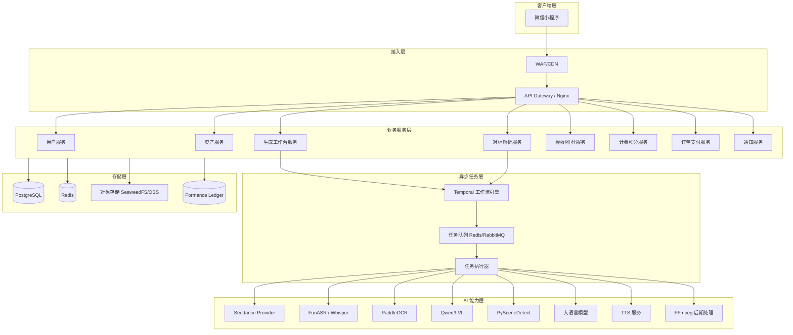
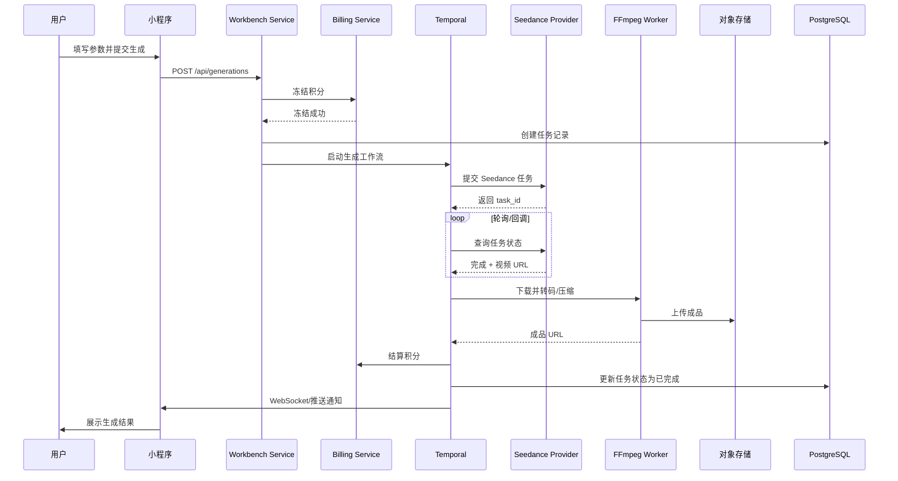
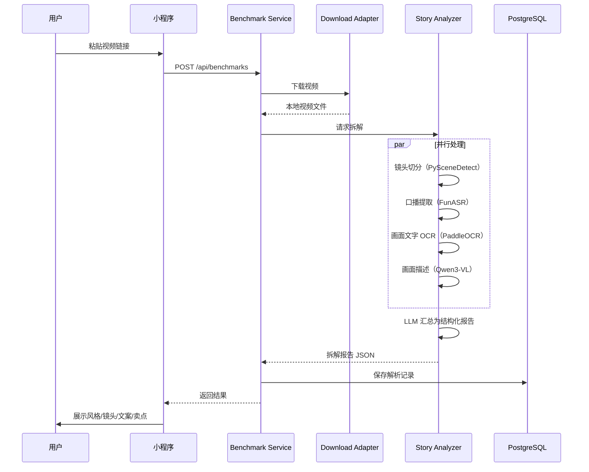
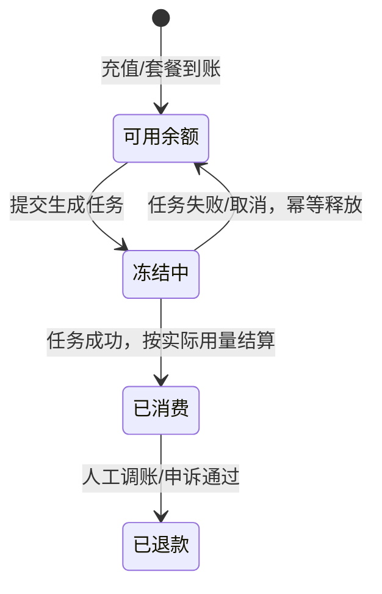
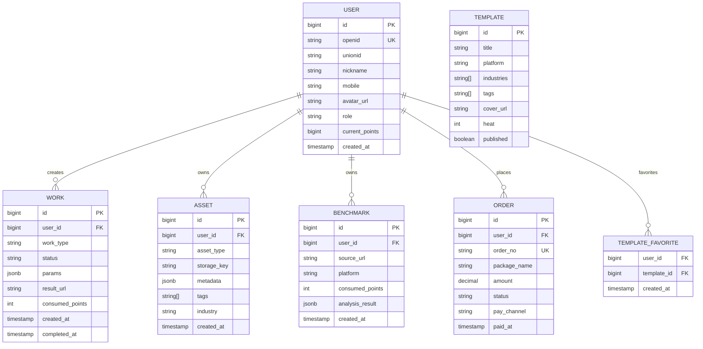
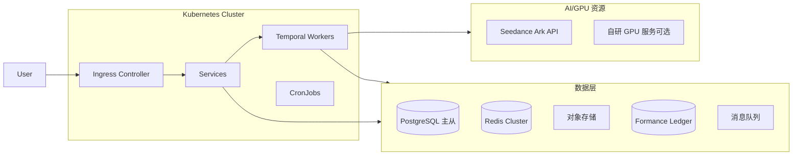

# ReelClone 技术架构方案

> **⚠️ TARGET 架构文档（非当前运行事实）**
> **本文档描述的是目标架构，包含 K8s、Formance Ledger、RabbitMQ 等尚未引入的组件。**
> **当前运行事实请参考 `CURRENT_ARCHITECTURE.md`。**
> **达到明确规模与运维触发条件后，本文件中的组件才会被重新评估引入。**

> 本方案基于「开源仓库可利用实现清单整合」与产品 PRD，给出 1:1 复刻 WouwouAI 微信小程序的总体技术架构、关键组件选型及核心数据流。

---

## 一、架构设计目标

1. **可扩展**：支持文生视频、图生视频、编辑视频、延长视频、3D 建模等多种生成能力横向扩展。
2. **高可用**：模型 Provider 可降级切换，任务失败可重试并返还积分。
3. **可观测**：全链路日志、指标、追踪，便于排查生成任务问题。
4. **合规安全**：真人形象授权、素材访问签名、支付幂等、内容合规审查。
5. **成本可控**：按实际用量结算，支持额度冻结/释放/退款。

---

## 二、总体架构



---

## 三、技术选型

### 3.1 前端

| 组件     | 选型                                    | 说明                                   |
| -------- | --------------------------------------- | -------------------------------------- |
| 框架     | 微信小程序原生 / Taro 3.x               | Taro 支持 React/Vue 语法，便于跨端扩展 |
| 状态管理 | Zustand / Pinia                         | 轻量，适合小程序                       |
| UI 组件  | 自研 + Vant Weapp                       | 深色主题需自定义                       |
| 上传组件 | tus-js-client                           | 大文件断点续传                         |
| 视频播放 | 小程序 video 组件 + 阿里云/腾讯云播放器 | 支持预览                               |

### 3.2 后端

| 组件       | 选型                         | 说明                                 |
| ---------- | ---------------------------- | ------------------------------------ |
| 主服务框架 | Node.js + NestJS 或 Go + Gin | 推荐 NestJS，与 TypeScript 栈统一    |
| 数据库     | PostgreSQL 16                | 关系型数据、JSONB 存储模板/任务配置  |
| 缓存       | Redis 7                      | 会话、限流、任务状态、热点数据       |
| 对象存储   | 阿里云 OSS / SeaweedFS       | 素材与成品存储，SeaweedFS 适合私有化 |
| 消息队列   | Redis Streams / RabbitMQ     | 任务排队与事件发布                   |
| 工作流引擎 | Temporal                     | 耐久任务、重试、子流程、失败补偿     |
| 账本       | Formance Ledger              | 积分冻结、结算、退款、审计           |
| 计量       | OpenMeter                    | 模型调用次数、时长、分辨率用量聚合   |

### 3.3 AI 与媒体处理

| 能力       | 选型                                  | 许可证/说明                  |
| ---------- | ------------------------------------- | ---------------------------- |
| 视频生成   | 火山 Seedance（官方 SDK）             | Apache-2.0 SDK，模型按量付费 |
| 视频下载   | lux（优先）+ yt-dlp（降级）           | MIT / Unlicense              |
| 镜头切分   | PySceneDetect / FireRed-OpenStoryline | BSD-3-Clause / Apache-2.0    |
| 语音识别   | FunASR（中文）/ faster-whisper        | MIT                          |
| 画面 OCR   | PaddleOCR                             | Apache-2.0                   |
| 视频理解   | Qwen3-VL                              | Apache-2.0（模型条款另审）   |
| 文案/润色  | 大语言模型（通义/豆包/DeepSeek 等）   | 按官方 API 计费              |
| 数字人/TTS | 自研或第三方 TTS + 口型同步           | 按服务商条款                 |
| 后期处理   | FFmpeg                                | LGPL/GPL，需控制编译参数     |
| 3D 生成    | TRELLIS（可选）                       | MIT                          |

### 3.4 微信生态与权限

| 组件           | 选型                              | 说明                               |
| -------------- | --------------------------------- | ---------------------------------- |
| 微信小程序登录 | 微信官方 API / wechatpy（Python） | MIT                                |
| 身份中心       | Casdoor                           | Apache-2.0，支持 OIDC/OAuth/多租户 |
| 权限控制       | OpenFGA 或 Casbin                 | Apache-2.0，项目级资源授权         |

### 3.5 推荐与模板

| 组件     | 选型               | 说明                            |
| -------- | ------------------ | ------------------------------- |
| 推荐引擎 | Gorse              | Apache-2.0，基于行为反馈推荐    |
| 模板 CMS | Payload（Node/TS） | MIT，支持草稿、版本、权限、审核 |
| 统计分析 | Umami              | MIT，轻量自托管事件统计         |

### 3.6 DevOps

| 组件     | 选型                         | 说明                   |
| -------- | ---------------------------- | ---------------------- |
| 容器编排 | Kubernetes                   | 服务部署与弹性伸缩     |
| CI/CD    | GitHub Actions / GitLab CI   | 自动化构建、测试、部署 |
| 监控     | Prometheus + Grafana         | 指标采集与可视化       |
| 日志     | Loki / ELK                   | 日志聚合               |
| 追踪     | Jaeger / OpenTelemetry       | 分布式追踪             |
| 告警     | Alertmanager + 企业微信/钉钉 | 异常通知               |

---

## 四、服务拆分

```
reelclone-monorepo
├── apps
│   ├── mp                  # 微信小程序
│   ├── api-gateway         # API 网关
│   ├── user-service        # 用户/账号/微信登录
│   ├── asset-service       # 素材/成品/真人形象
│   ├── workbench-service   # 生成工作台
│   ├── benchmark-service   # 对标解析
│   ├── template-service    # 模板/灵感广场/推荐
│   ├── billing-service     # 积分/额度/账本
│   ├── order-service       # 套餐/订单/微信支付
│   └── notification-service # 消息通知
├── workers
│   ├── temporal-worker     # 工作流任务执行器
│   └── media-worker        # FFmpeg/媒体处理
├── ai
│   ├── seedance-provider   # Seedance 统一 Provider
│   ├── download-adapter    # lux/yt-dlp 下载适配器
│   ├── story-analyzer      # 视频拆解（镜头/ASR/OCR/VLM）
│   └── prompt-engine       # 提示词模板与润色
├── infra
│   ├── terraform           # 基础设施即代码
│   ├── k8s-manifests       # K8s 部署文件
│   └── docker-compose      # 本地开发环境
└── packages
    ├── shared-types        # 公共类型定义
    ├── ui-kit              # 小程序 UI 组件库
    └── eslint-config       # 代码规范
```

---

## 五、核心数据流

### 5.1 视频生成任务流



### 5.2 对标解析任务流



### 5.3 积分与账本资金流



---

## 六、关键子系统设计

### 6.1 Seedance 统一 Provider

- 封装火山官方 Python/Go SDK。
- 维护模型 ID、区域、能力矩阵、参数校验规则。
- 支持多账号 Key 轮询、超时重试、错误分类映射。
- 接收火山回调或主动轮询获取结果。
- 关键能力：文生视频、图生视频（首帧/首尾帧）、参考生视频、上传素材。

### 6.2 视频下载适配器

- 统一入口，根据 URL 自动识别平台。
- 优先 lux，失败降级 yt-dlp。
- Cookie/签名池管理，定期更新。
- 下载结果缓存，避免重复下载。
- 监控各平台可用性，失效时告警。

### 6.3 视频拆解分析器

- **抽帧**：FFmpeg 按镜头/固定间隔抽帧。
- **镜头切分**：PySceneDetect 或 TransNetV2。
- **ASR**：FunASR 提取口播，输出带时间戳文本。
- **OCR**：PaddleOCR 提取画面商品名、价格、促销文案。
- **VLM 描述**：Qwen3-VL 对关键帧做画面描述与卖点提炼。
- **汇总**：大语言模型将多源结果整合为结构化报告。

### 6.4 积分与计费系统

- 使用 Formance Ledger 维护 `available / reserved / spent` 三类账户。
- 提交任务时从 `available` 转入 `reserved`。
- 任务成功按 OpenMeter 实际用量从 `reserved` 转入 `spent`。
- 任务失败/取消将 `reserved` 原路返还。
- 所有交易幂等，支持人工调账与审计。

### 6.5 素材与授权管理

- 素材元数据存储在 PostgreSQL，二进制存储在 OSS。
- 素材访问使用短期签名 URL（有效期 15 分钟）。
- 真人形象素材必须关联授权书与身份核验记录。
- 授权撤销后，相关素材与衍生作品级联禁用。
- 上传文件经过病毒扫描与敏感内容初审。

---

## 七、数据库核心模型



---

## 八、接口设计要点

### 8.1 RESTful 接口规范

- 基础路径：`/api/v1`
- 认证方式：Bearer JWT（小程序登录后换取）
- 响应格式：
  ```json
  {
    "code": 0,
    "message": "ok",
    "data": {}
  }
  ```
- 分页：
  ```json
  {
    "page": 1,
    "pageSize": 20,
    "total": 100,
    "list": []
  }
  ```

### 8.2 关键接口示例

| 方法 | 路径                           | 说明             |
| ---- | ------------------------------ | ---------------- |
| POST | /api/v1/auth/wechat-login      | 微信小程序登录   |
| GET  | /api/v1/users/me               | 获取当前用户信息 |
| POST | /api/v1/generations            | 提交生成任务     |
| GET  | /api/v1/generations/:id        | 查询任务状态     |
| POST | /api/v1/benchmarks             | 提交对标解析     |
| GET  | /api/v1/benchmarks             | 解析历史         |
| POST | /api/v1/assets                 | 上传素材         |
| GET  | /api/v1/assets                 | 资产列表         |
| GET  | /api/v1/templates              | 模板广场         |
| POST | /api/v1/templates/:id/favorite | 收藏模板         |
| GET  | /api/v1/points/balance         | 积分余额         |
| GET  | /api/v1/points/transactions    | 积分明细         |
| POST | /api/v1/orders                 | 创建套餐订单     |
| POST | /api/v1/orders/:id/pay         | 调起微信支付     |

---

## 九、安全与合规设计

### 9.1 认证与授权

- 微信小程序 `code2session` 获取 OpenID，绑定业务 User ID。
- 手机号绑定通过短信验证码。
- JWT 过期时间 2 小时，Refresh Token 7 天。
- 资源级权限使用 OpenFGA 判定 owner/editor/viewer。

### 9.2 内容安全

- 生成提示词前置敏感词过滤。
- 生成结果通过腾讯云/阿里云内容安全服务过审。
- 真人形象上传需完成人脸识别 + 电子授权书签署。
- 涉及商品、音乐、肖像的素材需明确授权范围。

### 9.3 支付安全

- 微信支付回调签名校验。
- 订单创建与支付回调幂等处理。
- 积分到账与 Ledger 记账同一事务。

### 9.4 数据安全

- 数据库敏感字段加密（手机号、OpenID）。
- OSS 签名 URL 短期有效，禁止公开 Bucket。
- 操作日志与审计日志独立存储，保留 180 天。

---

## 十、部署架构



---

## 十一、风险技术应对

| 风险           | 技术应对                                   |
| -------------- | ------------------------------------------ |
| 模型调用失败   | 多 Provider 轮询、指数退避重试、任务状态机 |
| 视频下载失效   | lux + yt-dlp 双适配、Cookie 池、降级策略   |
| 积分扣费异常   | Formance 账本 + 幂等键 + 人工调账接口      |
| 任务长时间挂起 | Temporal 超时控制、心跳检测、自动取消      |
| 大文件上传失败 | tus 断点续传、分片上传、OSS 直传           |
| 内容合规风险   | 前置过滤 + 后置审核 + 真人授权链           |

---

## 十二、附录

### 12.1 开源组件许可证清单

| 组件            | 许可证     | 使用方式   |
| --------------- | ---------- | ---------- |
| NestJS          | MIT        | 后端框架   |
| Taro            | MIT        | 小程序开发 |
| Temporal        | MIT        | 工作流引擎 |
| Formance Ledger | MIT        | 积分账本   |
| OpenFGA         | Apache-2.0 | 权限控制   |
| lux             | MIT        | 视频下载   |
| FunASR          | MIT        | 语音识别   |
| PaddleOCR       | Apache-2.0 | 画面 OCR   |
| Qwen3-VL        | Apache-2.0 | 视频理解   |
| FFmpeg          | LGPL/GPL   | 媒体处理   |
| Gorse           | Apache-2.0 | 推荐引擎   |
| Payload         | MIT        | 模板 CMS   |

### 12.2 参考文档

- [开源仓库可利用实现清单整合.md](开源仓库可利用实现清单整合.md)
- [02-产品PRD文档.md](02-产品PRD文档.md)
