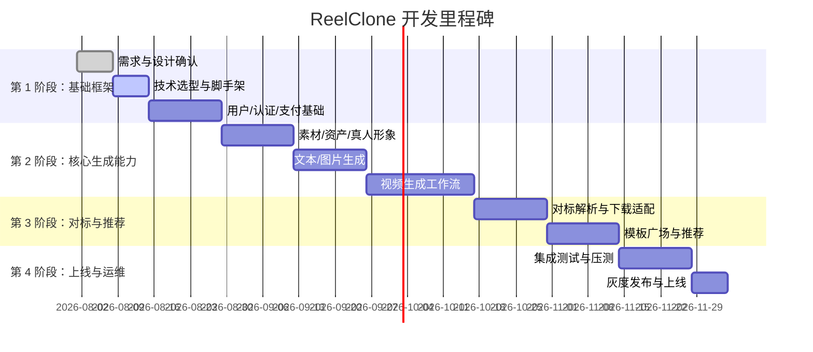

# ReelClone 开发运维计划

> 本计划基于产品 PRD 与技术架构方案，明确开发阶段、里程碑、团队分工、技术运维服务内容与范围。

---

## 一、项目概述

| 项目     | 内容                                                                                                                                                                                                 |
| -------- | ---------------------------------------------------------------------------------------------------------------------------------------------------------------------------------------------------- |
| 项目名称 | ReelClone（WouwouAI 1:1 复刻）                                                                                                                                                                       |
| 产品形态 | 微信小程序 + 后端微服务 + AI 任务流水线                                                                                                                                                              |
| 项目周期 | MVP 3 个月，完整版 6 个月                                                                                                                                                                            |
| 开发模式 | TDD + 敏捷迭代（2 周一个 Sprint）                                                                                                                                                                    |
| 部署目标 | 微信云托管（WeChat Cloud Run）+ 开发/测试环境（Docker Compose）                                                                                                                                      |
| 多端策略 | 小程序为主 + H5 Web 版按需编译（Taro 多端）                                                                                                                                                          |
| 配套文档 | [17-微信云托管部署影响分析.md](17-微信云托管部署影响分析.md)、[18-深度重构方案-微信云托管版.md](18-深度重构方案-微信云托管版.md)、[19-小程序与Web版代码复用分析.md](19-小程序与Web版代码复用分析.md) |

---

## 二、开发阶段与里程碑

### 2.1 阶段划分



### 2.2 里程碑说明

| 里程碑          | 时间        | 交付物                                             | 验收标准                             |
| --------------- | ----------- | -------------------------------------------------- | ------------------------------------ |
| M1 基础框架完成 | 第 1 个月末 | 用户服务、微信登录、手机号绑定、积分账本、支付闭环 | 可注册登录、可购买套餐、积分到账正确 |
| M2 生成能力上线 | 第 2 个月末 | 文本/图片/视频生成、作品管理、资产库               | 可完成一次文生视频并入库             |
| M3 对标解析上线 | 第 3 个月末 | 五平台视频下载、ASR/OCR/VLM 拆解、解析历史         | 可解析一条抖音视频并生成报告         |
| M4 MVP 上线     | 第 3 个月末 | 小程序提交审核、后端部署生产                       | 通过微信审核，核心流程跑通           |
| M5 完整版上线   | 第 6 个月末 | 灵感广场推荐、真人形象授权、3D 建模、团队权限      | 用户留存与付费转化达标               |

---

## 三、团队分工

### 3.1 推荐团队配置

| 角色          | 人数 | 职责                                    |
| ------------- | ---- | --------------------------------------- |
| 产品经理      | 1    | 需求确认、原型验收、上线节奏把控        |
| UI/UX 设计师  | 1    | 小程序界面设计、设计规范、切图标注      |
| 前端工程师    | 2    | 微信小程序开发、组件库、接口对接        |
| 后端工程师    | 3    | 业务服务、API 网关、数据库、工作流      |
| AI/算法工程师 | 2    | Seedance Provider、视频拆解、提示词工程 |
| 测试工程师    | 1    | 功能测试、自动化测试、压测              |
| 运维工程师    | 1    | K8s 部署、监控、CI/CD、安全             |

### 3.2 职责矩阵

| 模块                 | 负责人       | 协作人                    |
| -------------------- | ------------ | ------------------------- |
| 小程序首页/推荐/我的 | 前端工程师 A | UI 设计师                 |
| 生成工作台           | 前端工程师 B | 后端工程师 A、AI 工程师 A |
| 用户/认证/支付       | 后端工程师 A | 前端工程师 A/B            |
| 资产/作品管理        | 后端工程师 B | 前端工程师 B              |
| 生成任务/Temporal    | 后端工程师 C | AI 工程师 A/B             |
| 对标解析             | AI 工程师 A  | 后端工程师 C              |
| Seedance Provider    | AI 工程师 B  | 后端工程师 C              |
| 测试                 | 测试工程师   | 全员                      |
| 运维/部署            | 运维工程师   | 后端工程师 C              |

---

## 四、开发规范

### 4.1 代码规范

- 前端：TypeScript + ESLint + Prettier。
- 后端：NestJS + TypeScript，遵循 RESTful 接口规范。
- 数据库：迁移脚本使用 TypeORM / Prisma，禁止直接修改生产库。
- 提交规范：Conventional Commits（`feat:` / `fix:` / `docs:` / `test:` / `refactor:`）。
- 分支策略：Git Flow，`main` 为保护分支，`develop` 为日常开发，`feature/*` 为功能分支。

### 4.2 测试策略

| 测试类型 | 工具                      | 覆盖要求                         |
| -------- | ------------------------- | -------------------------------- |
| 单元测试 | Jest                      | 后端服务核心逻辑 ≥80%            |
| 集成测试 | Jest + Supertest          | 关键接口全覆盖                   |
| E2E 测试 | Playwright / 小程序自动化 | 主流程 ≥5 条                     |
| 压测     | k6 / Locust               | 生成任务提交、作品列表、支付回调 |
| 安全测试 | OWASP ZAP                 | 每季度一次                       |

### 4.3 代码审查

- 所有 PR 需至少 1 人 Code Review。
- 核心服务（支付、积分、任务状态机）需 2 人 Review。
- 合并前必须通过 CI（Lint + Test + Build）。

---

## 五、技术运维服务范围

### 5.1 服务级别目标（SLO）

| 指标             | 目标    | 说明                             |
| ---------------- | ------- | -------------------------------- |
| 系统可用性       | ≥99.9%  | 不含模型方与第三方平台不可用时段 |
| API 响应时间 P99 | ≤500ms  | 不含上传/下载大文件              |
| 生成任务成功率   | ≥95%    | 失败任务自动返还积分             |
| 支付成功率       | ≥99.5%  | 含微信支付回调异常人工处理       |
| 数据备份 RPO     | ≤1 小时 | 数据库与对象存储                 |
| 故障恢复 RTO     | ≤2 小时 | 核心服务                         |

### 5.2 运维服务内容

#### 5.2.1 基础设施运维

- Kubernetes 集群搭建与日常维护。
- PostgreSQL 主从部署、备份、恢复、慢查询优化。
- Redis 集群监控、内存告警、持久化策略。
- 对象存储 Bucket 管理、生命周期策略、CDN 配置。
- 域名、SSL 证书、WAF、DDoS 防护。

#### 5.2.2 应用运维

- 服务发布与回滚（蓝绿/金丝雀）。
- 容器镜像构建、镜像仓库管理、漏洞扫描。
- 环境管理：开发、测试、预发布、生产四环境隔离。
- 配置管理：ConfigMap/Secret，敏感信息加密。
- 定时任务管理：对账、清理、统计报表。

#### 5.2.3 监控与告警

- 指标监控：CPU/内存/磁盘/网络/QPS/延迟/错误率。
- 日志聚合：结构化日志，支持按用户/任务/Trace ID 检索。
- 分布式追踪：生成任务全链路追踪。
- 告警通道：企业微信/钉钉/短信/电话，分级告警。
- 告警规则：
  - 服务 5xx 错误率 > 1% 持续 2 分钟 → P1
  - 生成任务失败率 > 10% 持续 5 分钟 → P1
  - 支付回调延迟 > 5 分钟 → P0
  - 数据库连接数 > 80% → P2
  - 磁盘使用率 > 85% → P2

#### 5.2.4 安全运维

- 定期漏洞扫描与补丁更新。
- 访问日志审计与异常行为检测。
- 密钥轮换（数据库密码、OSS Key、支付密钥、模型 API Key）。
- 备份加密与异地容灾。
- 合规检查：ICP 备案、隐私协议、用户数据导出/删除。

### 5.3 Bug 修复流程

```
发现 Bug
    ↓
登记工单（优先级 P0/P1/P2/P3）
    ↓
复现与定位
    ↓
开发修复 → 代码 Review → 自动化测试
    ↓
部署至测试环境验证
    ↓
发布至生产（紧急 Bug 走热修复流程）
    ↓
回归验证并关闭工单
```

| 优先级 | 定义                                 | 响应时间   | 修复时间 |
| ------ | ------------------------------------ | ---------- | -------- |
| P0     | 核心流程不可用（登录/支付/生成失败） | 15 分钟    | 4 小时   |
| P1     | 重要功能异常（对标解析/作品下载）    | 1 小时     | 24 小时  |
| P2     | 一般功能问题（UI/统计/提示）         | 4 小时     | 72 小时  |
| P3     | 优化建议、非阻塞问题                 | 1 个工作日 | 排期处理 |

---

## 六、部署与发布计划

### 6.1 环境规划

| 环境       | 用途          | 部署位置                    |
| ---------- | ------------- | --------------------------- |
| 开发环境   | 本地/联调     | 开发者本地 + docker-compose |
| 测试环境   | 功能/集成测试 | K8s 测试集群                |
| 预发布环境 | 灰度验证      | K8s 生产集群独立 Namespace  |
| 生产环境   | 正式对外      | K8s 生产集群                |

### 6.2 发布流程

1. **提交 PR**：功能开发完成，关联需求/缺陷工单。
2. **CI 检查**：Lint、Unit Test、Integration Test、Build。
3. **Code Review**：通过后合并至 `develop`。
4. **部署测试环境**：自动触发，测试工程师验收。
5. **合并至 `main`**：Sprint 末或 hotfix。
6. **构建生产镜像**：镜像标签使用 Git Commit SHA。
7. **预发布验证**：金丝雀 5% 流量，观察 30 分钟。
8. **全量发布**：逐步滚动更新至 100%。
9. **发布复盘**：记录问题与改进项。

### 6.3 回滚策略

- 保留最近 5 个版本镜像。
- 一键回滚脚本：`kubectl rollout undo deployment/<service>`。
- 数据库变更使用 Flyway/Liquibase，支持向下兼容。
- 重大故障启用熔断，降级为静态提示页。

---

## 七、应急预案

### 7.1 常见故障场景

| 场景                | 现象              | 应急措施                                        |
| ------------------- | ----------------- | ----------------------------------------------- |
| Seedance 模型不可用 | 大量生成任务失败  | 切换备用 Provider、暂停新任务入口、批量返还积分 |
| 视频下载链路失效    | 对标解析大量失败  | 切换 yt-dlp、降级为仅文本分析、提示用户         |
| 微信支付回调异常    | 订单状态不一致    | 人工对账、补偿积分、排查网络/签名问题           |
| 数据库主库故障      | 写入失败          | 切换从库为主库、恢复备份、通知用户              |
| OSS 访问异常        | 素材/成品无法加载 | 检查签名 URL 有效期、切换 Bucket、CDN 刷新      |
| 小程序被封/审核驳回 | 无法访问          | 准备备用小程序账号、按微信要求整改              |

### 7.2 应急响应小组

| 角色       | 职责                         |
| ---------- | ---------------------------- |
| 值班运维   | 接收告警、初步定位、执行预案 |
| 后端负责人 | 服务级故障定位与修复         |
| AI 负责人  | 模型/拆解链路故障处理        |
| 产品负责人 | 用户通知、公告、赔付方案     |
| 客服       | 接收用户反馈、安抚、记录工单 |

---

## 八、成本估算（参考）

### 8.1 基础设施成本（月度）

| 资源           | 配置                    | 估算费用      |
| -------------- | ----------------------- | ------------- |
| K8s 节点       | 4 台 8C16G              | ¥2,500        |
| 数据库 RDS     | PostgreSQL 4C8G 主从    | ¥1,800        |
| Redis          | 4G 集群版               | ¥800          |
| 对象存储 + CDN | 按量                    | ¥1,000        |
| 域名/SSL/WAF   | 按年分摊                | ¥500          |
| 监控/日志      | Prometheus/Grafana/Loki | ¥500          |
| **小计**       |                         | **¥7,100/月** |

### 8.2 第三方服务成本（月度）

| 服务              | 说明                       | 估算费用       |
| ----------------- | -------------------------- | -------------- |
| Seedance 模型调用 | 按生成视频数量             | ¥5,000+        |
| 大语言模型 API    | 提示词润色、文案、拆解汇总 | ¥2,000+        |
| 语音识别/OCR/VLM  | 对标解析                   | ¥1,500+        |
| 短信验证码        | 按发送条数                 | ¥300+          |
| 微信支付手续费    | 按交易金额 0.6%            | 按实际         |
| 内容安全审核      | 按调用次数                 | ¥500+          |
| **小计**          |                            | **¥9,300+/月** |

### 8.3 人力成本

| 角色     | 人数  | 周期   | 估算       |
| -------- | ----- | ------ | ---------- |
| 研发团队 | 10 人 | 6 个月 | 按实际薪资 |
| 运维支持 | 1 人  | 持续   | 按实际薪资 |

---

## 九、文档与知识管理

### 9.1 必须维护的文档

| 文档           | 维护人            | 更新时机   |
| -------------- | ----------------- | ---------- |
| PRD            | 产品经理          | 需求变更   |
| 技术架构方案   | 架构师/后端负责人 | 架构调整   |
| API 文档       | 后端工程师        | 接口变更   |
| 数据库设计文档 | 后端工程师        | 模型变更   |
| 部署手册       | 运维工程师        | 环境变更   |
| 运维手册       | 运维工程师        | 流程变更   |
| 应急预案       | 运维工程师        | 演练后更新 |

### 9.2 知识沉淀

- 每个 Sprint 结束进行复盘会议，记录改进项。
- 技术债务清单定期 review，安排偿还。
- 故障案例库：每次 P0/P1 故障形成 Case Study。

---

## 十、附录

### 10.1 联系方式

| 角色       | 职责           |
| ---------- | -------------- |
| 项目经理   | 整体进度与风险 |
| 技术负责人 | 架构与技术决策 |
| 运维负责人 | 部署与稳定性   |
| 安全负责人 | 合规与安全     |

### 10.2 参考文档

- [01-完整功能点列表和说明.md](01-完整功能点列表和说明.md)
- [02-产品PRD文档.md](02-产品PRD文档.md)
- [03-技术架构方案.md](03-技术架构方案.md)
