# ReelClone 截图操作流程映射

> **版本**: v2.0（截图审计版）  
> **目标**: 建立 31 张截图之间的页面跳转、弹窗触发、状态切换关系，使无视觉能力的 LLM 能按流程图还原完整交互链路。  
> **截图目录**: `D:\Data\projects\ReelClone\01-docs\复刻项目的功能界面截图`

---

## 一、总体应用导航架构

```mermaid
flowchart TB
    subgraph TabBar["底部 TabBar"]
        Home[首页]
        Recommend[推荐]
        Create[+(创作)]
        Benchmark[对标解析]
        Mine[我的]
    end

    Home --> HomePage[FR1_首页_01]
    HomePage --> Search[搜索页]
    HomePage --> TextGen[FR2_文本生成_01]
    HomePage --> ImageGen[FR2_图片生成_01]
    HomePage --> VideoGen[FR2_视频生成_01/02/03/04/05/06]
    HomePage --> BenchmarkPage[FR3_对标解析_01]
    HomePage --> Inspiration[FR4_灵感广场/推荐]

    Recommend --> RecommendPage[FR4_推荐_01]
    RecommendPage --> IndustryBind[FR4_灵感广场_01]
    RecommendPage --> TemplateList[FR4_灵感广场_03]

    Create --> CreateMenu[FR5_个人中心_02]
    CreateMenu --> TextGen
    CreateMenu --> ImageGen
    CreateMenu --> VideoGen
    CreateMenu --> BenchmarkPage

    Benchmark --> BenchmarkPage

    Mine --> MinePage[FR5_个人中心_01]
    MinePage --> Settings[FR6_设置_01]
    MinePage --> MyWorks[FR8_我的作品_01]
    MinePage --> MyAssets[FR7_我的资产_01]
    MinePage --> CreateMenu

    Settings --> BindMobile[FR6_设置_03]
    Settings --> ChangePassword[FR6_设置_04]
    Settings --> MyPackage[FR10_套餐积分_02]
    Settings --> Consumption[FR10_套餐积分_03]
    Settings --> MyOrders[FR10_套餐积分_04]
    Settings --> About[FR11_关于_01]
    Settings --> MyTemplates[FR9_我的模板_01]
    Settings --> MyWorks
    Settings --> MyAssets
    Settings --> BenchmarkPage

    MyPackage --> SubscribePlan[FR10_套餐积分_01]
    MyOrders --> SubscribePlan
```

---

## 二、流程编号规则

| 编号段 | 含义 | 示例 |
|--------|------|------|
| `FL-1.x` | 首页相关流程 | FL-1.1 首页进入文本生成 |
| `FL-2.x` | 生成工作台相关流程 | FL-2.3 视频生成子类型切换 |
| `FL-3.x` | 对标解析流程 | FL-3.1 提交竞品链接分析 |
| `FL-4.x` | 灵感广场/推荐流程 | FL-4.1 首次进入绑定行业偏好 |
| `FL-5.x` | 个人中心流程 | FL-5.1 展开快捷创作菜单 |
| `FL-6.x` | 设置流程 | FL-6.1 进入设置页 |
| `FL-7.x` | 我的资产流程 | FL-7.1 上传素材 |
| `FL-8.x` | 我的作品流程 | FL-8.1 查看作品列表 |
| `FL-9.x` | 我的模板流程 | FL-9.1 查看空状态 |
| `FL-10.x` | 套餐积分流程 | FL-10.1 查看订阅计划 |
| `FL-11.x` | 关于流程 | FL-11.1 打开关于弹窗 |

---

## 三、核心流程映射

### FL-1 首页流程

#### FL-1.1 首页 → 文本生成

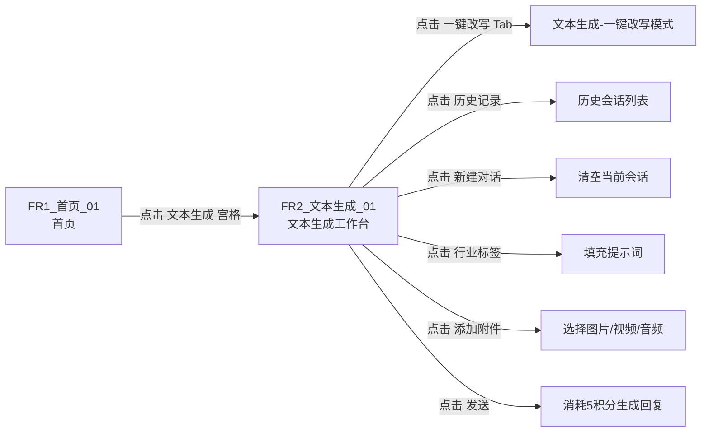

#### FL-1.2 首页 → 图片生成

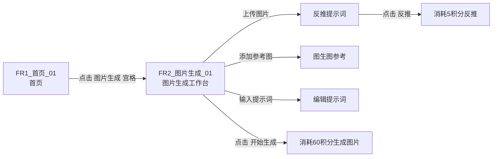

#### FL-1.3 首页 → 视频生成

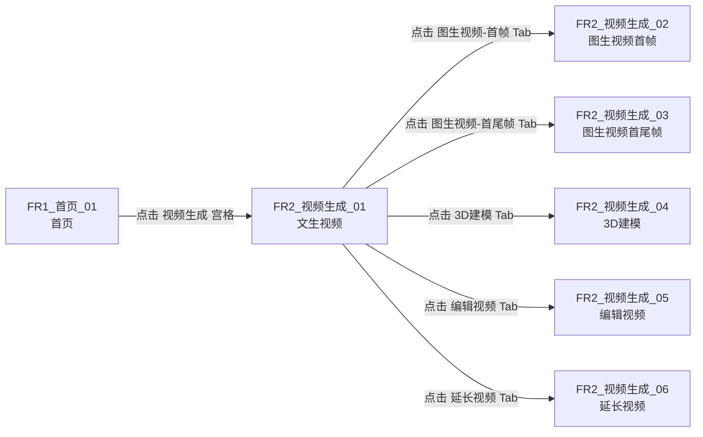

#### FL-1.4 首页 → 对标解析

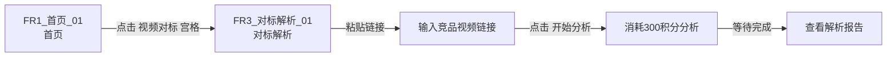

#### FL-1.5 首页 → 灵感模板/推荐

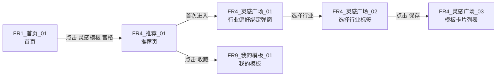

---

### FL-2 生成工作台内部流程

#### FL-2.1 文本/图片/视频生成 Tab 切换

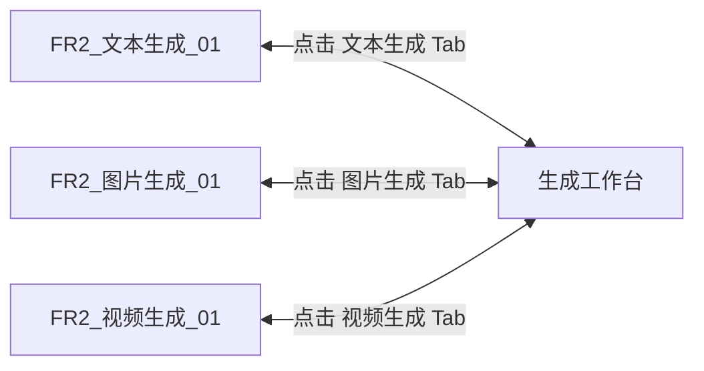

#### FL-2.2 视频生成子类型切换

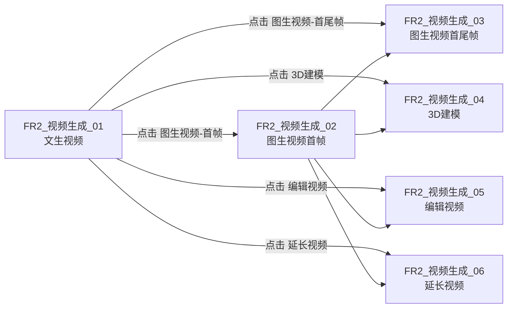

#### FL-2.3 视频生成通用提交流程

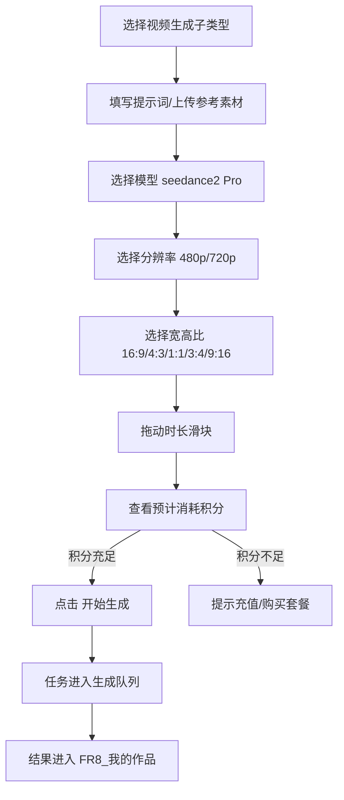

---

### FL-3 对标解析流程

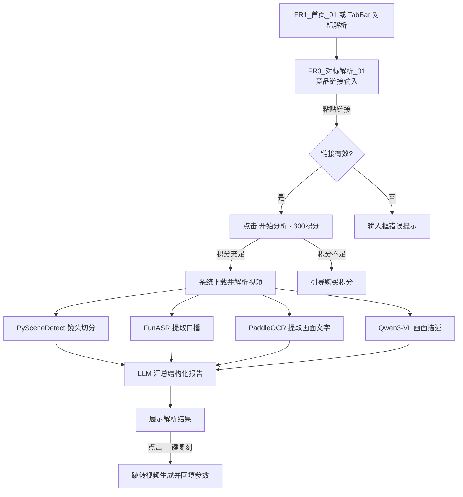

---

### FL-4 灵感广场/推荐流程

#### FL-4.1 首次进入推荐页

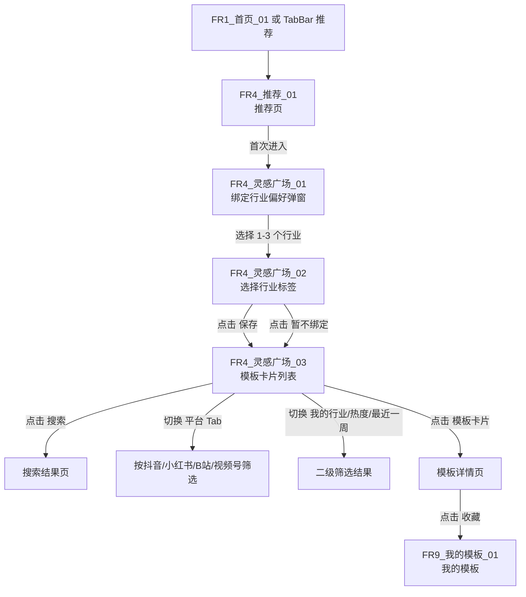

#### FL-4.2 推荐页分类浏览

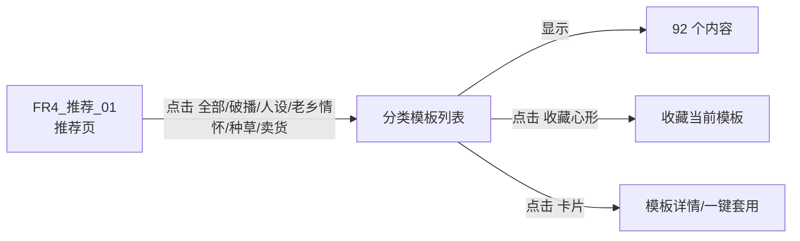

---

### FL-5 个人中心流程

#### FL-5.1 我的主页

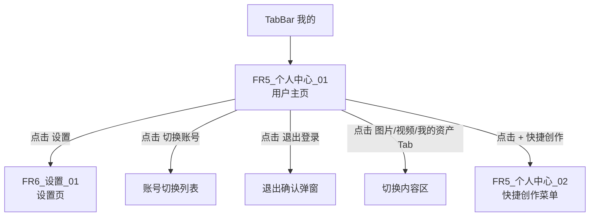

#### FL-5.2 快捷创作菜单

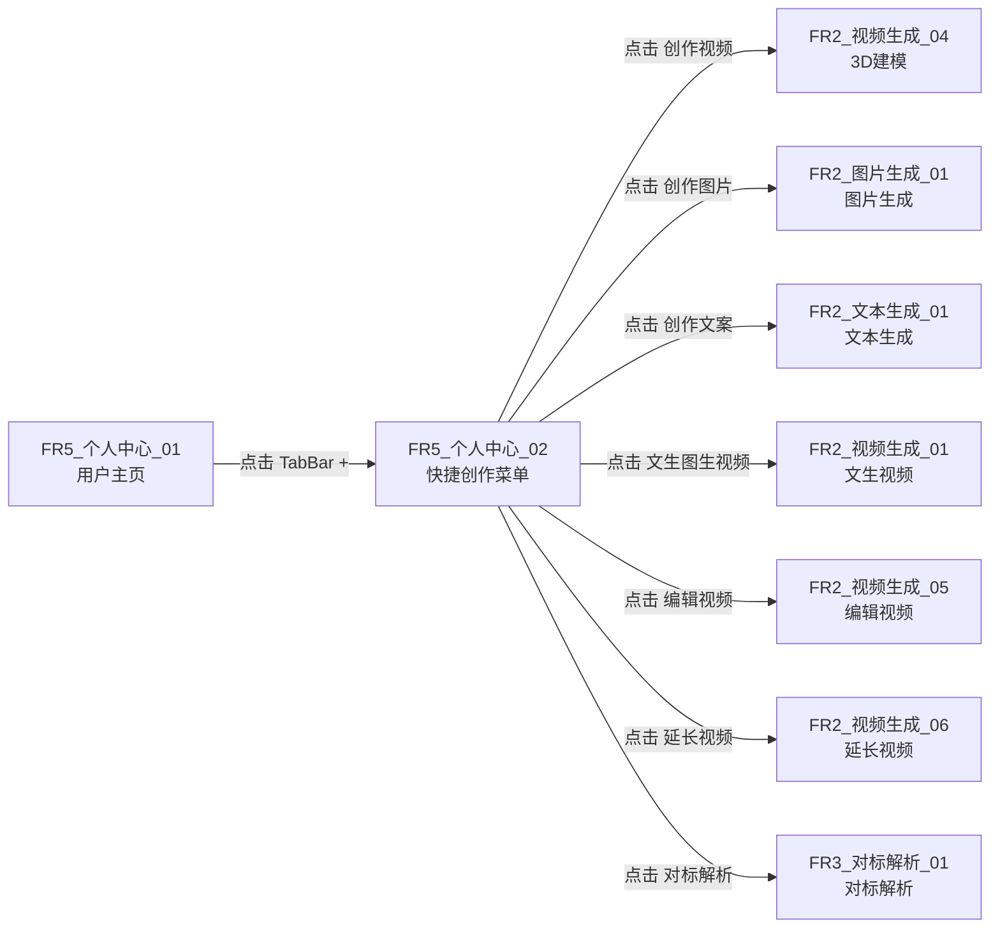

---

### FL-6 设置流程

#### FL-6.1 设置页入口与子页

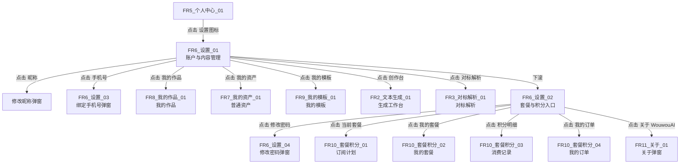

#### FL-6.2 绑定手机号流程

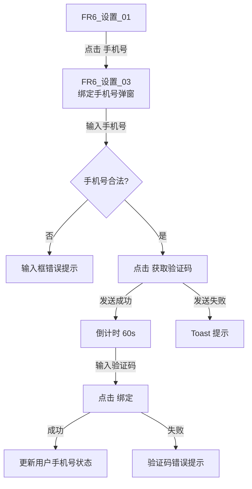

#### FL-6.3 修改密码流程

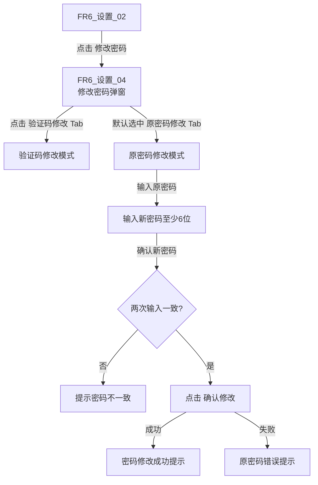

---

### FL-7 我的资产流程

#### FL-7.1 普通资产管理

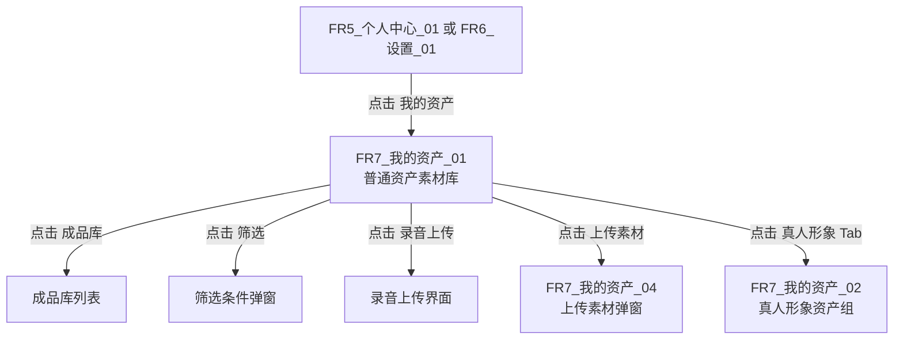

#### FL-7.2 真人形象资产组管理

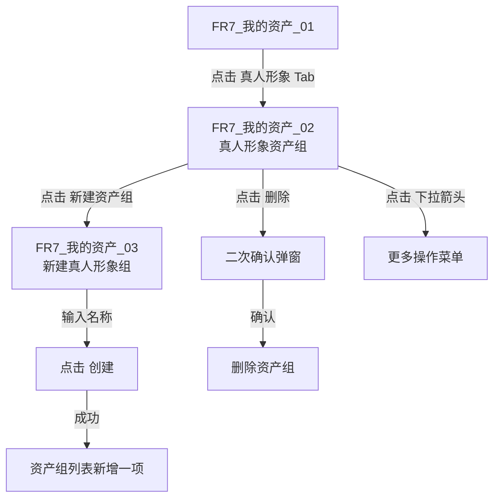

#### FL-7.3 上传素材流程

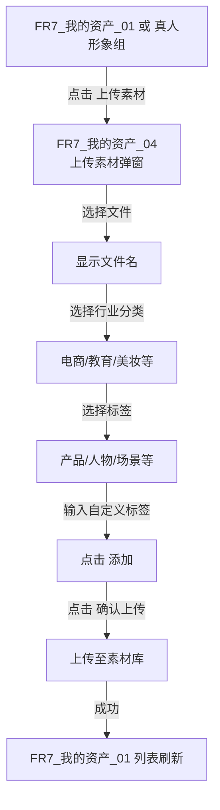

---

### FL-8 我的作品流程

```mermaid
flowchart TD
    A[FR5_个人中心_01 或 FR6_设置_01] -->|点击 我的作品| B[FR8_我的作品_01<br/>作品列表]
    B -->|点击 创作新作品| C[FR2_文本生成_01<br/>生成工作台]
    B -->|切换 图像/视频 Tab| D[切换作品类型]
    B -->|切换 全部/生成中/已完成/失败| E[状态筛选]
    B -->|点击 作品卡片| F[作品详情/预览/下载/再创作]
```

---

### FL-9 我的模板流程

```mermaid
flowchart TD
    A[FR6_设置_01 或 FR4_推荐_01] -->|点击 我的模板/收藏| B[FR9_我的模板_01<br/>我的模板空状态]
    B -->|空状态| C[提示去推荐页收藏]
    B -->|存在收藏| D[模板卡片列表]
```

---

### FL-10 套餐积分流程

#### FL-10.1 套餐购买

```mermaid
flowchart TD
    A[FR6_设置_02] -->|点击 当前套餐/我的套餐/我的订单| B[FR10_套餐积分_02<br/>我的套餐]
    B -->|点击 立即订阅| C[FR10_套餐积分_01<br/>订阅计划]
    C -->|选择套餐| D[调起微信支付]
    D -->|支付成功| E[积分/套餐到账]
    D -->|支付失败| F[保留订单待支付]
```

#### FL-10.2 消费记录查看

```mermaid
flowchart TD
    A[FR6_设置_02] -->|点击 积分明细| B[FR10_套餐积分_03<br/>消费记录]
    B -->|展示| C[本月已用 0 积分]
    B -->|下滚| D[流水明细列表]
    D -->|空状态| E[暂无消费记录]
```

#### FL-10.3 订单管理

```mermaid
flowchart TD
    A[FR6_设置_02] -->|点击 我的订单| B[FR10_套餐积分_04<br/>我的订单]
    B -->|点击 购买套餐| C[FR10_套餐积分_01<br/>订阅计划]
    B -->|空状态| D[浏览套餐计划按钮]
    B -->|存在订单| E[订单列表]
```

---

### FL-11 关于流程

```mermaid
flowchart LR
    A[FR6_设置_02] -->|点击 关于 WouwouAI| B[FR11_关于_01<br/>关于弹窗]
    B -->|展示| C[Logo + 产品名 + Slogan + 版本号]
    B -->|点击 关闭| D[返回 FR6_设置_02]
```

---

## 四、全量截图流程节点总表

| 流程编号 | 流程名称 | 起点 | 终点 | 涉及截图 | 触发动作 |
|----------|----------|------|------|----------|----------|
| FL-1.1 | 首页 → 文本生成 | 首页 | 文本生成工作台 | FR1, FR2_文本生成 | 点击 文本生成 宫格 |
| FL-1.2 | 首页 → 图片生成 | 首页 | 图片生成工作台 | FR1, FR2_图片生成 | 点击 图片生成 宫格 |
| FL-1.3 | 首页 → 视频生成 | 首页 | 视频生成工作台 | FR1, FR2_视频生成_* | 点击 视频生成 宫格 |
| FL-1.4 | 首页 → 对标解析 | 首页 | 对标解析页 | FR1, FR3 | 点击 视频对标 宫格 |
| FL-1.5 | 首页 → 灵感模板 | 首页 | 推荐页 | FR1, FR4_* | 点击 灵感模板 宫格 |
| FL-2.1 | 生成工作台 Tab 切换 | 任一工作台 | 另一工作台 | FR2_文本生成, FR2_图片生成, FR2_视频生成_* | 点击顶部 Tab |
| FL-2.2 | 视频生成子类型切换 | 文生视频 | 其他子类型 | FR2_视频生成_* | 点击二级 Tab |
| FL-2.3 | 视频生成提交 | 视频生成页 | 我的作品 | FR2_视频生成_*, FR8 | 点击 开始生成 |
| FL-3.1 | 提交对标解析 | 对标解析页 | 解析报告 | FR3 | 点击 开始分析 |
| FL-4.1 | 首次进入推荐页 | 推荐页 | 模板列表 | FR4_* | 进入推荐页 |
| FL-4.2 | 推荐页分类浏览 | 推荐页 | 模板详情 | FR4_推荐_01 | 点击分类/卡片 |
| FL-5.1 | 进入个人中心 | TabBar | 我的主页 | FR5_个人中心_01 | 点击 我的 |
| FL-5.2 | 展开快捷创作菜单 | 我的主页 | 创作菜单浮层 | FR5_个人中心_01, FR5_个人中心_02 | 点击 TabBar + |
| FL-6.1 | 进入设置页 | 我的主页 | 设置页 | FR5_个人中心_01, FR6_设置_01/02 | 点击 设置 |
| FL-6.2 | 绑定手机号 | 设置页 | 绑定成功 | FR6_设置_01, FR6_设置_03 | 点击 手机号 |
| FL-6.3 | 修改密码 | 设置页 | 修改成功 | FR6_设置_02, FR6_设置_04 | 点击 修改密码 |
| FL-7.1 | 管理普通资产 | 设置/我的主页 | 普通资产 | FR5/FR6, FR7_我的资产_01 | 点击 我的资产 |
| FL-7.2 | 管理真人形象 | 普通资产 | 真人形象 | FR7_我的资产_01/02/03 | 切换 Tab/新建 |
| FL-7.3 | 上传素材 | 资产页 | 素材上传成功 | FR7_我的资产_01/04 | 点击 上传素材 |
| FL-8.1 | 查看作品 | 设置/我的主页 | 作品列表 | FR5/FR6, FR8 | 点击 我的作品 |
| FL-9.1 | 查看模板收藏 | 设置页 | 我的模板 | FR6_设置_01, FR9 | 点击 我的模板 |
| FL-10.1 | 购买套餐 | 设置页 | 订阅计划 | FR6_设置_02, FR10_套餐积分_01/02/04 | 点击 我的套餐/订单 |
| FL-10.2 | 查看消费记录 | 设置页 | 消费记录 | FR6_设置_02, FR10_套餐积分_03 | 点击 积分明细 |
| FL-11.1 | 查看关于 | 设置页 | 关于弹窗 | FR6_设置_02, FR11 | 点击 关于 WouwouAI |

---

## 五、状态切换映射

### 弹窗/浮层触发与关闭

| 触发源 | 触发动作 | 打开弹窗/浮层 | 关闭方式 |
|--------|----------|---------------|----------|
| FR4_推荐_01 / 首次进入 | 进入推荐页 | FR4_灵感广场_01 行业偏好绑定弹窗 | 点击 × / 保存 / 暂不绑定 |
| FR6_设置_01 | 点击 手机号 | FR6_设置_03 绑定手机号弹窗 | 点击 取消 / 绑定成功 |
| FR6_设置_02 | 点击 修改密码 | FR6_设置_04 修改密码弹窗 | 点击 取消 / 确认修改 |
| FR5_个人中心_01 | 点击 TabBar + | FR5_个人中心_02 快捷创作菜单浮层 | 点击遮罩 / 选择功能 |
| FR6_设置_02 | 点击 关于 WouwouAI | FR11_关于_01 关于弹窗 | 点击 关闭 |
| FR7_我的资产_01 | 点击 上传素材 | FR7_我的资产_04 上传素材弹窗 | 点击 × / 确认上传 |
| FR7_我的资产_02 | 点击 新建资产组 | FR7_我的资产_03 新建输入区 | 点击 取消 / 创建 |

### Tab 切换映射

| 页面 | Tab 组 | 可切换项 |
|------|--------|----------|
| 生成工作台 | 一级 Tab | 文本生成 / 图片生成 / 视频生成 |
| 文本生成 | 子 Tab | 对话 / 一键改写 |
| 视频生成 | 二级 Tab | 文生视频 / 图生视频-首帧 / 图生视频-首尾帧 / 3D建模 / 编辑视频 / 延长视频 |
| 个人中心 | 作品 Tab | 图片 / 视频 / 我的资产 |
| 我的资产 | 资产类型 Tab | 普通资产 / 真人形象 |
| 我的作品 | 类型 Tab | 图像 / 视频 |
| 我的作品 | 状态筛选 | 全部 / 生成中 / 已完成 / 失败 |
| 灵感广场 | 平台筛选 | 全部 / 抖音 / 小红书 / B站 / 视频号 |
| 修改密码 | 方式 Tab | 验证码修改 / 原密码修改 |

---

## 六、关键业务流程串联

### 完整创作闭环

```mermaid
flowchart TD
    Start[用户打开小程序] --> Home[FR1_首页_01]
    Home -->|点击 视频生成| Workbench[FR2_视频生成_01 文生视频]
    Workbench -->|缺少素材| AssetLib[FR7_我的资产_01 素材库]
    AssetLib -->|上传素材| UploadDialog[FR7_我的资产_04 上传素材]
    UploadDialog -->|确认上传| AssetLib
    AssetLib -->|选择素材| Workbench
    Workbench -->|配置参数| Submit{积分充足?}
    Submit -->|是| TaskQueue[任务队列]
    Submit -->|否| Recharge[FR10_套餐积分_01 订阅计划]
    Recharge -->|支付成功| Submit
    TaskQueue -->|生成完成| MyWorks[FR8_我的作品_01]
    MyWorks -->|预览/下载/再创作| Done[完成]
```

### 爆款复刻闭环

```mermaid
flowchart TD
    Start[用户发现竞品视频] --> CopyLink[复制视频链接]
    CopyLink --> Benchmark[FR3_对标解析_01]
    Benchmark -->|粘贴链接| Analyze{积分充足?}
    Analyze -->|是| Download[下载并解析视频]
    Analyze -->|否| Recharge[FR10_套餐积分_01]
    Download --> ASR[FunASR 口播]
    Download --> OCR[PaddleOCR 画面文字]
    Download --> Scene[镜头切分]
    Download --> VLM[Qwen3-VL 画面描述]
    ASR --> Report[结构化拆解报告]
    OCR --> Report
    Scene --> Report
    VLM --> Report
    Report --> Clone[一键复刻]
    Clone --> Workbench[FR2_视频生成 自动回填参数]
    Workbench --> Generate[AI 生成新视频]
    Generate --> MyWorks[FR8_我的作品_01]
```
