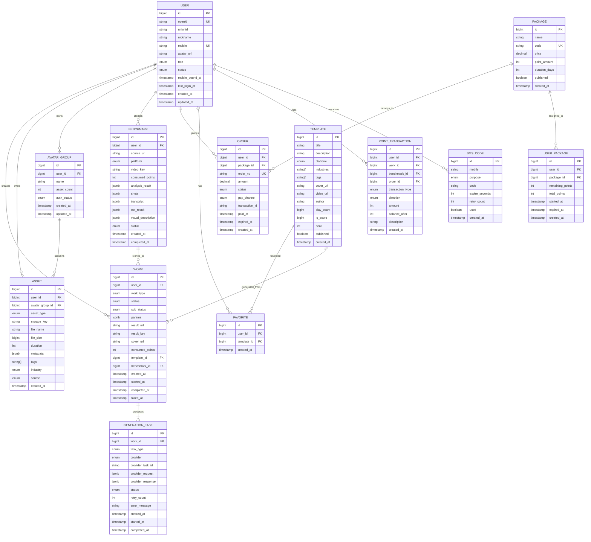
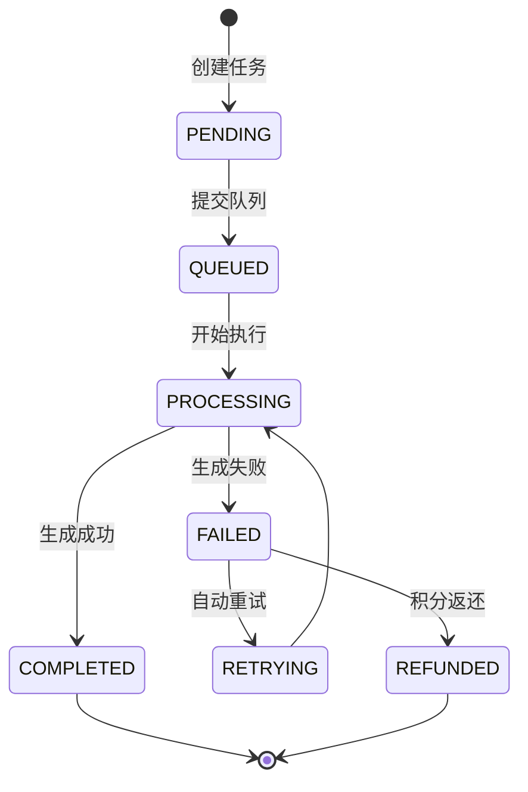
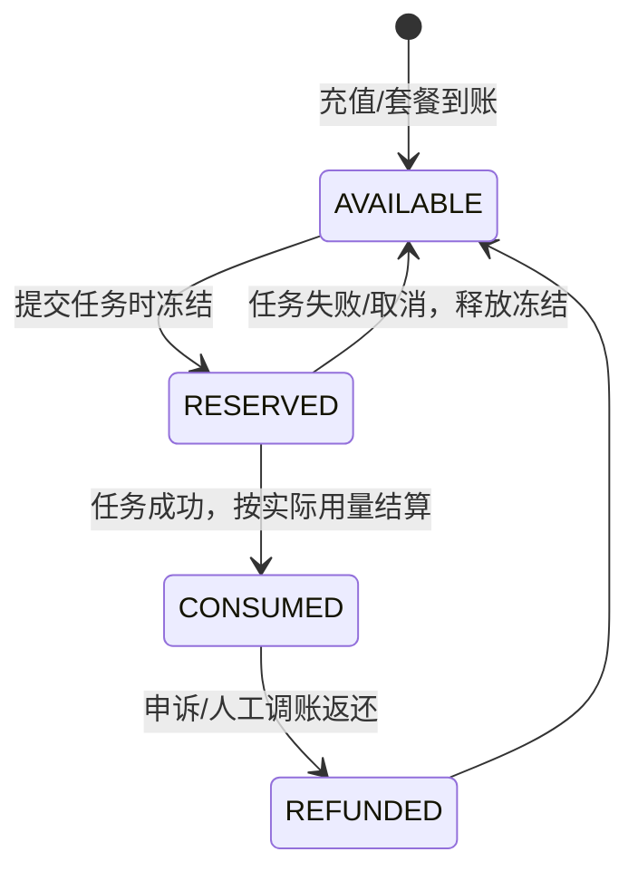
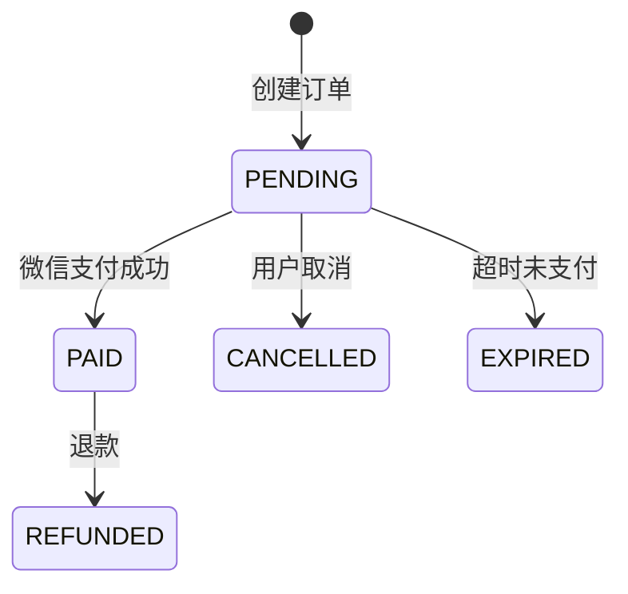
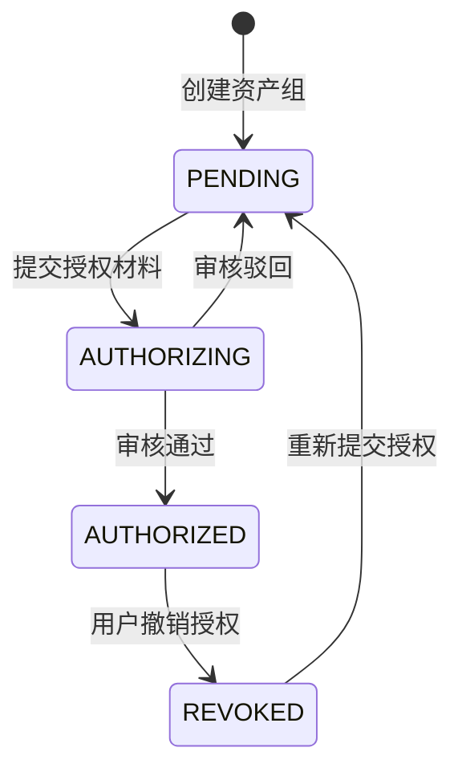

# ReelClone 数据模型设计

> **版本**: v2.0（截图审计版）  
> **目标**: 基于截图视觉审计与流程映射，推导完整的数据实体、字段约束、关联关系与状态机，为后端数据库设计提供唯一事实来源。  
> **建模原则**: 第三范式为主，JSONB 存储动态配置，状态机显式定义，所有枚举值全量列出。

---

## 一、实体关系总图



---

## 二、实体字段详细说明

### 2.1 USER（用户）

**说明**: 微信小程序用户，一个 OpenID 对应一个用户。

| 字段名 | 类型 | 约束 | 默认值 | 说明 |
|--------|------|------|--------|------|
| id | bigint | PK, auto_increment | - | 内部用户 ID（截图中展示为 1569） |
| openid | string(64) | UK, not null | - | 微信 OpenID |
| unionid | string(64) | nullable | - | 微信 UnionID |
| nickname | string(64) | not null | `微信用户` + 随机后缀 | 截图中展示 `微信用户7saJt8` |
| mobile | string(16) | UK, nullable | - | 绑定手机号 |
| avatar_url | string(512) | nullable | - | 头像 URL |
| role | enum | not null | `USER` | `USER` / `ADMIN` / `AGENT` |
| status | enum | not null | `ACTIVE` | `ACTIVE` / `FROZEN` / `DELETED` |
| mobile_bound_at | timestamp | nullable | - | 手机号绑定时间 |
| last_login_at | timestamp | nullable | - | 最后登录时间 |
| created_at | timestamp | not null | now() | 注册时间 |
| updated_at | timestamp | not null | now() | 更新时间 |

---

### 2.2 WORK（作品）

**说明**: 用户创作的图片/视频作品，一个作品可能对应多次生成任务（重试/再创作）。

| 字段名 | 类型 | 约束 | 默认值 | 说明 |
|--------|------|------|--------|------|
| id | bigint | PK | - | 作品 ID |
| user_id | bigint | FK → USER.id, not null | - | 创作者 |
| work_type | enum | not null | - | `TEXT` / `IMAGE` / `VIDEO` |
| status | enum | not null | `PENDING` | 作品状态 |
| sub_status | enum | nullable | - | 细分状态 |
| params | jsonb | not null | `{}` | 生成参数（提示词、模型、分辨率、时长等） |
| result_url | string(1024) | nullable | - | 结果文件访问 URL |
| result_key | string(512) | nullable | - | 对象存储 Key |
| cover_url | string(1024) | nullable | - | 封面图 URL |
| consumed_points | int | not null, ≥0 | 0 | 实际消耗积分 |
| template_id | bigint | FK → TEMPLATE.id, nullable | - | 来源模板 |
| benchmark_id | bigint | FK → BENCHMARK.id, nullable | - | 来源对标解析 |
| created_at | timestamp | not null | now() | 创建时间 |
| started_at | timestamp | nullable | - | 开始生成时间 |
| completed_at | timestamp | nullable | - | 完成时间 |
| failed_at | timestamp | nullable | - | 失败时间 |

#### WORK.params 示例结构

```json
{
  "generationType": "TEXT_TO_VIDEO",
  "prompt": "一位年轻女性在海边奔跑...",
  "model": "seedance2-pro",
  "resolution": "480p",
  "aspectRatio": "9:16",
  "duration": 5,
  "referenceImages": ["asset_key_1", "asset_key_2"],
  "referenceVideo": "asset_key_3",
  "referenceAudio": "asset_key_4",
  "firstFrame": "asset_key_5",
  "lastFrame": "asset_key_6"
}
```

---

### 2.3 GENERATION_TASK（生成任务）

**说明**: 一次具体的 AI 模型调用任务，与作品 1:N 关联（支持重试）。

| 字段名 | 类型 | 约束 | 默认值 | 说明 |
|--------|------|------|--------|------|
| id | bigint | PK | - | 任务 ID |
| work_id | bigint | FK → WORK.id, not null | - | 所属作品 |
| task_type | enum | not null | - | `TEXT` / `IMAGE` / `VIDEO` / `PROMPT_POLISH` / `PROMPT_REVERSE` |
| provider | enum | not null | - | `SEEDANCE` / `QWEN_VL` / `FUNASR` / `PADDLEOCR` / `LLM` |
| provider_task_id | string(128) | nullable | - | 模型方任务 ID |
| provider_request | jsonb | not null | `{}` | 请求参数 |
| provider_response | jsonb | nullable | - | 响应结果 |
| status | enum | not null | `PENDING` | 任务状态 |
| retry_count | int | not null, ≥0 | 0 | 重试次数 |
| error_message | text | nullable | - | 失败原因 |
| created_at | timestamp | not null | now() | 创建时间 |
| started_at | timestamp | nullable | - | 开始执行时间 |
| completed_at | timestamp | nullable | - | 完成时间 |

---

### 2.4 ASSET（素材/资产）

**说明**: 用户上传的原始素材或 AI 生成的成品。

| 字段名 | 类型 | 约束 | 默认值 | 说明 |
|--------|------|------|--------|------|
| id | bigint | PK | - | 资产 ID |
| user_id | bigint | FK → USER.id, not null | - | 所有者 |
| avatar_group_id | bigint | FK → AVATAR_GROUP.id, nullable | - | 所属真人形象组 |
| asset_type | enum | not null | - | `IMAGE` / `VIDEO` / `AUDIO` / `MATERIAL` / `FINISHED` |
| storage_key | string(512) | not null | - | 对象存储 Key |
| file_name | string(255) | not null | - | 原始文件名，如 `recording-1785208093713.webm` |
| file_size | bigint | not null, ≥0 | 0 | 文件大小（字节） |
| duration | int | nullable, ≥0 | - | 音视频时长（秒） |
| metadata | jsonb | not null | `{}` | 宽度/高度/码率/格式等 |
| tags | string[] | not null | `{}` | 产品/人物/场景/背景音乐/特效/素材/模板/Logo |
| industry | enum | nullable | - | 电商/教育/美妆/餐饮/房产/科技/医疗/汽车/金融/其他 |
| source | enum | not null | `UPLOAD` | `UPLOAD` / `CAMERA` / `WORK` / `ASSET_LIBRARY` |
| created_at | timestamp | not null | now() | 上传时间 |

---

### 2.5 AVATAR_GROUP（真人形象资产组）

**说明**: 管理真人形象素材的集合，需关联授权信息。

| 字段名 | 类型 | 约束 | 默认值 | 说明 |
|--------|------|------|--------|------|
| id | bigint | PK | - | 资产组 ID |
| user_id | bigint | FK → USER.id, not null | - | 所有者 |
| name | string(64) | not null | - | 组名称，如 `test` |
| asset_count | int | not null, ≥0 | 0 | 素材数量（截图中展示 `0 个素材`） |
| auth_status | enum | not null | `PENDING` | 授权状态 |
| created_at | timestamp | not null | now() | 创建时间 |
| updated_at | timestamp | not null | now() | 更新时间 |

---

### 2.6 BENCHMARK（对标解析）

**说明**: 用户提交的竞品视频解析记录。

| 字段名 | 类型 | 约束 | 默认值 | 说明 |
|--------|------|------|--------|------|
| id | bigint | PK | - | 解析 ID |
| user_id | bigint | FK → USER.id, not null | - | 提交者 |
| source_url | string(1024) | not null | - | 原始视频链接 |
| platform | enum | not null | - | `DOUYIN` / `XIAOHONGSHU` / `BILIBILI` / `KUAISHOU` / `WEIBO` |
| video_key | string(512) | nullable | - | 下载后的本地存储 Key |
| consumed_points | int | not null, ≥0 | 300 | 消耗积分 |
| analysis_result | jsonb | nullable | - | 结构化拆解报告 |
| shots | jsonb | nullable | - | 镜头切分结果 `[{start, end, description}]` |
| transcript | jsonb | nullable | - | ASR 口播文本 `[{start, end, text}]` |
| ocr_result | jsonb | nullable | - | OCR 画面文字 `[{frame, text}]` |
| visual_description | jsonb | nullable | - | VLM 画面描述 `[{frame, description}]` |
| status | enum | not null | `PENDING` | 解析状态 |
| created_at | timestamp | not null | now() | 提交时间 |
| completed_at | timestamp | nullable | - | 完成时间 |

#### BENCHMARK.analysis_result 示例结构

```json
{
  "style": "口播种草风格，节奏紧凑",
  "shots": [
    {"index": 1, "start": 0, "end": 3, "description": "全景展示产品"},
    {"index": 2, "start": 3, "end": 8, "description": "中景人物手持产品"}
  ],
  "copywriting": "大家好，今天给大家推荐一款...",
  "rhythm": "前3秒抓眼球，每5秒一个卖点",
  "sellingPoints": ["价格优势", "使用场景", "用户痛点"],
  "suggestedPrompt": "一位年轻女性手持..."
}
```

---

### 2.7 TEMPLATE（模板）

**说明**: 灵感广场/推荐中的模板资源。

| 字段名 | 类型 | 约束 | 默认值 | 说明 |
|--------|------|------|--------|------|
| id | bigint | PK | - | 模板 ID |
| title | string(128) | not null | - | 标题，如 `减肥种草模版` |
| description | text | nullable | - | 详细描述 |
| platform | enum | not null | - | `DOUYIN` / `XIAOHONGSHU` / `BILIBILI` / `SHIPINHAO` |
| industries | string[] | not null | `{}` | 适用行业 |
| tags | string[] | not null | `{}` | 破播/人设/老乡情怀/种草/卖货/同城IP |
| cover_url | string(1024) | not null | - | 封面图 |
| video_url | string(1024) | nullable | - | 预览视频 |
| author | string(64) | nullable | - | 作者，如 `老师好我叫何同学` |
| play_count | bigint | not null, ≥0 | 0 | 播放量，如 `28377000` |
| iq_score | bigint | not null, ≥0 | 0 | IQ 热度值，如 `8513000` |
| heat | int | not null, ≥0 | 0 | 热度排序值 |
| published | boolean | not null | true | 是否上线 |
| created_at | timestamp | not null | now() | 创建时间 |

---

### 2.8 FAVORITE（模板收藏）

**说明**: 用户收藏的模板。

| 字段名 | 类型 | 约束 | 默认值 | 说明 |
|--------|------|------|--------|------|
| id | bigint | PK | - | 收藏 ID |
| user_id | bigint | FK → USER.id, not null | - | 用户 |
| template_id | bigint | FK → TEMPLATE.id, not null | - | 模板 |
| created_at | timestamp | not null | now() | 收藏时间 |

**唯一约束**: (user_id, template_id)

---

### 2.9 PACKAGE（套餐）

**说明**: 系统定义的积分套餐。

| 字段名 | 类型 | 约束 | 默认值 | 说明 |
|--------|------|------|--------|------|
| id | bigint | PK | - | 套餐 ID |
| name | string(64) | not null | - | 套餐名称，如 `基础版` |
| code | string(32) | UK, not null | - | 套餐编码 |
| price | decimal(10,2) | not null, ≥0 | - | 价格（元） |
| point_amount | int | not null, ≥0 | - | 包含积分数量 |
| duration_days | int | not null, ≥0 | - | 有效期（天） |
| published | boolean | not null | true | 是否上架 |
| created_at | timestamp | not null | now() | 创建时间 |

---

### 2.10 USER_PACKAGE（用户套餐）

**说明**: 用户购买的套餐实例，记录剩余积分与有效期。

| 字段名 | 类型 | 约束 | 默认值 | 说明 |
|--------|------|------|--------|------|
| id | bigint | PK | - | 用户套餐 ID |
| user_id | bigint | FK → USER.id, not null | - | 用户 |
| package_id | bigint | FK → PACKAGE.id, not null | - | 套餐 |
| remaining_points | int | not null, ≥0 | - | 剩余积分 |
| total_points | int | not null, ≥0 | - | 总积分 |
| started_at | timestamp | not null | - | 生效时间 |
| expired_at | timestamp | not null | - | 过期时间 |
| created_at | timestamp | not null | now() | 创建时间 |

---

### 2.11 ORDER（订单）

**说明**: 用户购买套餐的订单。

| 字段名 | 类型 | 约束 | 默认值 | 说明 |
|--------|------|------|--------|------|
| id | bigint | PK | - | 订单 ID |
| user_id | bigint | FK → USER.id, not null | - | 购买者 |
| package_id | bigint | FK → PACKAGE.id, not null | - | 购买套餐 |
| order_no | string(32) | UK, not null | - | 订单号 |
| amount | decimal(10,2) | not null, ≥0 | - | 订单金额 |
| status | enum | not null | `PENDING` | 订单状态 |
| pay_channel | enum | nullable | - | `WECHAT_PAY` |
| transaction_id | string(64) | nullable | - | 微信支付流水号 |
| paid_at | timestamp | nullable | - | 支付时间 |
| expired_at | timestamp | nullable | - | 订单过期时间 |
| created_at | timestamp | not null | now() | 创建时间 |

---

### 2.12 POINT_TRANSACTION（积分流水）

**说明**: 积分变动流水，与 Formance Ledger 对账。

| 字段名 | 类型 | 约束 | 默认值 | 说明 |
|--------|------|------|--------|------|
| id | bigint | PK | - | 流水 ID |
| user_id | bigint | FK → USER.id, not null | - | 用户 |
| work_id | bigint | FK → WORK.id, nullable | - | 关联作品 |
| benchmark_id | bigint | FK → BENCHMARK.id, nullable | - | 关联对标解析 |
| order_id | bigint | FK → ORDER.id, nullable | - | 关联订单 |
| transaction_type | enum | not null | - | 交易类型 |
| direction | enum | not null | - | `CREDIT` / `DEBIT` |
| amount | int | not null | - | 变动数量（正数） |
| balance_after | int | not null | - | 变动后余额 |
| description | string(255) | not null | - | 说明 |
| created_at | timestamp | not null | now() | 交易时间 |

---

### 2.13 SMS_CODE（短信验证码）

**说明**: 手机号绑定/修改密码的验证码。

| 字段名 | 类型 | 约束 | 默认值 | 说明 |
|--------|------|------|--------|------|
| id | bigint | PK | - | 验证码 ID |
| mobile | string(16) | not null | - | 手机号 |
| purpose | enum | not null | - | `BIND_MOBILE` / `CHANGE_PASSWORD` |
| code | string(8) | not null | - | 验证码 |
| expire_seconds | int | not null | 300 | 有效期 5 分钟 |
| retry_count | int | not null, ≥0 | 0 | 验证重试次数 |
| used | boolean | not null | false | 是否已使用 |
| created_at | timestamp | not null | now() | 发送时间 |

---

## 三、枚举值全量定义

### 3.1 USER.role

| 值 | 说明 |
|----|------|
| `USER` | 普通用户 |
| `ADMIN` | 管理员 |
| `AGENT` | 代理商 |

### 3.2 USER.status

| 值 | 说明 |
|----|------|
| `ACTIVE` | 正常 |
| `FROZEN` | 冻结 |
| `DELETED` | 已注销 |

### 3.3 WORK.work_type

| 值 | 说明 |
|----|------|
| `TEXT` | 文本生成结果 |
| `IMAGE` | 图片作品 |
| `VIDEO` | 视频作品 |

### 3.4 WORK.status



| 值 | 说明 |
|----|------|
| `PENDING` | 待提交（仅创建记录） |
| `QUEUED` | 已入队 |
| `PROCESSING` | 生成中 |
| `COMPLETED` | 已完成 |
| `FAILED` | 失败 |
| `RETRYING` | 重试中 |
| `REFUNDED` | 已退款 |

### 3.5 GENERATION_TASK.task_type

| 值 | 说明 |
|----|------|
| `TEXT` | 文本生成 |
| `IMAGE` | 图片生成 |
| `VIDEO` | 视频生成 |
| `PROMPT_POLISH` | 提示词润色 |
| `PROMPT_REVERSE` | 提示词反推 |
| `BENCHMARK_ANALYSIS` | 对标解析 |

### 3.6 GENERATION_TASK.provider

| 值 | 说明 |
|----|------|
| `SEEDANCE` | 火山 Seedance |
| `QWEN_VL` | 通义千问 VLM |
| `FUNASR` | FunASR 语音识别 |
| `PADDLEOCR` | PaddleOCR |
| `LLM` | 大语言模型 |

### 3.7 GENERATION_TASK.status

| 值 | 说明 |
|----|------|
| `PENDING` | 待执行 |
| `RUNNING` | 执行中 |
| `SUCCESS` | 成功 |
| `FAILED` | 失败 |
| `CANCELLED` | 已取消 |

### 3.8 ASSET.asset_type

| 值 | 说明 |
|----|------|
| `IMAGE` | 图片 |
| `VIDEO` | 视频 |
| `AUDIO` | 音频 |
| `MATERIAL` | 原始素材 |
| `FINISHED` | 成品 |

### 3.9 ASSET.industry

| 值 | 说明 |
|----|------|
| `NONE` | 不选 |
| `ECOMMERCE` | 电商 |
| `EDUCATION` | 教育 |
| `BEAUTY` | 美妆 |
| `CATERING` | 餐饮 |
| `REAL_ESTATE` | 房产 |
| `TECHNOLOGY` | 科技 |
| `MEDICAL` | 医疗 |
| `AUTOMOTIVE` | 汽车 |
| `FINANCE` | 金融 |
| `OTHER` | 其他 |

### 3.10 ASSET.source

| 值 | 说明 |
|----|------|
| `UPLOAD` | 相册上传 |
| `CAMERA` | 相机拍摄 |
| `WORK` | 从作品选择 |
| `ASSET_LIBRARY` | 从素材库选择 |

### 3.11 AVATAR_GROUP.auth_status

| 值 | 说明 |
|----|------|
| `PENDING` | 待授权 |
| `AUTHORIZING` | 授权中 |
| `AUTHORIZED` | 已授权 |
| `REVOKED` | 已撤销 |

### 3.12 BENCHMARK.platform

| 值 | 说明 |
|----|------|
| `DOUYIN` | 抖音 |
| `XIAOHONGSHU` | 小红书 |
| `BILIBILI` | B站 |
| `KUAISHOU` | 快手 |
| `WEIBO` | 微博 |

### 3.13 BENCHMARK.status

| 值 | 说明 |
|----|------|
| `PENDING` | 待解析 |
| `DOWNLOADING` | 下载中 |
| `ANALYZING` | 分析中 |
| `COMPLETED` | 完成 |
| `FAILED` | 失败 |

### 3.14 TEMPLATE.platform

| 值 | 说明 |
|----|------|
| `DOUYIN` | 抖音 |
| `XIAOHONGSHU` | 小红书 |
| `BILIBILI` | B站 |
| `SHIPINHAO` | 视频号 |

### 3.15 ORDER.status

| 值 | 说明 |
|----|------|
| `PENDING` | 待支付 |
| `PAID` | 已支付 |
| `CANCELLED` | 已取消 |
| `REFUNDED` | 已退款 |
| `EXPIRED` | 已过期 |

### 3.16 ORDER.pay_channel

| 值 | 说明 |
|----|------|
| `WECHAT_PAY` | 微信支付 |

### 3.17 POINT_TRANSACTION.transaction_type

| 值 | 说明 |
|----|------|
| `RECHARGE` | 充值 |
| `PACKAGE_GRANT` | 套餐赠送 |
| `TEXT_GENERATION` | 文本生成 |
| `IMAGE_GENERATION` | 图片生成 |
| `VIDEO_GENERATION` | 视频生成 |
| `PROMPT_POLISH` | 提示词润色 |
| `PROMPT_REVERSE` | 提示词反推 |
| `BENCHMARK_ANALYSIS` | 对标解析 |
| `REFUND` | 失败返还 |
| `ADJUSTMENT` | 人工调账 |

### 3.18 POINT_TRANSACTION.direction

| 值 | 说明 |
|----|------|
| `CREDIT` | 收入 |
| `DEBIT` | 支出 |

### 3.19 SMS_CODE.purpose

| 值 | 说明 |
|----|------|
| `BIND_MOBILE` | 绑定手机号 |
| `CHANGE_PASSWORD` | 修改密码 |

---

## 四、核心业务状态机

### 4.1 积分冻结-结算-退还状态机



**说明**:

- `AVAILABLE`: 用户可用余额。
- `RESERVED`: 任务提交时冻结，未实际扣减。
- `CONSUMED`: 任务成功后正式扣减。
- `REFUNDED`: 失败或调账后返还。

### 4.2 订单生命周期状态机



### 4.3 真人形象授权状态机



**级联规则**: 授权状态变为 `REVOKED` 时，该组下所有 ASSET 的 `source` 标记为禁用，相关 WORK 不可再用于生成。

---

## 五、关键索引设计

### 5.1 用户相关

```sql
CREATE UNIQUE INDEX idx_user_openid ON "user"(openid);
CREATE UNIQUE INDEX idx_user_mobile ON "user"(mobile) WHERE mobile IS NOT NULL;
CREATE INDEX idx_user_created_at ON "user"(created_at);
```

### 5.2 作品相关

```sql
CREATE INDEX idx_work_user_id_status ON work(user_id, status);
CREATE INDEX idx_work_user_id_type ON work(user_id, work_type);
CREATE INDEX idx_work_benchmark_id ON work(benchmark_id) WHERE benchmark_id IS NOT NULL;
CREATE INDEX idx_work_template_id ON work(template_id) WHERE template_id IS NOT NULL;
CREATE INDEX idx_work_created_at ON work(created_at DESC);
```

### 5.3 任务相关

```sql
CREATE INDEX idx_generation_task_work_id ON generation_task(work_id);
CREATE INDEX idx_generation_task_status_provider ON generation_task(status, provider);
CREATE INDEX idx_generation_task_provider_task_id ON generation_task(provider_task_id) WHERE provider_task_id IS NOT NULL;
```

### 5.4 资产相关

```sql
CREATE INDEX idx_asset_user_id_type ON asset(user_id, asset_type);
CREATE INDEX idx_asset_avatar_group_id ON asset(avatar_group_id) WHERE avatar_group_id IS NOT NULL;
CREATE INDEX idx_asset_tags ON asset USING GIN(tags);
```

### 5.5 订单与积分

```sql
CREATE UNIQUE INDEX idx_order_order_no ON "order"(order_no);
CREATE INDEX idx_order_user_id_status ON "order"(user_id, status);
CREATE INDEX idx_point_transaction_user_id_created ON point_transaction(user_id, created_at DESC);
CREATE INDEX idx_sms_code_mobile_purpose ON sms_code(mobile, purpose, created_at DESC);
```

---

## 六、数据一致性规则

| 规则编号 | 规则描述 | 实现方式 |
|----------|----------|----------|
| R1 | 用户积分余额必须等于所有流水 `balance_after` 的最后一条 | 定时对账任务 + Formance Ledger |
| R2 | 作品状态与关联任务状态保持一致 | 工作流状态机驱动 |
| R3 | 订单支付成功后必须到账积分/套餐 | 微信支付回调 + 幂等处理 |
| R4 | 任务失败必须返还冻结积分 | Temporal 补偿事务 |
| R5 | 真人形象授权撤销后禁用相关素材 | 授权状态监听器级联更新 |
| R6 | 模板删除后同步清理收藏记录 | 数据库外键级联删除 |
| R7 | 同一用户同一模板只能收藏一次 | 唯一索引 (user_id, template_id) |
| R8 | 验证码 5 分钟内最多发送 3 次 | 计数器 + 滑动窗口限流 |
