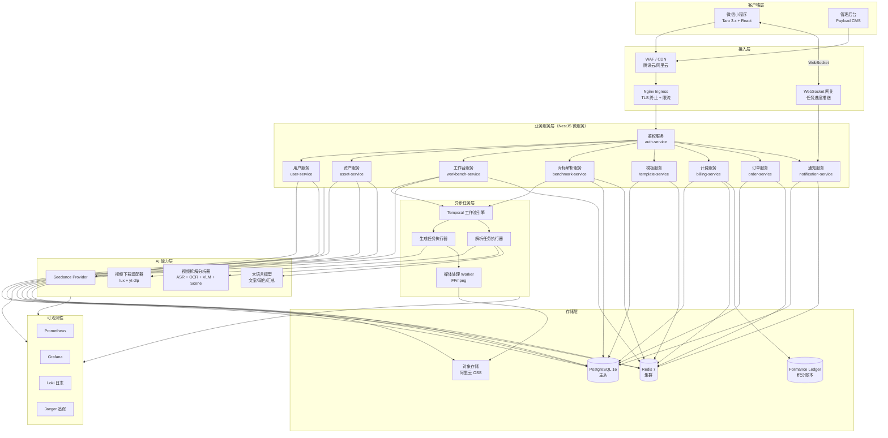
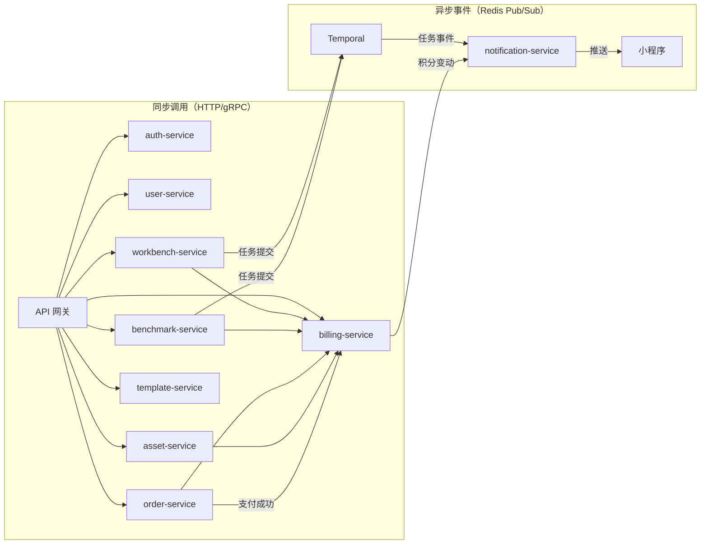
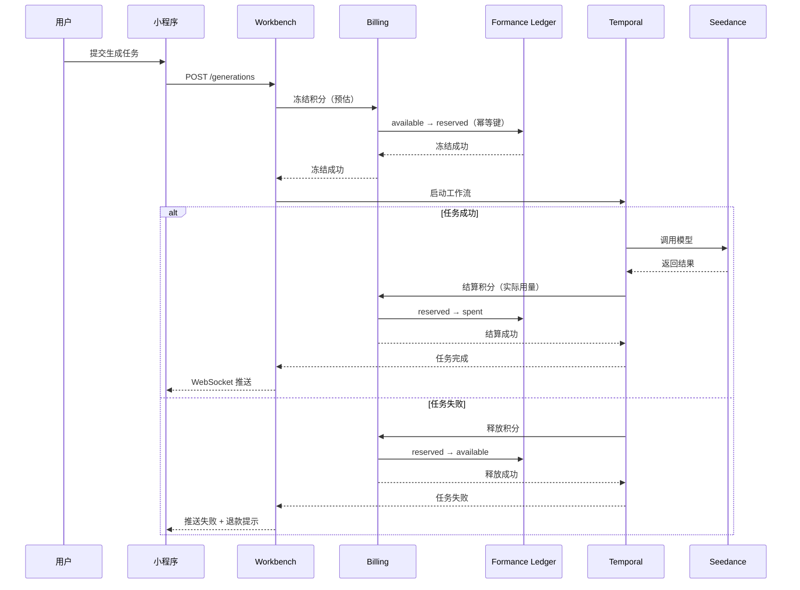
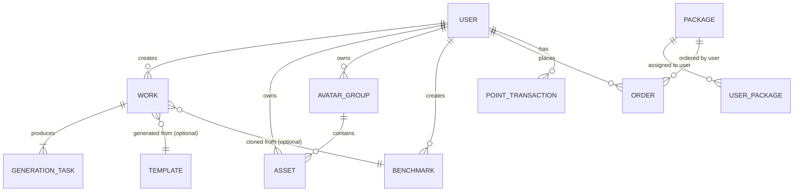
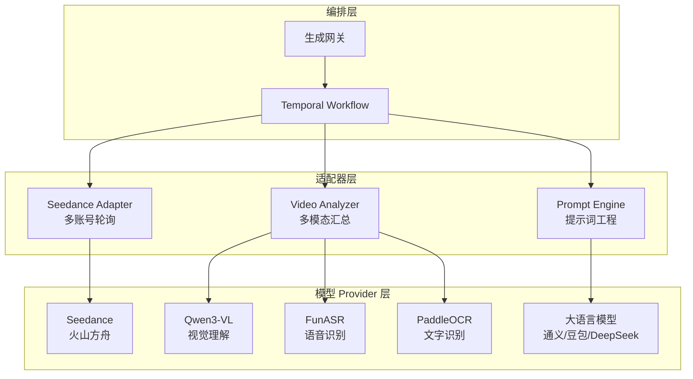
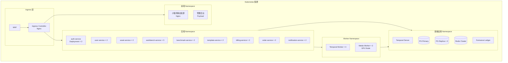
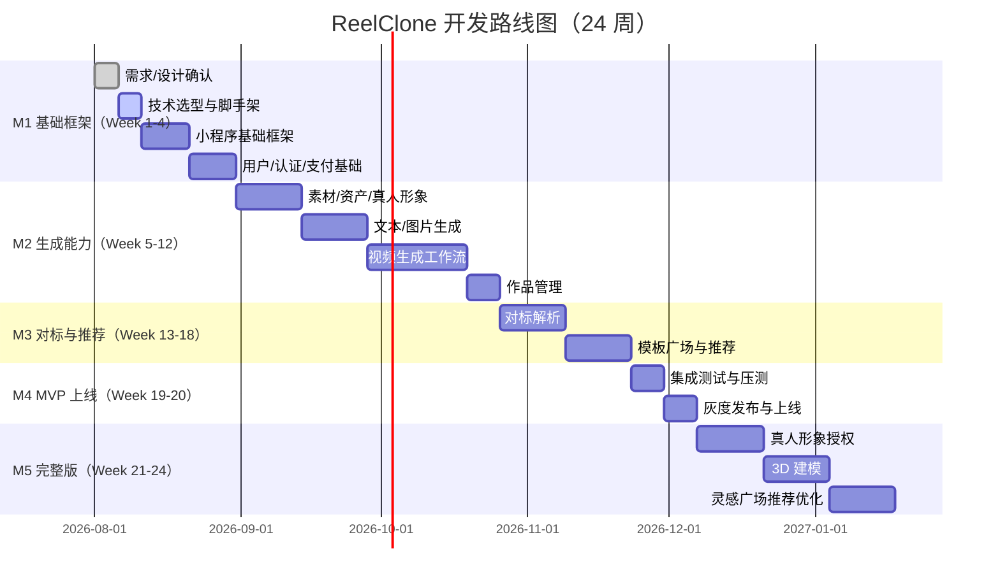

# ReelClone 项目架构分析与开发计划报告

> **版本**: v1.0
> **生成日期**: 2026-07-29
> **生成方式**: 基于质量节拍（Quality Rhythm）Phase 0→1 流程，从 0 开始的系统性架构分析与开发计划制定
> **目标平台**: **微信小程序**（核心交付形态）
> **配套文档**:
> - [01-完整功能点列表和说明.md](01-完整功能点列表和说明.md) — 129 个 FR，11 个模块
> - [02-产品PRD文档.md](02-产品PRD文档.md) — 功能/非功能需求、UI 规范、业务流程
> - [03-技术架构方案.md](03-技术架构方案.md) — 总体技术架构与选型
> - [04-开发运维计划.md](04-开发运维计划.md) — 里程碑、团队、SLO
> - [05-截图视觉审计报告.md](05-截图视觉审计报告.md) — 31 张截图像素级审计
> - [06-截图操作流程映射.md](06-截图操作流程映射.md) — 21 个 Mermaid 流程图
> - [07-数据模型设计.md](07-数据模型设计.md) — 13 个实体、ER 图、状态机
> - [08-测试用例集.md](08-测试用例集.md) — 正向/边界/异常/UI 四类用例

---

## 目录

- [一、执行摘要](#一执行摘要)
- [二、项目背景与目标](#二项目背景与目标)
- [三、微信小程序平台特性与约束分析](#三微信小程序平台特性与约束分析)
- [四、整体架构设计](#四整体架构设计)
- [五、前端架构（微信小程序）](#五前端架构微信小程序)
- [六、后端服务架构](#六后端服务架构)
- [七、数据架构](#七数据架构)
- [八、AI 能力集成架构](#八ai-能力集成架构)
- [九、部署与运维架构](#九部署与运维架构)
- [十、开发计划与里程碑](#十开发计划与里程碑)
- [十一、风险评估与应对](#十一风险评估与应对)
- [十二、质量保障体系](#十二质量保障体系)
- [十三、成本估算](#十三成本估算)
- [十四、附录](#十四附录)

---

## 一、执行摘要

### 1.1 项目定位

ReelClone 是 WouwouAI 微信小程序的 1:1 复刻项目，定位为**智能视频创作带货平台**。通过 AI 视频生成（Seedance）、对标解析、模板广场三大核心能力，帮助电商商家、本地生活商家、个人 IP/MCN 低成本生产爆款短视频。

### 1.2 核心交付物

| 交付物 | 形态 | 关键指标 |
|--------|------|----------|
| 微信小程序 | 最终用户使用入口 | 31 张截图复刻，129 个 FR |
| 后端微服务集群 | 业务/计费/任务调度 | 10 个微服务，开放 API 约 50 个 |
| AI 任务流水线 | 视频生成与对标解析 | Seedance Provider + 视频拆解 |
| 运维基础设施 | K8s + 监控 + CI/CD | SLO 99.9% 可用性 |

### 1.3 关键决策摘要

| 维度 | 决策 | 理由 |
|------|------|------|
| 小程序框架 | **Taro 3.x + React** | 跨端扩展性、TypeScript 原生支持、社区活跃 |
| 后端框架 | **NestJS + TypeScript** | 与前端共享类型、模块化、DI/IoC 成熟 |
| 数据库 | **PostgreSQL 16** | JSONB 存动态参数、成熟生态、强一致性 |
| 工作流引擎 | **Temporal** | 耐久任务、重试/补偿、子流程、长视频生成必备 |
| 积分账本 | **Formance Ledger** | 原子复式记账、幂等冲正、审计友好 |
| 权限控制 | **OpenFGA** | 细粒度资源授权（素材/作品/真人形象） |
| 视频生成 | **火山 Seedance** | 官方 SDK、多模型支持、按量付费 |
| 视频下载 | **lux + yt-dlp 双适配** | 多平台支持、降级策略 |

### 1.4 项目周期

- **MVP 阶段**: 3 个月（12 周），覆盖 P0 功能，可提交微信审核
- **完整版阶段**: 6 个月（24 周），覆盖 P1 功能，达到生产可用
- **成熟期**: 12 个月，覆盖 P2 功能，企业级 SaaS

---

## 二、项目背景与目标

### 2.1 市场背景

短视频带货与本地生活推广已成为商家获客核心手段。爆款视频的规律（镜头节奏、口播文案、画面风格）可被结构化拆解并复用，但普通商家缺乏专业拆解与再生产能力。

### 2.2 用户痛点

1. **不知道拍什么** — 缺乏爆款灵感与行业模板
2. **不会写文案** — 口播脚本、卖点提炼困难
3. **不会拍/剪视频** — 拍摄、剪辑、配音成本高
4. **想复刻竞品** — 看到同行爆款，无法快速拆解生成
5. **版权与形象风险** — 使用真人形象、商品素材缺乏授权管理

### 2.3 产品价值

- **降低创作门槛**: AI 文生视频、图生视频、数字人，输入文字或参考图即可生成
- **爆款复刻**: 粘贴竞品链接自动拆解风格/镜头/文案，基于拆解结果生成新视频
- **行业模板库**: 按行业/平台/热度聚合爆款模板，一键套用
- **资产与合规**: 素材库、真人形象授权组、积分套餐体系

### 2.4 成功指标

| 指标类型 | 指标 | MVP 目标 | 完整版目标 |
|----------|------|----------|------------|
| 用户增长 | 注册用户数 | 1000+ | 50000+ |
| 活跃度 | 周活跃率 | ≥30% | ≥40% |
| 转化 | 付费转化率 | ≥5% | ≥10% |
| 生成效率 | 单视频生成耗时 | ≤5 分钟 | ≤3 分钟 |
| 满意度 | NPS | ≥30 | ≥45 |
| 任务成功率 | 生成成功率 | ≥95% | ≥98% |

---

## 三、微信小程序平台特性与约束分析

> **本章重点**: 微信小程序作为最终交付平台，其特性与约束直接决定架构选型。所有架构决策必须以小程序为锚点。

### 3.1 平台硬性约束

| 约束类型 | 限制值 | 对架构的影响 |
|---------|--------|------------|
| 小程序包大小 | 主包 ≤2MB，总包 ≤20MB（含分包） | 必须分包加载，资源动态化 |
| 单个分包大小 | ≤2MB | 按业务模块划分分包 |
| 网络请求并发数 | 同时 ≤10 个 | 请求队列、合并请求 |
| wx.request 超时 | 默认 60s | 长任务必须异步 + 轮询 |
| 文件上传 | 单次 ≤100MB | 大文件用 OSS 直传或 tus |
| 视频播放 | video 组件，支持 m3u8/mp4 | 后端需输出兼容格式 |
| 本地存储 | 单个 key 1MB，总 10MB | 重要数据走服务端 |
| 后台运行 | 小程序后台 5 分钟后冻结 | 生成任务必须服务端持久化 |
| 微信支付 | 仅支持微信支付 | 商业化唯一通道 |
| 登录方式 | wx.login + 手机号授权 | 主登录流为微信登录 |

### 3.2 微信生态能力利用

| 能力 | API | 项目用途 |
|------|-----|---------|
| 微信登录 | `wx.login` + `code2session` | 用户身份建立 |
| 手机号快速登录 | `<button open-type="getPhoneNumber">` | 一键绑定手机号 |
| 微信支付 | `wx.requestPayment` | 套餐购买 |
| 客服消息 | 客服按钮 + 后端推送 | 用户支持 |
| 模板消息 / 订阅消息 | 订阅消息 | 生成完成通知 |
| 分享 | `onShareAppMessage` / `onShareTimeline` | 作品/模板分享 |
| 扫码 | `wx.scanCode` | 素材库扫码导入（可选） |
| 图片/视频选择 | `wx.chooseMedia` | 素材上传 |
| 拍照 | `wx.chooseMedia` sourceType camera | 拍摄素材 |
| 录音 | `wx.getRecorderManager` | 录音素材 |
| 文件下载 | `wx.downloadFile` | 作品下载（需业务域名） |
| WebSocket | `wx.connectSocket` | 任务进度实时推送 |
| 地理位置定位 | `wx.getLocation` | 同城 IP 推荐 |

### 3.3 小程序审核合规要求

| 合规项 | 要求 | 架构应对 |
|--------|------|---------|
| ICP 备案 | 必须展示备案号 | 设置页底部固定展示 |
| 用户隐私协议 | 收集信息前需授权 | 首次启动弹窗 + 后端记录 |
| 内容安全 | UGC 必须过审 | 生成结果走内容安全 API |
| 真人形象授权 | 需明确授权链路 | 真人形象资产组强制授权流程 |
| 虚拟物品支付 | iOS 端虚拟物品走 IAP（豁免少） | 套餐属于虚拟物品，需评估 iOS 限制 |
| 服务类目 | 视频生成类需选「工具-效率」或「教育」 | 提交审核时类目匹配 |
| 分享朋友圈 | 白名单机制 | 需申请能力 |

### 3.4 小程序架构决策矩阵

| 决策点 | 选项 | 决策 | 理由 |
|--------|------|------|------|
| 原生 vs 跨端 | 原生 / Taro / uni-app | **Taro 3.x** | 跨端扩展、React 语法、TypeScript 友好 |
| 状态管理 | 原生 setData / MobX / Zustand | **Zustand** | 轻量、无 Provider、与 React 一致 |
| UI 库 | Vant Weapp / Taro UI / 自研 | **Vant Weapp + 自研深色主题** | Vant 成熟，自研覆盖深色品牌 |
| 上传协议 | wx.uploadFile / OSS 直传 / tus | **OSS 直传 + tus（大文件）** | 绕过小程序 100MB 限制 |
| 任务进度 | 轮询 / WebSocket / 订阅消息 | **WebSocket + 订阅消息（兜底）** | 实时性 + 离线兜底 |
| 视频播放 | video 组件 / 第三方播放器 | **小程序原生 video 组件** | 兼容性最好 |
| 分包策略 | 不分包 / 业务分包 / 按页面分包 | **业务分包** | 主包放公共，按模块分包 |
| 登录方式 | wx.login + 手机号 / 仅手机号 | **wx.login + 手机号授权** | 符合截图设计 |

---

## 四、整体架构设计

### 4.1 架构总图



### 4.2 架构设计原则

1. **小程序优先** — 所有架构决策以小程序最终落地为锚点
2. **服务无状态** — 业务服务不持有会话状态，便于水平扩展
3. **任务异步化** — 所有 AI 生成/解析任务走 Temporal 异步工作流
4. **幂等优先** — 支付、积分扣减、任务提交全部幂等
5. **失败可补偿** — 任何一步失败都有对应的补偿/回滚机制
6. **前后端类型同步** — 通过 OpenAPI / Protobuf 自动生成 TypeScript 类型
7. **按需扩展** — AI Worker 与业务服务独立伸缩
8. **合规前置** — 内容安全、真人授权、ICP 备案内建于架构

### 4.3 架构层次划分

| 层次 | 职责 | 关键组件 |
|------|------|---------|
| 客户端层 | UI 渲染、用户交互、本地缓存 | Taro 小程序、Admin 后台 |
| 接入层 | TLS、限流、鉴权、路由 | Nginx、WAF、WebSocket 网关 |
| 业务服务层 | 业务逻辑、API 暴露 | 10 个 NestJS 微服务 |
| 异步任务层 | 长任务编排、重试、补偿 | Temporal + Worker 池 |
| AI 能力层 | 模型调用、视频处理 | Seedance、ASR/OCR/VLM |
| 存储层 | 持久化、缓存、对象存储 | PG、Redis、OSS、Ledger |
| 可观测性 | 指标、日志、追踪 | Prometheus、Loki、Jaeger |

---

## 五、前端架构（微信小程序）

### 5.1 技术选型

| 组件 | 选型 | 版本 | 说明 |
|------|------|------|------|
| 框架 | Taro | 3.6.x | React 语法，跨端扩展 |
| UI 库 | Vant Weapp | 1.x | 基础组件，深色主题自定义 |
| 状态管理 | Zustand | 4.x | 轻量、TypeScript 友好 |
| 请求库 | Taro.request 封装 | - | 统一拦截器、错误处理、重试 |
| 上传 | tus-js-client + OSS SDK | - | 大文件断点续传 |
| WebSocket | Taro.connectSocket | - | 任务进度推送 |
| 图标 | 自研 SVG 渐变图标 | - | 八宫格彩色渐变 |
| 视频 | 小程序原生 video | - | 兼容性最好 |
| 富文本 | 小程序 rich-text | - | 协议/关于页 |
| 图表 | EcCanvas | - | 消费记录统计图 |

### 5.2 目录结构

```
reelclone-mp/
├── config/                    # Taro 配置
│   ├── dev.ts
│   ├── prod.ts
│   └── index.ts
├── src/
│   ├── app.tsx                # 入口
│   ├── app.config.ts          # 全局配置（TabBar、分包）
│   ├── app.scss               # 全局样式
│   ├── index.html
│   ├── pages/                 # 主包页面
│   │   ├── home/              # 首页（TabBar）
│   │   │   ├── index.tsx
│   │   │   ├── index.scss
│   │   │   └── index.config.ts
│   │   ├── discover/          # 推荐（TabBar）
│   │   ├── benchmark/         # 对标解析（TabBar）
│   │   └── profile/           # 我的（TabBar）
│   ├── subpackages/           # 分包
│   │   ├── workbench/         # 生成工作台分包
│   │   │   ├── pages/
│   │   │   │   ├── text-gen/       # 文本生成
│   │   │   │   ├── image-gen/      # 图片生成
│   │   │   │   ├── video-gen/      # 视频生成
│   │   │   │   │   ├── text-to-video/
│   │   │   │   │   ├── first-frame/
│   │   │   │   │   ├── first-last-frame/
│   │   │   │   │   ├── 3d-model/
│   │   │   │   │   ├── edit-video/
│   │   │   │   │   └── extend-video/
│   │   │   │   └── work-detail/    # 作品详情
│   │   │   └── components/
│   │   ├── asset/             # 资产管理分包
│   │   │   └── pages/
│   │   │       ├── asset-list/
│   │   │       ├── avatar-group/
│   │   │       └── upload/
│   │   ├── billing/           # 计费分包
│   │   │   └── pages/
│   │   │       ├── subscribe/      # 订阅计划
│   │   │       ├── my-package/     # 我的套餐
│   │   │       ├── transactions/   # 消费记录
│   │   │       └── orders/         # 我的订单
│   │   └── settings/          # 设置分包
│   │       └── pages/
│   │           ├── settings/
│   │           ├── bind-mobile/
│   │           └── change-password/
│   ├── components/            # 全局组件
│   │   ├── TabBar/            # 自定义 TabBar（如需）
│   │   ├── QuickCreate/       # 快捷创作浮层
│   │   ├── IndustryPicker/    # 行业偏好选择
│   │   ├── PromptInput/       # 提示词输入
│   │   ├── MediaUploader/     # 媒体上传
│   │   ├── CreditBadge/       # 积分徽章
│   │   ├── WorkCard/          # 作品卡片
│   │   ├── TemplateCard/      # 模板卡片
│   │   ├── EmptyState/        # 空状态
│   │   ├── LoadingState/      # 加载状态
│   │   ├── ErrorState/        # 错误状态
│   │   └── GradientIcon/      # 渐变 SVG 图标
│   ├── stores/                # Zustand 状态
│   │   ├── userStore.ts       # 用户信息
│   │   ├── creditStore.ts     # 积分余额
│   │   ├── workbenchStore.ts  # 工作台参数
│   │   ├── assetStore.ts      # 资产选择
│   │   └── notificationStore.ts # 通知
│   ├── services/              # API 调用
│   │   ├── request.ts         # 请求封装
│   │   ├── auth.service.ts
│   │   ├── user.service.ts
│   │   ├── generation.service.ts
│   │   ├── benchmark.service.ts
│   │   ├── asset.service.ts
│   │   ├── template.service.ts
│   │   ├── billing.service.ts
│   │   ├── order.service.ts
│   │   └── upload.service.ts
│   ├── hooks/                 # 自定义 Hooks
│   │   ├── useAuth.ts
│   │   ├── useCredits.ts
│   │   ├── useGeneration.ts
│   │   ├── useWebSocket.ts
│   │   ├── useUpload.ts
│   │   └── usePagination.ts
│   ├── utils/                 # 工具函数
│   │   ├── storage.ts         # 本地存储
│   │   ├── format.ts          # 格式化
│   │   ├── validate.ts        # 校验
│   │   ├── date.ts            # 日期
│   │   └── tracker.ts         # 埋点
│   ├── types/                 # TypeScript 类型
│   │   ├── api.d.ts           # API 响应类型
│   │   ├── models.d.ts        # 业务模型
│   │   └── enum.ts            # 枚举
│   ├── constants/             # 常量
│   │   ├── api.ts
│   │   ├── enum.ts
│   │   └── config.ts
│   └── styles/                # 全局样式
│       ├── variables.scss     # 主题变量
│       ├── mixins.scss        # Mixins
│       └── reset.scss         # 重置样式
├── package.json
├── tsconfig.json
└── .eslintrc.js
```

### 5.3 分包策略

```typescript
// app.config.ts
export default {
  pages: [
    'pages/home/index',
    'pages/discover/index',
    'pages/benchmark/index',
    'pages/profile/index',
  ],
  subPackages: [
    {
      root: 'subpackages/workbench',
      pages: [
        'pages/text-gen/index',
        'pages/image-gen/index',
        'pages/video-gen/index',
        // ...
      ],
    },
    {
      root: 'subpackages/asset',
      pages: ['pages/asset-list/index', 'pages/avatar-group/index', 'pages/upload/index'],
    },
    {
      root: 'subpackages/billing',
      pages: [
        'pages/subscribe/index',
        'pages/my-package/index',
        'pages/transactions/index',
        'pages/orders/index',
      ],
    },
    {
      root: 'subpackages/settings',
      pages: ['pages/settings/index', 'pages/bind-mobile/index', 'pages/change-password/index'],
    },
  ],
  preloadRule: {
    'pages/home/index': {
      network: 'all',
      packages: ['subpackages/workbench'],
    },
    'pages/profile/index': {
      network: 'all',
      packages: ['subpackages/settings', 'subpackages/billing'],
    },
  },
  window: {
    navigationStyle: 'custom',
    backgroundColor: '#0F0F1A',
    navigationBarBackgroundColor: '#0F0F1A',
    navigationBarTitleText: 'WouwouAI',
    navigationBarTextStyle: 'white',
  },
  tabBar: {
    color: '#666666',
    selectedColor: '#7C3AED',
    backgroundColor: '#0F0F1A',
    borderStyle: 'black',
    list: [
      { pagePath: 'pages/home/index', text: '首页', iconPath: '...', selectedIconPath: '...' },
      { pagePath: 'pages/discover/index', text: '推荐', iconPath: '...', selectedIconPath: '...' },
      { pagePath: 'pages/benchmark/index', text: '对标解析', iconPath: '...', selectedIconPath: '...' },
      { pagePath: 'pages/profile/index', text: '我的', iconPath: '...', selectedIconPath: '...' },
    ],
  },
};
```

### 5.4 UI 规范与主题

```scss
// styles/variables.scss

// 品牌色（蓝紫渐变）
$brand-primary: #4F46E5;
$brand-secondary: #7C3AED;
$brand-gradient: linear-gradient(135deg, #4F46E5 0%, #7C3AED 100%);

// 深色主题色板
$bg-primary: #0F0F1A;     // 页面背景
$bg-secondary: #1A1A2E;   // 卡片背景
$bg-tertiary: #252540;    // 输入框背景
$bg-elevated: #2D2D4A;    // 弹窗背景

// 文字色
$text-primary: #FFFFFF;   // 主文字
$text-secondary: #B4B4CC; // 次要文字
$text-tertiary: #6B6B85;  // 辅助文字
$text-disabled: #4A4A5E;  // 禁用文字

// 功能色
$color-success: #10B981;
$color-warning: #F59E0B;
$color-error: #EF4444;
$color-info: #3B82F6;

// 圆角
$radius-sm: 8rpx;
$radius-md: 16rpx;
$radius-lg: 24rpx;
$radius-xl: 32rpx;
$radius-full: 999rpx;

// 间距
$space-xs: 8rpx;
$space-sm: 16rpx;
$space-md: 24rpx;
$space-lg: 32rpx;
$space-xl: 48rpx;

// 字号
$font-xs: 20rpx;
$font-sm: 24rpx;
$font-md: 28rpx;
$font-lg: 32rpx;
$font-xl: 36rpx;
$font-xxl: 48rpx;

// 八宫格渐变图标色（按业务模块）
$icon-text-gen: linear-gradient(135deg, #667EEA 0%, #764BA2 100%);
$icon-image-gen: linear-gradient(135deg, #F093FB 0%, #F5576C 100%);
$icon-video-gen: linear-gradient(135deg, #4FACFE 0%, #00F2FE 100%);
$icon-3d-model: linear-gradient(135deg, #43E97B 0%, #38F9D7 100%);
$icon-edit-video: linear-gradient(135deg, #FA709A 0%, #FEE140 100%);
$icon-extend-video: linear-gradient(135deg, #30CFD0 0%, #330867 100%);
$icon-benchmark: linear-gradient(135deg, #A8EDEA 0%, #FED6E3 100%);
$icon-template: linear-gradient(135deg, #FF9A9E 0%, #FECFEF 100%);
```

### 5.5 状态管理设计

```typescript
// stores/userStore.ts
import { create } from 'zustand';
import { persist } from 'zustand/middleware';

interface UserState {
  user: User | null;
  isLoggedIn: boolean;
  setUser: (user: User) => void;
  logout: () => void;
  updateCredits: (credits: number) => void;
}

export const useUserStore = create<UserState>()(
  persist(
    (set) => ({
      user: null,
      isLoggedIn: false,
      setUser: (user) => set({ user, isLoggedIn: true }),
      logout: () => set({ user: null, isLoggedIn: false }),
      updateCredits: (credits) =>
        set((state) => ({
          user: state.user ? { ...state.user, currentPoints: credits } : null,
        })),
    }),
    { name: 'reelclone-user' }
  )
);
```

### 5.6 请求封装与拦截器

```typescript
// services/request.ts
import Taro from '@tarojs/taro';
import { useUserStore } from '@/stores/userStore';

const BASE_URL = process.env.TARO_APP_API_URL;
const MAX_CONCURRENT = 8; // 小程序并发限制内留余量

interface RequestQueueItem {
  request: () => Promise<any>;
  resolve: (value: any) => void;
  reject: (reason: any) => void;
}

class RequestManager {
  private queue: RequestQueueItem[] = [];
  private running = 0;

  async request<T>(options: Taro.request.Option): Promise<T> {
    return new Promise((resolve, reject) => {
      const item: RequestQueueItem = {
        request: () => this.executeRequest<T>(options),
        resolve: resolve as any,
        reject,
      };
      this.queue.push(item);
      this.process();
    });
  }

  private async process() {
    while (this.queue.length > 0 && this.running < MAX_CONCURRENT) {
      const item = this.queue.shift()!;
      this.running++;
      try {
        const result = await item.request();
        item.resolve(result);
      } catch (err) {
        item.reject(err);
      } finally {
        this.running--;
        this.process();
      }
    }
  }

  private async executeRequest<T>(options: Taro.request.Option): Promise<T> {
    const userStore = useUserStore.getState();
    const token = Taro.getStorageSync('token');

    const response = await Taro.request({
      ...options,
      url: BASE_URL + options.url,
      header: {
        'Content-Type': 'application/json',
        Authorization: token ? `Bearer ${token}` : '',
        ...options.header,
      },
    });

    if (response.statusCode === 401) {
      // Token 过期，刷新或跳登录
      userStore.logout();
      Taro.reLaunch({ url: '/pages/home/index' });
      throw new Error('Unauthorized');
    }

    if (response.data.code !== 0) {
      throw new Error(response.data.message);
    }

    return response.data.data;
  }
}

export const requestManager = new RequestManager();
```

### 5.7 WebSocket 任务进度推送

```typescript
// hooks/useWebSocket.ts
import { useEffect, useRef } from 'react';
import Taro from '@tarojs/taro';

export function useTaskProgress(taskId: string, onUpdate: (progress: TaskProgress) => void) {
  const socketRef = useRef<Taro.SocketTask | null>(null);

  useEffect(() => {
    if (!taskId) return;

    const socket = Taro.connectSocket({
      url: `${process.env.TARO_APP_WS_URL}/tasks/${taskId}/progress`,
      header: { Authorization: `Bearer ${Taro.getStorageSync('token')}` },
    });

    socket.onMessage((res) => {
      const data = JSON.parse(res.data);
      onUpdate(data);
      if (data.status === 'COMPLETED' || data.status === 'FAILED') {
        socket.close({});
      }
    });

    socket.onClose(() => {
      // 兜底：订阅消息通知
    });

    socketRef.current = socket;

    return () => {
      socket.close({});
    };
  }, [taskId]);
}
```

### 5.8 大文件上传（OSS 直传 + tus）

```typescript
// services/upload.service.ts
import Taro from '@tarojs/taro';

export async function getUploadToken(fileName: string, fileType: string): Promise<UploadToken> {
  return requestManager.request({
    url: '/api/v1/assets/upload-token',
    method: 'POST',
    data: { fileName, fileType },
  });
}

export async function uploadToOSS(filePath: string, token: UploadToken): Promise<string> {
  // 小程序直传 OSS（STS Token 模式）
  return new Promise((resolve, reject) => {
    Taro.uploadFile({
      url: token.host,
      filePath,
      name: 'file',
      formData: {
        key: token.key,
        policy: token.policy,
        OSSAccessKeyId: token.accessKeyId,
        signature: token.signature,
        'x-oss-security-token': token.securityToken,
      },
      success: (res) => {
        if (res.statusCode === 204) {
          resolve(token.key);
        } else {
          reject(new Error('Upload failed'));
        }
      },
      fail: reject,
    });
  });
}

// 大文件用 tus 断点续传（通过 H5 适配层）
export async function uploadLargeFile(filePath: string, onProgress?: (p: number) => void) {
  // 调用后端 tus 端点，分片上传
}
```

---

## 六、后端服务架构

### 6.1 微服务拆分

| 服务 | 端口 | 职责 | 主要实体 |
|------|------|------|----------|
| auth-service | 3001 | 微信登录、JWT 签发、鉴权 | User（部分） |
| user-service | 3002 | 用户信息、手机号绑定、设置 | User |
| asset-service | 3003 | 素材/成品/真人形象管理 | Asset, AvatarGroup |
| workbench-service | 3004 | 生成任务提交、参数校验 | Work, GenerationTask |
| benchmark-service | 3005 | 对标解析任务管理 | Benchmark |
| template-service | 3006 | 模板/灵感广场/推荐 | Template, Favorite |
| billing-service | 3007 | 积分/额度/账本 | PointTransaction, UserPackage |
| order-service | 3008 | 套餐/订单/微信支付 | Order, Package |
| notification-service | 3009 | WebSocket 推送、订阅消息 | Notification |
| media-worker | - | FFmpeg 媒体处理（Worker） | - |

### 6.2 服务间通信



### 6.3 NestJS 项目结构

```
reelclone-backend/
├── apps/
│   ├── auth-service/
│   │   ├── src/
│   │   │   ├── main.ts
│   │   │   ├── app.module.ts
│   │   │   ├── controllers/
│   │   │   ├── services/
│   │   │   ├── dto/
│   │   │   └── entities/
│   │   └── test/
│   ├── user-service/
│   ├── asset-service/
│   ├── workbench-service/
│   ├── benchmark-service/
│   ├── template-service/
│   ├── billing-service/
│   ├── order-service/
│   └── notification-service/
├── libs/                     # 共享代码
│   ├── common/               # 通用工具
│   │   ├── decorators/
│   │   ├── filters/
│   │   ├── guards/
│   │   ├── interceptors/
│   │   └── pipes/
│   ├── database/             # 数据库模块
│   │   ├── entities/
│   │   ├── migrations/
│   │   └── repositories/
│   ├── ai/                   # AI 能力封装
│   │   ├── seedance/
│   │   ├── downloader/
│   │   ├── analyzer/
│   │   └── prompt-engine/
│   └── temporal/             # 工作流定义
│       ├── workflows/
│       └── activities/
├── workers/
│   ├── temporal-worker/      # Temporal Worker
│   └── media-worker/         # FFmpeg Worker
├── docker/
│   ├── Dockerfile.base
│   ├── Dockerfile.service
│   └── docker-compose.yml
├── package.json
├── tsconfig.json
└── nx.json                   # Nx Monorepo
```

### 6.4 API 规范

```typescript
// 统一响应格式
interface ApiResponse<T> {
  code: number;      // 0 = 成功，非 0 = 错误码
  message: string;
  data: T;
  traceId?: string;
}

// 分页响应
interface PaginatedResponse<T> {
  code: number;
  message: string;
  data: {
    list: T[];
    page: number;
    pageSize: number;
    total: number;
  };
}

// 错误码规范
enum ErrorCode {
  SUCCESS = 0,
  UNAUTHORIZED = 401,
  FORBIDDEN = 403,
  NOT_FOUND = 404,
  VALIDATION_ERROR = 422,
  INSUFFICIENT_CREDITS = 4001,
  TASK_FAILED = 4002,
  PAYMENT_FAILED = 4003,
  CONTENT_REJECTED = 4004,
  RATE_LIMITED = 429,
  INTERNAL_ERROR = 5000,
}
```

### 6.5 关键接口清单

| 方法 | 路径 | 服务 | 说明 |
|------|------|------|------|
| POST | /api/v1/auth/wechat-login | auth | 微信小程序登录 |
| POST | /api/v1/auth/refresh-token | auth | 刷新 Token |
| GET | /api/v1/users/me | user | 获取当前用户 |
| PUT | /api/v1/users/me | user | 更新用户信息 |
| POST | /api/v1/users/bind-mobile | user | 绑定手机号 |
| POST | /api/v1/sms/send | user | 发送短信验证码 |
| POST | /api/v1/assets/upload-token | asset | 获取 OSS 上传凭证 |
| GET | /api/v1/assets | asset | 资产列表 |
| POST | /api/v1/assets | asset | 创建资产 |
| DELETE | /api/v1/assets/:id | asset | 删除资产 |
| POST | /api/v1/avatar-groups | asset | 创建真人形象组 |
| GET | /api/v1/avatar-groups | asset | 真人形象组列表 |
| DELETE | /api/v1/avatar-groups/:id | asset | 删除真人形象组 |
| POST | /api/v1/generations | workbench | 提交生成任务 |
| GET | /api/v1/generations | workbench | 生成任务列表 |
| GET | /api/v1/generations/:id | workbench | 任务详情/状态 |
| POST | /api/v1/generations/:id/cancel | workbench | 取消任务 |
| POST | /api/v1/generations/:id/retry | workbench | 重试任务 |
| POST | /api/v1/benchmarks | benchmark | 提交对标解析 |
| GET | /api/v1/benchmarks | benchmark | 解析历史 |
| GET | /api/v1/benchmarks/:id | benchmark | 解析详情 |
| GET | /api/v1/templates | template | 模板广场 |
| GET | /api/v1/templates/:id | template | 模板详情 |
| POST | /api/v1/templates/:id/favorite | template | 收藏模板 |
| DELETE | /api/v1/templates/:id/favorite | template | 取消收藏 |
| GET | /api/v1/templates/favorites | template | 我的收藏 |
| GET | /api/v1/points/balance | billing | 积分余额 |
| GET | /api/v1/points/transactions | billing | 积分流水 |
| GET | /api/v1/packages | order | 套餐列表 |
| POST | /api/v1/orders | order | 创建订单 |
| POST | /api/v1/orders/:id/pay | order | 调起支付 |
| POST | /api/v1/orders/:id/cancel | order | 取消订单 |
| GET | /api/v1/orders | order | 订单列表 |
| GET | /api/v1/orders/:id | order | 订单详情 |
| POST | /api/v1/webhooks/wechat-pay | order | 微信支付回调 |
| POST | /api/v1/webhooks/seedance | workbench | Seedance 任务回调 |
| GET | /api/v1/notifications | notification | 通知列表 |
| WS | /ws/tasks/:taskId/progress | notification | 任务进度推送 |

### 6.6 工作流编排（Temporal）

```typescript
// libs/temporal/workflows/video-generation.workflow.ts

@Workflow()
export class VideoGenerationWorkflow {
  @WorkflowMethod()
  async execute(params: VideoGenParams): Promise<VideoGenResult> {
    const { workId, userId, provider, modelConfig } = params;

    // 1. 提交到 Seedance
    const providerTaskId = await Activity.submitToSeedance(modelConfig);

    // 2. 轮询任务状态（带超时）
    let attempts = 0;
    const maxAttempts = 120; // 10 分钟
    let result: SeedanceResult | null = null;

    while (attempts < maxAttempts) {
      await Workflow.sleep(5000); // 每 5 秒轮询
      result = await Activity.querySeedanceTask(providerTaskId);
      if (result.status === 'COMPLETED') break;
      if (result.status === 'FAILED') {
        await Activity.refundCredits(userId, workId);
        await Activity.updateWorkStatus(workId, 'FAILED', result.error);
        throw new Error('Generation failed');
      }
      attempts++;
    }

    if (!result) {
      // 超时
      await Activity.cancelSeedanceTask(providerTaskId);
      await Activity.refundCredits(userId, workId);
      await Activity.updateWorkStatus(workId, 'TIMEOUT');
      throw new Error('Generation timeout');
    }

    // 3. 下载并后处理（FFmpeg）
    const processedKey = await Activity.postProcess(result.videoUrl, modelConfig);

    // 4. 结算积分（实际用量）
    const actualCost = await Activity.calculateActualCost(modelConfig);
    await Activity.settleCredits(userId, workId, actualCost);

    // 5. 更新作品状态
    await Activity.updateWorkStatus(workId, 'COMPLETED', {
      resultKey: processedKey,
      resultUrl: await Activity.generateSignedUrl(processedKey),
    });

    // 6. 通知用户
    await Activity.notifyUser(userId, workId, 'COMPLETED');

    return { workId, resultKey: processedKey };
  }
}
```

### 6.7 积分计费流程



---

## 七、数据架构

### 7.1 数据库选型

| 数据库 | 用途 | 版本 | 部署 |
|--------|------|------|------|
| PostgreSQL | 业务主库 | 16 | 主从（1主2从） |
| Redis | 缓存/会话/限流/队列 | 7 | 集群（3主3从） |
| 对象存储 | 素材/成品/封面 | - | 阿里云 OSS |
| Formance Ledger | 积分账本 | latest | 单节点（高可用） |

### 7.2 PostgreSQL 分库策略

| 库 | 用途 | 主要表 |
|----|------|--------|
| reelclone_main | 用户/资产/作品/订单 | users, assets, works, orders, packages |
| reelclone_billing | 积分流水/账本 | point_transactions, ledger_entries |
| reelclone_template | 模板/推荐 | templates, favorites, template_stats |
| reelclone_benchmark | 对标解析 | benchmarks, analysis_results |

### 7.3 核心数据模型（基于 07 文档）

完整 ER 图见 [07-数据模型设计.md](07-数据模型设计.md)，本报告聚焦关键实体：



**13 个核心实体**:

1. USER（用户） — 微信 OpenID 关联
2. WORK（作品） — 图片/视频/文本作品
3. GENERATION_TASK（生成任务） — 一次具体模型调用
4. ASSET（资产） — 素材/成品
5. AVATAR_GROUP（真人形象组） — 含授权链路
6. BENCHMARK（对标解析） — 竞品视频解析记录
7. TEMPLATE（模板） — 灵感广场模板
8. FAVORITE（收藏） — 用户-模板收藏关系
9. PACKAGE（套餐） — 订阅套餐定义
10. USER_PACKAGE（用户套餐） — 用户持有的有效套餐
11. ORDER（订单） — 套餐购买订单
12. POINT_TRANSACTION（积分流水） — 增减明细
13. SMS_CODE（短信验证码） — 短信验证记录

### 7.4 Redis 使用策略

| 用途 | Key Pattern | 过期时间 | 说明 |
|------|-------------|---------|------|
| JWT 黑名单 | `jwt:blacklist:{jti}` | 2 小时 | 退出登录时加入 |
| 短信验证码 | `sms:{mobile}:{purpose}` | 5 分钟 | 限流 60s/次 |
| 用户会话 | `session:{userId}` | 7 天 | Refresh Token |
| 积分余额缓存 | `credits:{userId}` | 5 分钟 | 减少 DB 查询 |
| 任务状态缓存 | `task:{taskId}:status` | 1 小时 | 高频查询 |
| 限流 | `rate:{userId}:{endpoint}` | 1 分钟 | 令牌桶 |
| 推荐 Cache | `recommend:{userId}` | 30 分钟 | 灵感广场 |
| 模板 Cache | `template:hot:{platform}` | 10 分钟 | 热门模板 |
| WebSocket Session | `ws:{userId}` | 实时 | 在线连接 |
| 分布式锁 | `lock:{resource}` | 30 秒 | 防重提交 |

### 7.5 OSS 存储策略

```
oss-bucket/
├── assets/                    # 素材
│   ├── images/{userId}/{assetId}.{ext}
│   ├── videos/{userId}/{assetId}.mp4
│   ├── audios/{userId}/{assetId}.mp3
│   └── avatars/{userId}/{groupId}/{assetId}.ext
├── works/                     # 作品
│   ├── images/{userId}/{workId}.png
│   ├── videos/{userId}/{workId}.mp4
│   └── covers/{userId}/{workId}.jpg
├── benchmarks/                # 对标解析
│   ├── videos/{userId}/{benchmarkId}.mp4
│   └── reports/{userId}/{benchmarkId}.json
├── templates/                 # 模板资源
│   ├── covers/{templateId}.jpg
│   └── videos/{templateId}.mp4
└── temp/                      # 临时文件（24h 过期）
    └── uploads/{userId}/{uuid}.{ext}
```

**访问控制**:
- 所有 Bucket 设为私有
- 通过后端签发短期 URL（15 分钟有效）
- 公开资源（模板封面）走 CDN 加速

---

## 八、AI 能力集成架构

### 8.1 AI 能力总览



### 8.2 Seedance Provider 设计

```typescript
// libs/ai/seedance/seedance.provider.ts

@Injectable()
export class SeedanceProvider {
  private apiKeys: string[]; // 多账号轮询
  private currentKeyIndex = 0;

  async submitTask(params: SeedanceTaskParams): Promise<string> {
    const apiKey = this.getNextApiKey();
    const client = new SeedanceClient({ apiKey });

    const request = this.buildRequest(params);
    const response = await client.tasks.create(request);

    return response.taskId;
  }

  async queryTask(taskId: string): Promise<SeedanceTaskStatus> {
    const apiKey = this.getApiKeyForTask(taskId);
    const client = new SeedanceClient({ apiKey });

    const task = await client.tasks.get(taskId);
    return this.mapStatus(task);
  }

  async cancelTask(taskId: string): Promise<void> {
    const apiKey = this.getApiKeyForTask(taskId);
    const client = new SeedanceClient({ apiKey });
    await client.tasks.cancel(taskId);
  }

  private getNextApiKey(): string {
    // 轮询策略 + 故障切换
    this.currentKeyIndex = (this.currentKeyIndex + 1) % this.apiKeys.length;
    return this.apiKeys[this.currentKeyIndex];
  }

  private buildRequest(params: SeedanceTaskParams): SeedanceRequest {
    // 根据生成类型构建请求
    switch (params.generationType) {
      case 'TEXT_TO_VIDEO':
        return this.buildTextToVideoRequest(params);
      case 'IMAGE_TO_VIDEO_FIRST_FRAME':
        return this.buildFirstFrameRequest(params);
      case 'IMAGE_TO_VIDEO_FIRST_LAST_FRAME':
        return this.buildFirstLastFrameRequest(params);
      case 'EDIT_VIDEO':
        return this.buildEditRequest(params);
      case 'EXTEND_VIDEO':
        return this.buildExtendRequest(params);
      default:
        throw new Error(`Unsupported generation type: ${params.generationType}`);
    }
  }
}
```

### 8.3 视频拆解分析器

```typescript
// libs/ai/analyzer/video-analyzer.service.ts

@Injectable()
export class VideoAnalyzerService {
  async analyze(videoPath: string): Promise<AnalysisReport> {
    // 并行执行所有分析维度
    const [shots, transcript, ocr, visualDescription] = await Promise.all([
      this.detectScenes(videoPath),
      this.transcribeAudio(videoPath),
      this.extractText(videoPath),
      this.describeVisual(videoPath),
    ]);

    // LLM 汇总为结构化报告
    const report = await this.summarizeWithLLM({
      shots,
      transcript,
      ocr,
      visualDescription,
    });

    return report;
  }

  private async detectScenes(videoPath: string): Promise<Shot[]> {
    // PySceneDetect 镜头切分
    // 调用 Python 服务或子进程
  }

  private async transcribeAudio(videoPath: string): Promise<Transcript> {
    // FunASR 中文语音识别
  }

  private async extractText(videoPath: string): Promise<OCRResult[]> {
    // PaddleOCR 提取画面文字
  }

  private async describeVisual(videoPath: string): Promise<VisualDescription[]> {
    // Qwen3-VL 关键帧描述
  }

  private async summarizeWithLLM(inputs: AnalysisInputs): Promise<AnalysisReport> {
    // LLM 汇总为：风格、镜头节奏、文案、卖点、可复刻要素
  }
}
```

### 8.4 视频下载适配器

```typescript
// libs/ai/downloader/video-downloader.service.ts

@Injectable()
export class VideoDownloaderService {
  async download(url: string): Promise<DownloadResult> {
    const platform = this.detectPlatform(url);

    try {
      // 优先 lux
      return await this.downloadWithLux(url, platform);
    } catch (luxError) {
      // 降级 yt-dlp
      try {
        return await this.downloadWithYtDlp(url, platform);
      } catch (ytdlpError) {
        throw new DownloadFailedError(url, platform, luxError, ytdlpError);
      }
    }
  }

  private detectPlatform(url: string): Platform {
    if (url.includes('douyin.com')) return 'DOUYIN';
    if (url.includes('xiaohongshu.com')) return 'XIAOHONGSHU';
    if (url.includes('bilibili.com')) return 'BILIBILI';
    if (url.includes('kuaishou.com')) return 'KUAISHOU';
    if (url.includes('weibo.com')) return 'WEIBO';
    throw new UnsupportedPlatformError(url);
  }
}
```

### 8.5 提示词引擎

```typescript
// libs/ai/prompt-engine/prompt-engine.service.ts

@Injectable()
export class PromptEngineService {
  // 反推提示词：图片 → 文本
  async reversePrompt(imageKey: string): Promise<string> {
    const url = await this.ossService.getSignedUrl(imageKey);
    const description = await this.qwenClient.describeImage(url);
    return this.refinePrompt(description);
  }

  // 润色提示词
  async polishPrompt(rawPrompt: string, industry?: string): Promise<string> {
    const template = this.getTemplate(industry);
    return await this.llmClient.complete({
      system: template,
      user: rawPrompt,
      maxTokens: 500,
    });
  }

  // 生成文案
  async generateCopy(params: CopyGenParams): Promise<string> {
    const { industry, product, style, referenceText } = params;
    const template = this.getCopyTemplate(industry, style);
    return await this.llmClient.complete({
      system: template,
      user: `商品：${product}\n参考：${referenceText}`,
    });
  }
}
```

---

## 九、部署与运维架构

### 9.1 环境规划

| 环境 | 用途 | 部署位置 | 数据 |
|------|------|---------|------|
| 开发环境 | 本地开发 | Docker Compose | Mock 数据 |
| 测试环境 | 功能测试 | K8s test 集群 | 测试数据 |
| 预发布环境 | 灰度验证 | K8s prod 集群（独立 Namespace） | 脱敏数据 |
| 生产环境 | 正式对外 | K8s prod 集群 | 真实数据 |

### 9.2 K8s 部署架构



### 9.3 CI/CD 流水线

```yaml
# .github/workflows/ci.yml
name: CI/CD Pipeline

on:
  push:
    branches: [main, develop]
  pull_request:
    branches: [main, develop]

jobs:
  lint-test:
    runs-on: ubuntu-latest
    steps:
      - uses: actions/checkout@v4
      - uses: actions/setup-node@v4
        with:
          node-version: '20'
          cache: 'npm'

      - name: Install dependencies
        run: npm ci

      - name: Lint
        run: npm run lint

      - name: Type check
        run: npm run typecheck

      - name: Unit tests
        run: npm run test:unit

      - name: Integration tests
        run: npm run test:integration

      - name: Build
        run: npm run build

  build-images:
    needs: lint-test
    if: github.ref == 'refs/heads/main' || github.ref == 'refs/heads/develop'
    runs-on: ubuntu-latest
    strategy:
      matrix:
        service: [auth, user, asset, workbench, benchmark, template, billing, order, notification]
    steps:
      - uses: actions/checkout@v4
      - name: Build and push Docker image
        run: |
          docker build -t registry.cn-hangzhou.aliyuncs.com/reelclone/${{ matrix.service }}:${{ github.sha }} \
            -f docker/Dockerfile.service \
            --build-arg SERVICE_NAME=${{ matrix.service }} .
          docker push registry.cn-hangzhou.aliyuncs.com/reelclone/${{ matrix.service }}:${{ github.sha }}

  deploy:
    needs: build-images
    runs-on: ubuntu-latest
    steps:
      - name: Deploy to K8s
        run: |
          kubectl set image deployment/auth-service \
            auth-service=registry.cn-hangzhou.aliyuncs.com/reelclone/auth:${{ github.sha }} \
            -n reelclone-${{ github.ref_name }}
          # ... 其他服务

  build-miniprogram:
    needs: lint-test
    if: github.ref == 'refs/heads/main'
    runs-on: ubuntu-latest
    steps:
      - name: Build mini program
        run: npm run build:weapp
      - name: Upload to 微信开发者工具
        run: npx miniprogram-ci upload --pp ./dist --pk ${{ secrets.MP_PRIVATE_KEY }} --uv ${{ github.run_number }}
```

### 9.4 监控与告警

| 指标 | 阈值 | 告警级别 | 通知方式 |
|------|------|---------|---------|
| API 5xx 错误率 | >1% 持续 2 分钟 | P1 | 钉钉 + 短信 |
| API P99 延迟 | >500ms 持续 5 分钟 | P2 | 钉钉 |
| 生成任务失败率 | >10% 持续 5 分钟 | P1 | 钉钉 + 短信 |
| 支付回调延迟 | >5 分钟 | P0 | 电话 + 短信 |
| 数据库连接数 | >80% | P2 | 钉钉 |
| 磁盘使用率 | >85% | P2 | 钉钉 |
| Redis 内存 | >80% | P2 | 钉钉 |
| Pod 重启次数 | >3 次/小时 | P2 | 钉钉 |
| Temporal 任务积压 | >100 | P2 | 钉钉 |

### 9.5 日志与追踪

| 维度 | 工具 | 保留时长 | 用途 |
|------|------|---------|------|
| 应用日志 | Loki | 30 天 | 调试、审计 |
| 访问日志 | Nginx + Loki | 90 天 | 安全审计 |
| 指标 | Prometheus | 90 天 | 性能监控 |
| 分布式追踪 | Jaeger | 7 天 | 链路排查 |
| 错误聚合 | Sentry | 90 天 | 异常告警 |

---

## 十、开发计划与里程碑

### 10.1 总体里程碑



### 10.2 Sprint 详细分解

#### Sprint 1（Week 1-2）— 基础框架搭建

**目标**: 项目骨架可运行，CI/CD 流水线打通

| 任务 | 负责人 | 验收标准 |
|------|--------|---------|
| Monorepo 初始化（Nx） | 后端 A | `npm run build` 全部通过 |
| Taro 小程序脚手架 | 前端 A | 小程序可在开发者工具运行 |
| NestJS 微服务脚手架 | 后端 B | 至少 1 个服务可启动 |
| PostgreSQL + Redis docker-compose | 运维 | 本地环境一键启动 |
| CI/CD 流水线 | 运维 | PR 触发 lint + test |
| 设计系统与主题变量 | UI 设计师 | SCSS 变量文档完成 |
| 小程序分包配置 | 前端 A | app.config.ts 配置完成 |
| API 规范文档 | 后端 A | OpenAPI 3.0 规范 |

#### Sprint 2（Week 3-4）— 用户与认证

**目标**: 用户可注册登录、绑定手机号、查看个人中心

| 任务 | 负责人 | 验收标准 | 对应 FR |
|------|--------|---------|---------|
| 微信登录（wx.login + code2session） | 后端 A | TC-USER-001 通过 | FR-5.9 |
| JWT 签发与刷新 | 后端 A | Token 2h，Refresh 7d | - |
| 用户信息接口 | 后端 B | GET /users/me 返回正确 | FR-5.2 |
| 手机号绑定（短信验证码） | 后端 B | TC-USER-002 通过 | FR-6.15 |
| 个人中心页面 | 前端 A | 截图 FR5_01 还原 | FR-5.1~5.7 |
| 设置页面 | 前端 B | 截图 FR6_01 还原 | FR-6.1~6.6 |
| 绑定手机号弹窗 | 前端 B | 截图 FR6_03 还原 | FR-6.15 |
| 退出登录 | 前端 A | TC-USER-005 通过 | FR-5.5 |
| 鉴权 Guard | 后端 A | 未授权请求 401 | - |

#### Sprint 3（Week 5-6）— 计费与支付

**目标**: 用户可购买套餐、积分到账、查看消费记录

| 任务 | 负责人 | 验收标准 | 对应 FR |
|------|--------|---------|---------|
| Formance Ledger 集成 | 后端 C | 积分账户创建成功 | - |
| 套餐管理 | 后端 B | CRUD 完整 | FR-10.1 |
| 微信支付集成 | 后端 C | 沙箱环境支付成功 | FR-10.2 |
| 支付回调幂等 | 后端 C | 重复回调不重复到账 | - |
| 积分冻结/结算/释放 | 后端 C | 单元测试覆盖 | - |
| 订阅计划页面 | 前端 B | 截图 FR10_01 还原 | FR-10.1 |
| 我的套餐页面 | 前端 B | 截图 FR10_02 还原 | FR-10.3~10.4 |
| 消费记录页面 | 前端 B | 截图 FR10_03 还原 | FR-10.5~10.7 |
| 我的订单页面 | 前端 B | 截图 FR10_04 还原 | FR-10.8~10.11 |

#### Sprint 4（Week 7-8）— 资产管理

**目标**: 用户可上传素材、管理真人形象组

| 任务 | 负责人 | 验收标准 | 对应 FR |
|------|--------|---------|---------|
| OSS 集成与签名 URL | 后端 B | 上传/下载成功 | - |
| 素材 CRUD | 后端 B | API 完整 | FR-7.1~7.6 |
| 真人形象组管理 | 后端 B | API 完整 | FR-7.7~7.10 |
| 上传素材弹窗 | 前端 A | 截图 FR7_04 还原 | FR-7.11~7.16 |
| 普通资产页面 | 前端 A | 截图 FR7_01 还原 | FR-7.1~7.6 |
| 真人形象页面 | 前端 A | 截图 FR7_02 还原 | FR-7.7~7.10 |
| 新建真人形象组 | 前端 A | 截图 FR7_03 还原 | FR-7.9 |
| tus 断点续传 | 后端 B | 100MB 文件上传成功 | - |

#### Sprint 5（Week 9-10）— 文本与图片生成

**目标**: 文本生成对话、图片生成（反推+图生图）可用

| 任务 | 负责人 | 验收标准 | 对应 FR |
|------|--------|---------|---------|
| LLM 集成（通义/豆包） | AI 工程师 A | 接口调用成功 | - |
| 提示词引擎 | AI 工程师 A | 反推/润色/文案可用 | - |
| Qwen3-VL 集成 | AI 工程师 A | 图片描述准确 | - |
| 文本生成服务 | 后端 A | API 完整 | FR-2.1 |
| 图片生成服务 | 后端 A | API 完整 | FR-2.2 |
| 文本生成工作台 | 前端 B | 截图 FR2_文本 还原 | FR-2.1.1~2.1.8 |
| 图片生成工作台 | 前端 B | 截图 FR2_图片 还原 | FR-2.2.1~2.2.6 |
| 积分扣减集成 | 后端 A | 文本 5 积分、图片 60 积分 | FR-2.1.8, 2.2.5 |

#### Sprint 6（Week 11-12）— 视频生成核心

**目标**: 文生视频可生成，作品列表可查看

| 任务 | 负责人 | 验收标准 | 对应 FR |
|------|--------|---------|---------|
| Seedance Provider 集成 | AI 工程师 B | 任务提交/查询成功 | - |
| Temporal 工作流 | 后端 C | 视频生成工作流跑通 | - |
| 视频生成服务 | 后端 A | API 完整 | FR-2.3 |
| 文生视频工作台 | 前端 B | 截图 FR2_视频_01 还原 | FR-2.3.1~2.3.8 |
| 图生视频-首帧 | 前端 B | 截图 FR2_视频_02 还原 | FR-2.4 |
| 图生视频-首尾帧 | 前端 B | 截图 FR2_视频_03 还原 | FR-2.5 |
| 编辑视频 | 前端 B | 截图 FR2_视频_05 还原 | FR-2.7 |
| 延长视频 | 前端 B | 截图 FR2_视频_06 还原 | FR-2.8 |
| FFmpeg 后处理 | AI 工程师 B | 转码/封面/压缩 | - |
| WebSocket 任务推送 | 后端 C | 实时进度更新 | - |
| 我的作品页面 | 前端 A | 截图 FR8_01 还原 | FR-8.1~8.7 |

#### Sprint 7（Week 13-14）— 对标解析

**目标**: 粘贴抖音链接可解析生成报告

| 任务 | 负责人 | 验收标准 | 对应 FR |
|------|--------|---------|---------|
| lux + yt-dlp 集成 | AI 工程师 A | 5 平台下载成功 | - |
| PySceneDetect 镜头切分 | AI 工程师 A | 镜头边界准确 | - |
| FunASR 语音识别 | AI 工程师 A | 中文口播准确率 ≥90% | - |
| PaddleOCR 文字识别 | AI 工程师 A | 画面文字提取 | - |
| Qwen3-VL 画面描述 | AI 工程师 A | 关键帧描述 | - |
| LLM 报告汇总 | AI 工程师 A | 结构化报告输出 | - |
| 对标解析服务 | 后端 A | API 完整 | FR-3.1~3.5 |
| 对标解析页面 | 前端 A | 截图 FR3_01 还原 | FR-3.1~3.4 |
| 解析结果展示 | 前端 A | 报告页面可用 | FR-3.5 |

#### Sprint 8（Week 15-16）— 模板与推荐

**目标**: 灵感广场可用，模板可收藏

| 任务 | 负责人 | 验收标准 | 对应 FR |
|------|--------|---------|---------|
| Payload CMS 集成 | 后端 B | 模板管理后台 | - |
| Gorse 推荐引擎 | 后端 B | 个性化推荐 | - |
| 模板 CRUD | 后端 B | API 完整 | FR-4.7~4.12 |
| 模板收藏 | 后端 B | API 完整 | FR-4.8 |
| 行业偏好绑定 | 后端 B | API 完整 | FR-4.1~4.3 |
| 灵感广场页面 | 前端 A | 截图 FR4_灵感广场 还原 | FR-4.1~4.8 |
| 推荐页 DISCOVER | 前端 A | 截图 FR4_推荐 还原 | FR-4.9~4.12 |
| 我的模板页面 | 前端 A | 截图 FR9_01 还原 | FR-9.1~9.3 |
| 首页八宫格与瀑布流 | 前端 A | 截图 FR1_01 还原 | FR-1.1~1.5 |

#### Sprint 9（Week 17-18）— 集成与优化

**目标**: 全流程打通，性能优化

| 任务 | 负责人 | 验收标准 |
|------|--------|---------|
| 全流程联调 | 全员 | 爆款复刻流程跑通 |
| 性能压测 | 测试 | API P99 ≤500ms |
| 安全扫描 | 运维 | OWASP ZAP 通过 |
| 小程序体验优化 | 前端 | 性能评分 ≥80 |
| 错误处理完善 | 全员 | 异常路径全覆盖 |
| 监控告警完善 | 运维 | 关键指标全告警 |
| 文档完善 | 全员 | API 文档/部署文档 |

#### Sprint 10（Week 19-20）— MVP 上线

**目标**: 小程序通过微信审核，生产环境上线

| 任务 | 负责人 | 验收标准 |
|------|--------|---------|
| 小程序审核提交 | 产品 | 通过微信审核 |
| 生产环境部署 | 运维 | K8s 生产集群部署完成 |
| 灰度发布 | 运维 | 5% → 50% → 100% |
| 用户验收测试 | 产品 | UAT 通过 |
| 应急预案演练 | 运维 | 故障演练通过 |
| MVP 复盘 | 全员 | 复盘报告输出 |

#### Sprint 11-12（Week 21-24）— 完整版

**目标**: P1 功能上线，达到生产可用

| 任务 | 负责人 | 验收标准 | 对应 FR |
|------|--------|---------|---------|
| 真人形象授权流程 | 后端 + 前端 | 授权链路完整 | FR-7.7~7.10 |
| 3D 建模集成 | AI 工程师 B | TRELLIS 集成 | FR-2.6 |
| 修改密码 | 后端 + 前端 | 两种方式可用 | FR-6.16 |
| 关于页面 | 前端 | 截图 FR11_01 还原 | FR-11 |
| 账号切换 | 后端 + 前端 | 多账号管理 | FR-5.4 |
| 推荐算法优化 | AI 工程师 A | CTR ≥10% | - |
| 内容安全审核 | 后端 | 生成结果过审 | - |

### 10.3 团队配置

| 角色 | 人数 | Sprint 1-6 | Sprint 7-10 | Sprint 11-12 |
|------|------|-----------|-------------|--------------|
| 产品经理 | 1 | 全程 | 全程 | 全程 |
| UI/UX 设计师 | 1 | 全程 | 部分 | 部分 |
| 前端工程师 | 2 | 全程 | 全程 | 全程 |
| 后端工程师 | 3 | 全程 | 全程 | 2 |
| AI/算法工程师 | 2 | Sprint 5+ | 全程 | 1 |
| 测试工程师 | 1 | Sprint 2+ | 全程 | 全程 |
| 运维工程师 | 1 | 全程 | 全程 | 部分 |

---

## 十一、风险评估与应对

### 11.1 技术风险

| 风险 | 概率 | 影响 | 应对策略 |
|------|------|------|---------|
| Seedance API 不可用 | 中 | 高 | 多 Key 轮询、备用 Provider、降级提示、自动退款 |
| 视频下载失效 | 高 | 中 | lux + yt-dlp 双适配、Cookie 池、平台监控告警 |
| 微信支付回调异常 | 低 | 高 | 幂等处理、主动查询、人工对账、对账 CronJob |
| Temporal 任务积压 | 中 | 中 | Worker 自动扩缩、任务优先级、超时取消 |
| 大文件上传失败 | 中 | 中 | tus 断点续传、OSS 直传、分片重试 |
| 小程序审核驳回 | 中 | 高 | 严格合规前置、备用小程序账号、内容安全 API |
| iOS 虚拟支付限制 | 中 | 高 | 评估 IAP 接入、Android 优先、虚拟物品文案规避 |

### 11.2 业务风险

| 风险 | 概率 | 影响 | 应对策略 |
|------|------|------|---------|
| 用户付费转化低 | 高 | 高 | 免费试用额度、限时折扣、内容质量提升 |
| 生成内容质量差 | 中 | 高 | 提示词工程、模型调优、用户反馈循环 |
| 真人形象侵权 | 低 | 高 | 强制授权流程、电子签约、审计日志 |
| 竞品视频版权 | 中 | 中 | 仅解析不直接复用、用户协议明确责任 |

### 11.3 合规风险

| 风险 | 应对 |
|------|------|
| ICP 备案 | 已有备案号 `粤ICP备2026062569号` |
| 隐私协议 | 首次启动弹窗 + 后端记录授权 |
| 内容安全 | 生成结果走腾讯云/阿里云内容安全 API |
| 数据安全 | 敏感字段加密、OSS 私有 Bucket、日志脱敏 |
| 真人授权 | 电子授权书 + 人脸识别 + 撤销级联 |

---

## 十二、质量保障体系

### 12.1 测试策略

| 测试类型 | 工具 | 覆盖要求 | 阶段 |
|----------|------|---------|------|
| 单元测试 | Jest | 后端核心逻辑 ≥80% | 每个 Sprint |
| 集成测试 | Jest + Supertest | 关键 API 100% | 每个 Sprint |
| E2E 测试 | 小程序自动化 + Playwright | 主流程 ≥10 条 | Sprint 9-10 |
| 视觉回归 | Miniprogram-recorder | 截图对比 | 每个 Sprint |
| 压测 | k6 | 核心接口 | Sprint 9 |
| 安全测试 | OWASP ZAP | 每季度 | 上线前 |
| 兼容性 | 微信开发者工具 + 真机 | iOS/Android 主流机型 | Sprint 10 |

### 12.2 代码审查

- 所有 PR 至少 1 人 Review
- 核心服务（支付、积分、任务状态机）2 人 Review
- 合并前必须通过 CI（Lint + Type + Test + Build）
- 安全敏感变更需安全负责人 Review

### 12.3 质量门禁（基于质量节拍）

每个 Sprint 结束时检查：

```
Phase 门禁检查：
  [ ] 日常循环 6 步完整执行
  [ ] 代码审查无 CRITICAL 问题
  [ ] 测试覆盖 ≥3 场景/模块
  [ ] API Key 无硬编码
  [ ] CHANGELOG 更新
  [ ] 文档同步
```

### 12.4 Bug 反思机制

发现 Bug 后执行 5 步反思：
1. **根因溯源** — git blame 找到引入 commit
2. **逃逸分析** — 哪些测试层未拦截
3. **系统性漏洞** — 具体文件 + 漏洞类型
4. **回归保护测试** — 新增测试用例
5. **预防措施** — 落地到 CI/Lint/规范

---

## 十三、成本估算

### 13.1 基础设施成本（月度）

| 资源 | 配置 | 估算费用 |
|------|------|---------|
| K8s 节点 | 4 台 8C16G | ¥2,500 |
| PostgreSQL RDS | 4C8G 主从 | ¥1,800 |
| Redis | 4G 集群版 | ¥800 |
| 对象存储 + CDN | 按量 | ¥1,000 |
| 域名/SSL/WAF | 按年分摊 | ¥500 |
| 监控/日志 | Prometheus/Grafana/Loki | ¥500 |
| **小计** | | **¥7,100/月** |

### 13.2 第三方服务成本（月度）

| 服务 | 说明 | 估算费用 |
|------|------|---------|
| Seedance 模型调用 | 按生成视频数量 | ¥5,000+ |
| 大语言模型 API | 提示词润色、文案、拆解汇总 | ¥2,000+ |
| ASR/OCR/VLM | 对标解析 | ¥1,500+ |
| 短信验证码 | 按发送条数 | ¥300+ |
| 微信支付手续费 | 按交易金额 0.6% | 按实际 |
| 内容安全审核 | 按调用次数 | ¥500+ |
| **小计** | | **¥9,300+/月** |

### 13.3 人力成本

| 角色 | 人数 | 周期 |
|------|------|------|
| 研发团队 | 10 人 | 6 个月 |
| 运维支持 | 1 人 | 持续 |

---

## 十四、附录

### 14.1 文档索引

| 编号 | 文档 | 说明 |
|------|------|------|
| 01 | [完整功能点列表和说明](01-完整功能点列表和说明.md) | 129 个 FR |
| 02 | [产品PRD文档](02-产品PRD文档.md) | 需求/非需求/流程 |
| 03 | [技术架构方案](03-技术架构方案.md) | 总体架构 |
| 04 | [开发运维计划](04-开发运维计划.md) | 团队/SLO |
| 05 | [截图视觉审计报告](05-截图视觉审计报告.md) | 31 张截图 |
| 06 | [截图操作流程映射](06-截图操作流程映射.md) | 21 个流程图 |
| 07 | [数据模型设计](07-数据模型设计.md) | 13 个实体 |
| 08 | [测试用例集](08-测试用例集.md) | 四类用例 |
| 09 | 本报告 | 架构分析与开发计划 |

### 14.2 关键技术决策记录（ADR）

| ADR | 标题 | 决策 | 日期 |
|-----|------|------|------|
| ADR-001 | 小程序框架选择 | Taro 3.x + React | 2026-07-29 |
| ADR-002 | 后端框架选择 | NestJS + TypeScript | 2026-07-29 |
| ADR-003 | 工作流引擎选择 | Temporal | 2026-07-29 |
| ADR-004 | 积分账本选择 | Formance Ledger | 2026-07-29 |
| ADR-005 | 视频生成 Provider | 火山 Seedance | 2026-07-29 |
| ADR-006 | 视频下载策略 | lux + yt-dlp 双适配 | 2026-07-29 |
| ADR-007 | 权限控制 | OpenFGA | 2026-07-29 |
| ADR-008 | 任务进度推送 | WebSocket + 订阅消息兜底 | 2026-07-29 |

### 14.3 质量节拍流程记录

本报告生成遵循质量节拍 Phase 0→1 流程：

```
Phase 0（探索期）
  ✅ 0.0 目标定义 — 复刻 WouwouAI 微信小程序
  ✅ 0.1 市场调研 — 已有 31 张截图 + 8 份文档
  ✅ 0.2 创意构想 — 1:1 复刻 + 微信小程序优化
  ✅ 0.3 需求确认 — 129 个 FR，11 个模块

Phase 1（规划期）
  ✅ 1.1 技术架构 — 本报告第四至八章
  ✅ 1.2 设计评审 — UI 规范 + 主题变量
  ✅ 1.3 开发计划 — 本报告第十章
  ✅ 1.4 DX 审查 — API 规范 + 类型同步
```

### 14.4 版本记录

| 版本 | 日期 | 变更 |
|------|------|------|
| v1.0 | 2026-07-29 | 初版：完整架构分析 + 开发计划 |

---

> **下一步建议**:
> 1. 启动 Sprint 1，搭建项目骨架
> 2. 同步进行 UI 设计稿精细还原
> 3. 申请微信小程序账号、火山方舟 API Key
> 4. 准备 ICP 备案、域名、SSL 证书
> 5. 建立 K8s 开发/测试集群
