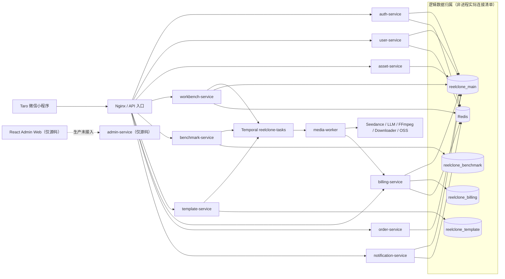
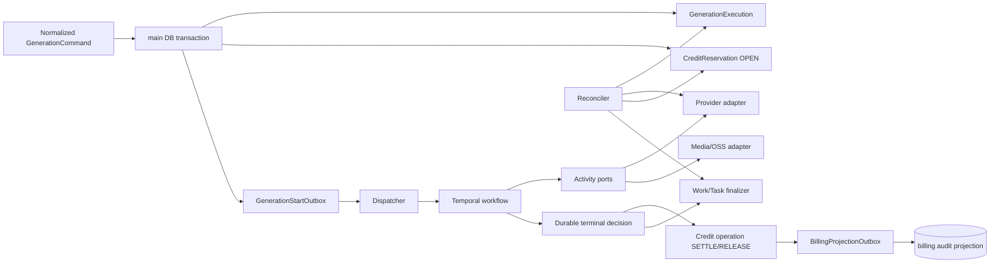

# ReelClone 项目深度重构分析报告

> 基线：`master@2ffed0e0b70021aef1c9a514033c938854554f2b`
>
> 日期：2026-08-01
>
> 结论性质：基于当前代码的重构决策输入，不是历史规划文档的复述，也不等同于生产验收。

## 1. 执行摘要

ReelClone 已经不是一个只有页面和 CRUD 的演示仓库。当前代码包含 10 个 NestJS 业务服务、1 个 Temporal worker、2 个前端应用、4 个 PostgreSQL 业务库，以及真实的生成、计费、订单、模板和通知链路。V2 生成计费已经引入主库权威预留、事务性 outbox、确定性 workflow ID、Provider 未确认前不退款等正确机制，这些应当保留。

但项目仍不具备可信的生产闭环。最危险的部分不是代码风格，而是以下四类系统性问题：

1. **资金和任务状态仍有不可恢复窗口**：V2 生成链路方向正确，但 legacy 计费、benchmark、管理员调账和支付赠分仍跨库直接双写；生成启动、Provider 提交和终态回写缺少 durable reconciler。
2. **身份、支付和外部能力存在真实模式阻断**：缺少微信凭证会自动降级为可伪造的 Mock 身份，Access/Refresh Token 与跨服务撤权边界失效；微信支付真实下单缺 Authorization 签名，真实回调验签直接返回成功；真实短信发送仍是抛错占位。
3. **CI/部署存在 false green**：根 build 只执行 `echo`，Docker job 对当前 `master` 不运行且路径全部错误，小程序 build 会跳过并成功，生产健康检查与真实路由不一致。
4. **模块边界被基础设施反向污染**：`common -> database`、`temporal -> ai/oss`；配置、鉴权、HTTP client、mock/real 判断和状态转换分散在多个服务中。

因此，本报告不建议“大爆炸式重写”或立刻上 Kubernetes。推荐顺序是：

```text
先关闭资金/安全/交付漏洞
  -> 建立 durable operation / execution / outbox / reconciler
  -> 收敛能力与运行时契约
  -> 拆分 shared library 和大型 orchestrator
  -> 最后优化前端结构、可观测性和发布平台
```

### 1.1 总体判断

| 维度       | 判断     | 核心原因                                                                                   |
| ---------- | -------- | ------------------------------------------------------------------------------------------ |
| 业务架构   | 黄       | 服务边界基本可辨认，但 shared library 方向混乱，服务粒度已高于当前交付成熟度               |
| 生成链路   | 红       | Provider 幂等未落到请求，启动/取消/终态缺恢复闭环，mock 可留下 OPEN 预留                   |
| 计费一致性 | 红黄并存 | V2 reservation/outbox 较稳健；legacy ledger、benchmark、grant/reward 仍有双写缺口          |
| 安全       | 红       | 微信登录可静默降级 Mock，Token 类型/撤权漂移，支付验签未实现，运行时密钥和外部资源边界不足 |
| 测试       | 黄       | 测试资产数量可观，但关键 workflow/provider/迁移/生产契约覆盖不足，完整套件未稳定收敛       |
| CI/CD      | 红       | 构建、镜像、小程序、E2E、迁移和生产 Compose 都未形成可信门禁                               |
| 可观测性   | 黄红     | 有 health/metrics/logger 代码，但缺统一上下文、采集、告警、SLO 和恢复工具                  |
| 文档一致性 | 红       | 旧架构文档描述 K8s、Formance、RabbitMQ 和不存在的目录，明显超前于实时代码                  |

## 2. 审计范围与方法

### 2.1 当前规模

- Git 跟踪文件：853。
- 应用：13 个，其中 10 个 NestJS 服务、1 个 media worker、2 个前端。
- 共享库：7 个，分别为 `ai/common/database/observability/oss/swagger/temporal`。
- 应用/库 TS/TSX：45,092 个非空行；口径为 Git 跟踪的 `apps|libs/**/*.{ts,tsx}`，排除 generated 与 `*.spec|*.test`。
- 标准测试 suite：100 个（72 backend、18 miniprogram、10 integration）；另计 6 个 integration setup/helper 后，共 106 个测试相关文件、21,888 个非空行。
- Nx 实际依赖图：`workbench-service` 直接依赖 6 个共享库；`common` 反向依赖 `database`；`temporal` 依赖 `ai` 和 `oss`。

### 2.2 证据来源

- 当前源码、Nx graph、TypeORM entities/migrations、Temporal workflow/activity、Docker/CI/部署脚本。
- `git status`、`git log`、源文件/测试文件统计和现有 coverage artifact。
- 五个独立分析方向：架构、生成/Temporal、计费/数据、API/安全、测试/交付。
- CCG 外部模型调用已尝试；本机 antigravity 的 `agy` 不在 PATH，Claude wrapper 以状态 1 退出，因此没有把失败调用伪装成有效审查结论。

### 2.3 本轮验证

| 命令                                       | 结果                       | 说明                                                                               |
| ------------------------------------------ | -------------------------- | ---------------------------------------------------------------------------------- |
| `npm run typecheck`                        | 通过                       | 根 TypeScript；根配置不覆盖 miniprogram                                            |
| `npm run lint`                             | 通过                       | 只覆盖 `apps/libs` 下的 `.ts`，不覆盖 TSX、脚本和配置                              |
| `npm run test:miniprogram -- --runInBand`  | 18 suites / 302 tests 通过 | 有 `act(...)` 警告，且 Jest 为 isolated transpilation                              |
| generation/Temporal 定向                   | 4 suites / 53 tests 通过   | 不代表真实 Provider/Temporal/PostgreSQL E2E                                        |
| billing 定向                               | 3 suites / 51 tests 通过   | Repository/DataSource mock 为主                                                    |
| SMS 单测单独重跑                           | 1 suite / 9 tests 通过     | 首轮完整套件中的临时 read error 未复现                                             |
| `npm run test:unit -- --runInBand`（首轮） | 未完成                     | 246 秒工具超时，期间出现一次 `UNKNOWN: unknown error, read`                        |
| `npm run test:unit -- --runInBand`（复跑） | 72 suites / 877 tests 通过 | 131.974 秒；出现 `MaxListenersExceededWarning`，说明测试进程存在 listener 清理债务 |
| `npm run test:integration`                 | 失败                       | 指向不存在的 `jest.integration.config.js`，所以没有把集成测试计入通过项            |

仓库现有 `coverage/coverage-summary.json` 是 2026-07-30 的旧快照，约为 lines 52.02%、branches 36.78%、functions 38.53%。它可以说明覆盖率量级，不能当作当前提交的实时覆盖率证明。

### 2.4 质量节拍门禁

| 门禁         | 结果         | 边界                                                                         |
| ------------ | ------------ | ---------------------------------------------------------------------------- |
| 源码上下文   | 通过         | 五个分析维度覆盖运行拓扑、生成、计费、API/安全、测试/交付，并与旧文档分离    |
| 静态检查     | 通过但不完整 | typecheck/lint 通过；lint 不覆盖 TSX、脚本与部署配置                         |
| 单元测试     | 通过但有债务 | 后端 877、miniprogram 302 项通过；存在 React `act(...)` 与 listener 清理警告 |
| 集成/E2E     | 失败         | integration 配置缺失，真实 PostgreSQL/Redis/Temporal/Provider/支付闭环未验证 |
| 安全/资金    | 失败         | 身份、支付、legacy 双写、生成恢复和外部资源仍有 P0                           |
| 构建/发布    | 失败         | 当前 CI/Docker/health/migration contract 会产生 false green                  |
| 外部交叉审查 | 工具不可用   | antigravity 缺 `agy`；Claude wrapper 状态 1，未产生有效模型结论              |

本报告不计算会掩盖红线的综合分：单元测试全绿不能抵消身份、资金或支付门禁失败。当前结论是“代码可继续演进，production readiness 不通过”。

## 3. 实时架构

### 3.1 当前生产入口与逻辑数据归属



生产 Nginx/Compose 只接入 9 个业务服务，admin-web/admin-service 当前没有生产 upstream 或容器；上图数据库与 Redis 边表示**逻辑归属**。实际 `DatabaseModule.forRoot()` 会为调用它的服务初始化全部四个连接，auth/order/benchmark/template/media-worker 等因此拥有比图中更宽的启动依赖；Redis 注册范围也包含 benchmark/order/template/media-worker（`libs/database/src/modules/database.module.ts:105`；`apps/auth-service/src/app.module.ts:49`；`apps/media-worker/src/app.module.ts:55`）。这类实际连接与领域归属的偏差正是 P1-6 的重构对象。

当前没有代码形式的 `api-gateway` 应用，也没有仓库内的 Terraform/K8s manifests。入口是生产 Compose 中的 Nginx。旧文档中的 Formance Ledger、RabbitMQ、`workers/`、`infra/`、`packages/` 和 Kubernetes 是目标设想，不是当前运行事实（`01-docs/03-技术架构方案.md:17`、`:145`、`:465`）。

### 3.2 模块职责

| 区域                     | 当前职责                                               | 主要热点                                                                                        |
| ------------------------ | ------------------------------------------------------ | ----------------------------------------------------------------------------------------------- |
| `apps/workbench-service` | Work/GenerationTask、冻结积分、启动/取消/重试 Temporal | `generation.service.ts` 约 872 行，同时承担 application service、saga、lock、mapping 和恢复标记 |
| `libs/temporal`          | 三类 workflow、activity 合约和实现、client/worker      | workflow 与 concrete AI/OSS 类型耦合；video workflow 约 536 行                                  |
| `apps/billing-service`   | legacy ledger、V2 reservation、投影、对账              | 新旧一致性模型并存，语义和恢复能力差异大                                                        |
| `libs/database`          | 四连接、entity、migration                              | 所有实体集中，连接配置与 `common/configuration` 重复                                            |
| `libs/common`            | exception/guard/interceptor/config/audit/store         | 名称是 common，实际包含 DB/Redis 基础设施，反向依赖 `database`                                  |
| `libs/ai`                | Seedance、LLM、下载、分析、FFmpeg、prompt              | real/mock 在 provider 内分支，外部能力/安全边界不统一                                           |
| `apps/miniprogram`       | 业务主客户端，约 11.5K 生产行                          | 仍展示 real mode 不支持或参数映射不完整的能力                                                   |
| `apps/admin-web`         | 运营后台                                               | API 类型一半 generated、一半手写；缺独立测试和 CI build                                         |

### 3.3 当前依赖方向问题

Nx graph 给出的关键边如下：

```text
common -> database
temporal -> ai, oss
ai -> common -> database
swagger -> common -> database
workbench-service -> common, database, observability, temporal, ai, swagger
```

这意味着一个只想复用 exception/decorator 的服务，也会在逻辑上被拉向数据库基础设施；一个本应保持确定性、可测试的 workflow 包，又直接认识具体 Provider 和 OSS service。当前 graph 没有形成 `domain -> application -> ports -> adapters` 的单向结构。

## 4. 应保留的正确设计

重构不能把已经解决的问题重新引入。以下模式是当前代码的资产：

1. **V2 主库权威预留**：`User.currentPoints`、`CreditReservation` 和 `BillingProjectionOutbox` 在同一 main transaction 提交（`apps/billing-service/src/billing/credit-reservation.service.ts:58`、`:171`）。
2. **单终态约束**：reservation 行锁和 `OPEN -> SETTLED|RELEASED` 状态校验防止结算/释放竞争（`apps/billing-service/src/billing/credit-reservation.service.ts:178`）。
3. **投影幂等与顺序**：billing transaction idempotency key 唯一，FREEZE 必须先于 terminal，projector 使用 `SKIP LOCKED`（`apps/billing-service/src/billing/credit-reservation.service.ts:273`）。
4. **生成能力 fail closed**：real mode 不支持的文本/图片在创建 Work 和冻结前拒绝（`apps/workbench-service/src/workbench/generation.service.ts:123`、`:181`）。
5. **确定性 workflow ID**：每个 GenerationTask 使用 `video-gen-{workId}-{generationTaskId}`，可处理启动响应丢失（`libs/temporal/src/temporal.service.ts:43`）。
6. **Provider 未确认前不退款**：取消/超时必须先确认外部任务停止（`libs/temporal/src/workflows/video-generation.workflow.ts:440`、`:501`）。
7. **重试并发保护**：Redis owner token + Lua compare-delete，数据库 Work 行锁和 active task 条件回写（`apps/workbench-service/src/workbench/generation.service.ts:477`、`:845`；`apps/media-worker/src/worker/workflow-state.store.ts:137`）。
8. **OpenAPI generated diff**：fixture 到 generated type 的一致性检查是契约自动化的正确起点（`.github/workflows/ci.yml:64`）。
9. **测试和最小 CI 权限基础**：两套 coverage threshold、coverage artifact、`contents: read` 和 concurrency cancellation 都值得保留。

## 5. 关键发现

### 5.1 P0：必须先止血

#### P0-1 身份令牌边界在生产配置与跨服务之间失效

**证据**

- `WechatService` 将显式 Mock **或** AppID/Secret 任一缺失都解释为 Mock；Mock 路径把任意非空 code 变成稳定的 `mock_openid_*`（`apps/auth-service/src/auth/wechat.service.ts:53`、`:85`）。
- Token 签发时虽写入 `type: access|refresh`，所有 HTTP Strategy 却不要求 Bearer 为 access；刷新接口也不要求输入为 refresh，并直接沿用旧 role（`apps/auth-service/src/auth/jwt.service.ts:54`；`apps/auth-service/src/auth/auth.service.ts:229`）。
- auth-service 检查 jti 黑名单/改密标记，user-service 还检查实时用户状态；admin 等其余服务只把已签名 payload 映射成用户（`apps/auth-service/src/auth/jwt.strategy.ts:67`；`apps/user-service/src/auth/jwt.strategy.ts:57`；`apps/admin-service/src/auth/jwt.strategy.ts:27`）。

**影响**

生产漏配微信凭证会从启动错误变成认证绕过；7 天 Refresh Token 可直接作为 Bearer，Access Token 又可刷新；登出、冻结、改密和降权后的旧 Token 在不同服务上得到不同授权结果。

**重构动作**

1. production/staging 缺微信凭证或绑定 Mock adapter 时启动失败；只有显式测试 profile 允许 Mock。
2. 建立唯一 `JwtAuthModule`：API 强制 access，刷新强制 refresh；使用可轮换 session family，检测复用并支持整族吊销。
3. 刷新时从权威用户状态读取 role/status；以持久化 `tokenVersion`/`credentialsChangedAt` 与 claim 比较，所有服务执行同一撤权协议。
4. 用契约测试逐个验证全部 HTTP 服务都拒绝 Refresh Bearer、旧权限、冻结用户和已吊销 session。

#### P0-2 微信支付真实模式不具备可信请求与回调认证

**证据**

- 真实下单请求明确缺少微信支付 `Authorization` 请求签名，只发送 `Wechatpay-Serial`（`apps/order-service/src/order/wechat-pay.service.ts:227`、`:253`）。
- 真实回调验签有 TODO，并直接 `return true`（`apps/order-service/src/order/wechat-pay.service.ts:174`、`:180`）。
- production 只禁止 mock 启动，并不会因验签未实现而拒绝 real mode（`apps/order-service/src/order/wechat-pay.service.ts:114`、`:126`）。
- Webhook 没有保留验签所需 raw body；成功响应还会被全局 response envelope 改写（`apps/order-service/src/order/webhook.controller.ts:41`；`libs/common/src/interceptors/response.interceptor.ts:67`）。
- 回调结果虽有 amount/currency，却没有建模 appid/mchid；订单 handler 按 `out_trade_no` 查到记录后不比较回调金额与 `Order.amount` 就进入 PAID（`apps/order-service/src/order/wechat-pay.service.ts:63`；`apps/order-service/src/order/order.service.ts:289`；`libs/database/src/entities/order.entity.ts:45`）。
- 真实短信发送仍直接抛出“待实现”（`apps/user-service/src/user/sms.service.ts:205`）。

**影响**

当前配置齐全并不等于支付/短信可用。支付下单大概率被微信拒绝；即使补上签名，错误商户、应用、金额或币种的合法签名消息仍可能驱动本地入账。继续把它们暴露为 production-ready 会制造安全和资金风险。

**重构动作**

1. 在实现并通过微信官方验签向量前，production readiness 必须 fail closed。
2. 用独立 `WechatPayAdapter` 封装请求签名、平台证书轮换、时间窗/nonce/replay 校验、AES-GCM 解密和错误分型。
3. 解密后逐项绑定 `appid/mchid/out_trade_no/amount.total/currency` 与本地配置和订单；`transaction_id` 必须唯一且与订单一一对应，重复同一事件只可幂等返回，任一冲突都不得改变订单、套餐或积分。
4. 支付回调只写 durable inbox/order event；订单、套餐和积分由可重放 application handler 处理。
5. SMS 同样使用显式 `MockSmsAdapter`/`RealSmsAdapter`，production 不允许绑定 placeholder adapter。

#### P0-3 legacy 计费仍存在跨库双写与重复入账窗口

**证据**

- legacy FREEZE/RELEASE/GRANT/REWARD/CONSUME 在 main 与 billing 之间直接双写，没有 durable operation（`apps/billing-service/src/billing/ledger.service.ts:268`、`:375`、`:430`、`:483`、`:533`）。
- `runIdempotent` 只从 billing transaction 查历史；main 已提交、billing 未写的窗口无法识别（`apps/billing-service/src/billing/billing.service.ts:395`）。
- Redis lock 使用固定值和固定 TTL，finally 直接 DEL；锁过期后旧请求可能删除新 owner（`apps/billing-service/src/billing/billing.service.ts:411`）。

**已确认的业务缺陷**

- benchmark 失败补偿复用 FREEZE 的幂等键，release 会被原 FREEZE 结果短路；成功和运行期失败也没有 settle/release，freezeId 只存在 Redis（`apps/benchmark-service/src/benchmark/benchmark.service.ts:131`、`:227`、`:434`；`libs/temporal/src/workflows/benchmark-analysis.workflow.ts:54`）。
- 管理员调账把字符串 `admin-grant` 写入 UUID `order_id`；main 余额先增加，billing insert 再失败，重试可再次加分（`apps/admin-service/src/admin-user/admin-user.service.ts:267`；`libs/database/src/entities/point-transaction.entity.ts:50`；`apps/billing-service/src/billing/ledger.service.ts:440`）。
- 支付赠分失败只写 7 天 Redis key，仓库没有消费者；订单再次收到回调时因已 PAID 直接返回（`apps/order-service/src/order/order.service.ts:333`、`:345`、`:417`）。
- reconciliation 用 `totalPoints - frozen` 推导 currentPoints，忽略 SETTLE/CONSUME，必然产生误报（`apps/billing-service/src/billing/reconciliation.service.ts:241`）。

**重构动作**

把 V2 模式推广为唯一模型：所有余额变化先在 main transaction 写 `CreditOperation`/`CreditReservation` 和 outbox，billing 库只做不可变审计投影。禁止新增 `reservationMode=false` 调用，逐项迁移 benchmark/order/template/admin，再删除 legacy direct dual-write。

#### P0-4 生成 saga 不能从所有故障点自动收敛

**证据**

- create 依次执行 Work save、billing freeze、Task save、active task save、Temporal RPC，跨多次 transaction/RPC（`apps/workbench-service/src/workbench/generation.service.ts:199`）。
- mock create 仍调用真实 billing freeze，随后直接 COMPLETED，没有 settle/release（`apps/workbench-service/src/workbench/generation.service.ts:245`、`:614`）。
- Temporal Activity 最多重试 3 次，但 `idempotentKey` 没进入 Seedance HTTP body/header；Provider 还会跨 key failover（`libs/temporal/src/workflows/video-generation.workflow.ts:68`；`libs/temporal/src/activities/seedance.activities.ts:91`；`libs/ai/src/seedance/seedance.provider.ts:255`、`:303`）。
- 成功路径先 settle 后更新 Work；若回写失败，通用 catch 会进入 failure 并尝试 release 已 SETTLED reservation（`libs/temporal/src/workflows/video-generation.workflow.ts:221`、`:297`、`:342`）。
- `provider_state_unknown`、`provider_cancel_pending`、`workflow_start_unknown`、`billing_release_pending` 只有写入点，没有自动 reconciler。

**影响**

可能出现重复外部任务、Provider 正在执行但本地无 taskId、COMPLETED + OPEN reservation、SETTLED + PROCESSING Work、取消已返回成功但资金和 Provider 仍 pending。

**重构动作**

1. 新建 durable `GenerationExecution`，持久化 request fingerprint、provider token、workflow ID、billing operation、stage、attempt 和 recovery deadline。
2. main transaction 只写 execution + start outbox；dispatcher 用确定性 ID 启动 Temporal，CAS ack。
3. 把成功状态拆为 `OUTPUT_READY -> SETTLEMENT_PENDING -> SETTLED -> COMPLETION_PENDING -> COMPLETED`。
4. 一旦已 SETTLED，只能向 COMPLETED 收敛，绝不能进入 RELEASE 分支。
5. 为 provider unknown/cancel requested/workflow start unknown 建定时 reconciliation workflow。
6. 如果 Provider 不支持幂等 token，使用 submission ledger + provider query 恢复，禁止对“结果未知”盲目跨 key 重提。

#### P0-5 CI 和部署门禁会产生 false green

**证据**

- 根 `npm run build` 只打印提示，不编译任何项目（`package.json:23`）；CI 仍将它作为 Build gate（`.github/workflows/ci.yml:87`）。
- Docker job 只在 `refs/heads/main` 运行，而当前主分支是 `master`；matrix 查找 `apps/auth/Dockerfile` 等错误路径，缺文件会打印 placeholder 并成功（`.github/workflows/ci.yml:90`、`:99`、`:104`）。
- 小程序真实 target 在 `apps/miniprogram/project.json`，CI 却检查根 `build:weapp`；找不到即跳过，整步还有 `continue-on-error`（`.github/workflows/ci.yml:135`）。
- `test:integration` 指向不存在的 `jest.integration.config.js`（`package.json:19`）。现有 E2E 不进 CI，setup 导出函数没有被 Jest 调用，部分“成功”流程允许 FAILED。
- production Compose 多数探针使用不存在的 `/users/health`、`/points/health` 等路径；通用 health 实际是 `/api/v1/health`，又未标记 `@Public()`（`docker/docker-compose.prod.yml:211`、`:332`；`libs/observability/src/health/health.controller.ts:41`）。
- init SQL 把 Temporal 用户密码重置为字面量 `temporal`，Compose 却使用 production env 密码；按示例 clean deploy 会认证失败（`docker/init-db.sql:35`；`docker/docker-compose.prod.yml:118`）。
- 应用/worker 默认 namespace 为 `reelclone`，Compose/init/deploy 没有创建步骤，worker 还只等待 Temporal `service_started`（`docker/.env.production.example:88`；`apps/media-worker/src/worker/worker.bootstrap.ts:64`；`docker/docker-compose.prod.yml:445`）。
- 部署脚本在缺 npx 时跳过 migration，并允许 migration 失败后交互式继续（`scripts/deploy.sh:225`）。
- 多个 Dockerfile 假设互不一致的 dist 路径，并拷贝未必生成的 `libs/*/dist`；仓库没有 `.dockerignore`。

**重构动作**

第一轮不改业务架构，先让门禁说真话：

```text
nx run-many -t lint,typecheck,test,build --all
  + miniprogram/admin-web production build
  + generated OpenAPI contract check
  + fresh Postgres migrations
  + real Dockerfile matrix (missing = fail)
  + docker compose config + clean-volume smoke
  + /livez /readyz HTTP 200/503 contract
  + 最小 Temporal workflow + billing invariant E2E
```

镜像由 CI 构建一次、以 digest 发布；生产只部署已验证制品，不能再在服务器 `git pull` 后构建 mutable `latest`。

#### P0-6 外部 URL 和资产边界不足

- 下载器只用字符串 `includes` 识别平台，未知 URL 仍会传给 `lux`/`yt-dlp`；没有 scheme、hostname、DNS/IP、redirect 和私网地址校验（`libs/ai/src/downloader/video-downloader.service.ts:79`、`:102`、`:124`）。
- Workbench 没有 Asset ownership verifier，用户 asset key 直接持久化并进入 Provider 参数（`apps/workbench-service/src/workbench/workbench.module.ts:21`；`apps/workbench-service/src/workbench/generation.service.ts:203`、`:640`）。
- asset-service 直接登记客户端提供的 `ossKey`，删除资产时再用服务端高权限凭证删除该 Key；攻击者可先登记其他用户或系统对象 Key，再借服务端权限删除（`apps/asset-service/src/asset/asset.service.ts:135`、`:188`）。

**重构动作**

建立统一 `ExternalResourcePolicy`：结构化 URL parse、严格 host allowlist、每次 DNS 解析后的私网/回环/保留网段拒绝、redirect 逐跳复核、响应大小/时长限制。对象上传使用绑定 user/key prefix/type/size/expiry 的 upload intent，服务端 HEAD 核验后才能 finalize；asset key 通过 owner、状态、媒体类型和租户校验后才能进入 Provider 或删除队列。

### 5.2 P1：高价值结构重构

#### P1-1 拆分 `common`，恢复依赖方向

`libs/common` 同时放 exception/decorator、JWT guard、audit log、ConfigStore、Redis 和 TypeORM module。`audit-log`/`config-store` 直接 import `@reelclone/database`（`libs/common/src/audit/audit-log.module.ts:15`；`libs/common/src/config/config-store.service.ts:23`），形成 `common -> database`。

建议拆为：

```text
libs/foundation        纯类型、错误、结果、通用函数，不依赖 Nest/DB
libs/http-nest         guard/filter/interceptor/decorator/bootstrap
libs/auth-contracts    principal/role/token claim，不含具体 Passport strategy
libs/config-contracts  typed config interfaces、validation schema
libs/platform-data     TypeORM/Redis/ConfigStore/Audit adapters
```

所有底层库建立 Nx tags/enforce-module-boundaries；`foundation/domain` 不允许 import `database/axios/nestjs`。

#### P1-2 拆分 Temporal contracts/workflows 与 worker adapters

`libs/temporal/src/activities/activity-context.ts` 的 dependency container 直接引用 `SeedanceProvider`、`LlmProvider`、`OSSService`，并使用进程级全局可变单例（`:26`、`:51`、`:71`）。这让 workflow contract、worker wiring 和 concrete provider 绑在同一包。

目标拆分：

```text
generation-contracts   serializable commands/events/state
generation-workflows   deterministic workflow only
generation-activities  port interfaces + retry classification
worker-adapters         Nest/TypeORM/Redis/Seedance/OSS concrete adapters
temporal-runtime        client/worker bootstrap/TLS/namespace/readiness
```

workflow 只认识 activity interface 和 stable error type。依赖注入由 worker 构造 activity closure，不再通过全局 singleton 取 concrete service。

#### P1-3 用 capability registry 收敛 UI、计价、校验和 Provider

API 暴露 8 种生成类型，但 real mode 只完整支持部分视频组合。EDIT/EXTEND 缺必需视频 URL，3D 被降级为首帧图生视频，`model/aspectRatio/referenceImages/referenceAudio` 有多处未进入真实 Provider（`apps/workbench-service/src/workbench/dto/create-generation.dto.ts:4`；`libs/temporal/src/activities/seedance.activities.ts:31`、`:91`；`libs/ai/src/seedance/seedance.provider.ts:303`）。duration 运行时允许任意正整数，计价只识别 10 秒（`apps/workbench-service/src/workbench/dto/create-generation.dto.ts:101`；`apps/workbench-service/src/workbench/points-calculator.util.ts:57`）。

建立单一 capability registry，按 `operation/provider/model` 声明：输入 schema、素材类型、时长/比例、价格、是否 real-ready、取消/查询/幂等能力。前端从 `/capabilities` 渲染；quote、validation、workflow mapping 和 Provider request 共用同一 normalized command。

#### P1-4 统一 runtime profile，消灭混合 real/mock

workbench、Temporal activity、Seedance、OSS、Downloader、SMS、Payment 各自解释环境变量。一个部署可能出现“真实计费 + mock worker”或“真实 Provider + mock OSS”。

启动时构建 immutable `RuntimeProfile`：

```text
profile=development-mock | integration | staging-real | production-real
dependencies={billing, temporal, provider, oss, ffmpeg, downloader, sms, payment}
```

每个 profile 声明允许的 adapter；production-real 任一依赖为 placeholder/mock/未探测成功，readiness 必须失败。mock adapter 使用隔离数据库/账户，不与真实计费混用。

#### P1-5 密钥管理不应以明文业务配置实现

ConfigStore 将 Provider key 直接写 `system_config.config_value`，再明文写 Redis cache（`libs/database/src/entities/system-config.entity.ts:19`；`libs/common/src/config/config-store.service.ts:142`、`:153`、`:169`）。这扩大了数据库 dump、Redis、管理员和日志事故的暴露面。

建议后台只维护 secret reference/version/rotation 状态，明文放云 Secret Manager/KMS，或至少 envelope encryption 后存储；读取端使用短期缓存且不得把 value 发布到普通 Pub/Sub。密钥更新、读取和失败必须进入审计日志。

#### P1-6 配置和连接拓扑重复且漂移

`libs/common/src/config/database.config.ts`、`configuration.ts` 和 `libs/database/src/modules/database.module.ts` 各自解析数据库环境变量，默认密码和数据库名处理不一致。`DatabaseModule.forRoot()` 默认初始化全部四个连接，billing-service 也因此依赖无关库可用。

建议每个 service 声明自己的 typed config 和最小 connection set；使用独立 DSN、pool、SSL、statement/lock timeout。配置 schema 在启动阶段统一校验，禁止业务代码直接读取 `process.env`。

#### P1-7 outbox/reconciliation 需要运维状态机

V2 outbox 只有 PENDING/DELIVERED，没有 attempts、nextAttemptAt、lastError、lease、DEAD 和人工 replay。查询按 updatedAt，而索引是 createdAt；被 FREEZE 阻塞的 terminal 可能占满 batch（`apps/billing-service/src/billing/credit-reservation.service.ts:147`、`:291`；`libs/database/src/entities/billing-projection-outbox.entity.ts:40`）。

增加 claim/lease/CAS ack、退避、死信、poison event、inspect/replay/resolve 工具和 backlog age 告警。claim transaction 要短，不能持 main row lock 跨 billing 网络调用。

#### P1-8 可观测性组件存在，但运行闭环不存在

- Metrics/Health controller 在全局 JWT guard 下通常不可抓取。
- tracing util 注释声称 AsyncLocalStorage，实际是进程全局变量，未来启用会串请求（`libs/common/src/utils/tracing.util.ts:21`、`:47`）。
- Nginx 使用 `X-Request-Id`，应用读取 `x-trace-id`，HTTP/Temporal 没有统一传播。
- Compose 没有 Prometheus/OTel collector/log backend/alert rule。

统一 W3C `traceparent`、真正 ALS/OTel context，并把 `workflowId/executionId/operationId/outboxId` 作为业务关联键。优先建设生成 pending age、OPEN reservation age、outbox backlog、paid-without-grant、provider duplicate submission、worker poller 和 readiness 告警。

#### P1-9 公共/内部 API 契约缺少统一信任边界

- 模板服务的发布入口直接接受 `sourceWorkId/coverKey/videoKey`，绕过 Workbench 对作品归属和完成状态的校验；公开详情也未强制模板为 ACTIVE（`apps/template-service/src/template/template.controller.ts:94`；`apps/template-service/src/template/template.service.ts:149`、`:168`）。
- workbench、benchmark、order 接受客户端幂等键，但缓存/锁/查询键没有统一绑定 userId；跨用户相同 key 可能互相阻断或复用结果（`apps/workbench-service/src/workbench/generation.service.ts:150`；`apps/benchmark-service/src/benchmark/benchmark.service.ts:132`；`apps/order-service/src/order/order.service.ts:114`）。
- 内部调用依赖全系统共享 `INTERNAL_API_KEY`，没有 caller、audience、scope、时效或重放边界；完整业务前缀又由 Nginx 公网代理（`libs/common/src/guards/internal-api-key.guard.ts:55`；`docker/nginx/nginx.conf:211`）。
- 小程序缺构建变量时静默回退 localhost，WebSocket 还硬编码本机地址并把 Token 放在 query（`apps/miniprogram/src/services/request.ts:200`；`apps/miniprogram/src/hooks/useWebSocket.ts:28`、`:75`）。

先用 consumer-driven contract test 固定现有内部命令，再迁移到有 issuer/audience/scope/jti/exp 的短期 service identity，并从公网路由明确拒绝 internal endpoint。所有外部幂等键规范化为 `(tenant, user, operation, key, requestHash)` 的 durable record；生产前端缺 API/WS origin 时必须构建失败，WebSocket 使用一次性短期 ticket。

#### P1-10 模板奖励补偿不能用“已发数量”推导缺失序号

实时奖励键按 `reward:template:{id}:use:{useCount}` 绑定使用序号，但补偿器只读取已发放条数 `rewardCount`，再扫描 `(rewardCount, useCount]`；如果 use 1/3 已发、use 2 失败，`rewardCount=2`，补偿只会重放 use 3，use 2 永久漏发。扫描又固定读取高 useCount 的前 500 条，低热度模板可能饥饿（`apps/template-service/src/template/template.service.ts:256`；`apps/template-service/src/template/reward-reconciliation.service.ts:75`、`:89`）。

迁移 legacy REWARD 前先止损：按 durable operation/ordinal 枚举真实缺口，不能用 count 猜序号；扫描使用稳定游标并证明全量可达，重放仍以 operation ID + request fingerprint 幂等。

### 5.3 P2：维护性与前端收敛

#### P2-1 认证与 bootstrap 重复

10 个服务各有 `jwt.strategy.ts`，global guard 有的通过 APP_GUARD、有的在 `main.ts` 手动 new，health/public/internal 组合因此容易漂移。应提供共享 `SecurityModule.forService()`，但保留 service-level policy，不要把所有授权逻辑塞进一个万能 guard。

#### P2-2 API client 和类型适配重复

admin-web 与 miniprogram 各复制一套 generated service types，再手写聚合别名和 API client。当前 consistency gate 只证明 fixture -> generated，不能证明 live controller -> OpenAPI fixture。

目标流程：

```text
live Nest application context
  -> OpenAPI JSON
  -> breaking-change diff
  -> generated typed clients/contracts package
  -> admin-web + miniprogram adapters
```

#### P2-3 前端按 workflow 组织，而不是继续堆 page 文件

miniprogram 生产代码约 11.5K 行，upload、benchmark detail、work detail 等页面已达到 14K-18K 字节；admin `Users.tsx` 也超过 11K 字节。拆分应围绕 query/form/command state，而不是只按视觉组件机械切文件。优先抽取：generation form schema、capability binding、upload state machine、async task projection、error/pending presentation。

#### P2-4 修正文档事实层和目标层

建议将文档明确分为：

- `CURRENT_ARCHITECTURE.md`：由代码和部署生成/校验的当前事实。
- ADR：为什么选择 main-authoritative credit、Temporal、Compose 等。
- `TARGET_ARCHITECTURE.md`：未来目标与触发条件。
- Runbook：部署、告警、恢复、人工 reconciliation。

Kubernetes、Formance、RabbitMQ、Terraform 只有在真实引入并验证后，才能进入 CURRENT 文档。

## 6. 根因归纳

这些问题不是几十个互不相关的小 bug，而是五个重复模式：

1. **把 Redis/log 当作恢复机制**：retry key、freezeId、pending marker 有生产者，没有 durable consumer/case state。
2. **把 mock 写成 real code 的条件分支**：模式判断分散，无法证明一个进程的完整运行 profile。
3. **先做微服务数量，后补服务级自治**：共享四库、共享大 common、HTTP 双写和现场构建削弱了服务边界。
4. **状态改变早于决策落盘**：外部 RPC、跨库提交、账务终态和业务终态之间缺 durable decision/operation。
5. **门禁验证了“命令退出 0”，没有验证“可部署制品存在”**：echo、skip、continue-on-error 和 mock success 形成 false green。

## 7. 目标架构

### 7.1 生成与计费主链路



核心不变量：

- 用户请求、业务对象、账务 reservation、workflow 和 Provider submission 都有稳定 ID/fingerprint。
- 所有可重试操作先落 durable intent，再执行副作用。
- Provider 结果未知是独立状态，不等于失败，也不触发退款。
- billing 投影失败不改变 main 权威余额；业务状态失败也不能逆转已提交的账务终态。
- reconciler 的每个动作可重复执行，并有 audit trail。

### 7.2 包边界

```text
foundation                 无框架纯类型/错误/Result
generation-domain          command/state/invariant/capability
billing-domain             operation/reservation/invariant
application-*              use case、transaction boundary、port
contracts-*                OpenAPI/event/Temporal serializable contract
adapters-*                 TypeORM/Redis/HTTP/Provider/OSS/Wechat
platform-nest              bootstrap/guard/filter/logger/readiness
runtime-worker             Temporal client/worker wiring
frontend-sdk               generated client + stable adapters
```

Nx 强制依赖方向：`domain -> foundation`；`application -> domain + ports`；`adapters -> application ports`；应用负责 composition root。

## 8. 分阶段路线图

### Phase 0：止血与真门禁（1-2 周）

| 工作项                                                         | 优先级 | 成本 | 验收                                                                    |
| -------------------------------------------------------------- | -----: | ---: | ----------------------------------------------------------------------- |
| ~~微信登录 fail closed；Access/Refresh 与统一撤权协议~~        |     P0 |    M | ✅ bf0a558 共享 JWT 策略 + 微信支付签名修复                             |
| ~~支付 real mode fail closed，完成请求/回调验签~~              |     P0 |    M | ✅ bf0a558 请求签名 + 回调验签适配                                      |
| benchmark freeze/settle/release 独立 key + durable reservation |     P0 |    M | 成功 settle、失败 release、补偿可重放；无 Redis-only 资金状态           |
| ~~admin grant 使用 adjustment UUID；订单 paid-grant outbox~~   |     P0 |    M | ✅ 已使用 randomUUID + V2 CreditOperation                               |
| ~~mock billing 隔离；修复 completed + OPEN~~                   |     P0 |  S-M | ✅ 2aa0834 Mock create 跳过真实 freeze                                  |
| CI 执行真实 Nx/Taro/Vite build 和正确 Docker matrix                |     P0 |    M | ⬜ P0-6 待做 |
| ~~fresh DB/Temporal bootstrap contract~~                           |     P0 |    M | ✅ dc79672 namespace 注册 + DBPLUGIN 修复 + 迁移补全 |
| ~~统一公开 `/livez` `/readyz`~~                                    |     P0 |  S-M | ✅ 92dbbed media-worker /livez /readyz + Docker /readyz |
| 外部 URL/asset ownership policy                                |     P0 |    M | SSRF/private IP/redirect/跨用户 asset 测试通过                          |

### Phase 1：一致性内核（2-5 周）

1. ~~新建 `CreditOperation`，迁移 legacy ledger 的 GRANT/REWARD/CONSUME/FREEZE/RELEASE；模板奖励按 ordinal 枚举缺口，不按 count 猜测。~~ ✅ 已完成
2. ~~新建 `GenerationExecution`、start outbox、terminal decision 和 reconciler。~~ ✅ C1 已完成：create(C1.1) 写入 Execution INITIATED；startWorkflow 更新 COMPLETED/FAILED/UNKNOWN；cancel(C1.2) 更新 CANCELED/PROVIDER_CANCEL_PENDING；finalize(C1.3) TypeOrmWorkflowStateStore 终态回调更新 stage。✅ C5 已完成：ReconcilerWorkflow 定期扫描 indeterminate 阶段 Execution，CAS claim 防并发，查询 Provider 状态，自动推进到终态。实现文件：`libs/temporal/src/types.ts`(RECONCILER_CONFIG + ReconcilerActivities)、`libs/temporal/src/activities/reconciler.activities.ts`(5 个 activity)、`libs/temporal/src/workflows/generation-reconciler.workflow.ts`(长运行扫描工作流)、`apps/media-worker/src/worker/activities.container.ts`(注册)。
3. ~~outbox 增加 lease/backoff/dead-letter/replay，并接 backlog/age 告警。~~ ✅ C6 已完成：BillingProjectionOutbox 增加 DEAD 终态、attempts/nextAttemptAt 指数退避、leaseOwner/leaseExpiresAt 分布式 claim、lastError 错误记录。projectPending 改为 FOR UPDATE SKIP LOCKED + lease 原子 claim 模式；handleFailedOutbox 指数退避（5s×2^n，上限 1h，10 次后 DEAD）；inspectOutbox/replayOutbox/getDeadLetterSummary 运维工具；BillingProjectionCron 增加 backlog/age/DEAD 告警指标。18 个单元测试全通过。实现文件：`libs/database/src/entities/billing-projection-outbox.entity.ts`(DEAD 状态 + 5 个新字段 + claim 索引)、`libs/database/src/migrations/main/0014_enhance_billing_outbox_lease_backoff.ts`(迁移)、`apps/billing-service/src/billing/credit-reservation.service.ts`(claimBatch + handleFailedOutbox + markDead + inspectOutbox + replayOutbox + getDeadLetterSummary)、`apps/billing-service/src/billing/billing-projection.cron.ts`(backlog/age/DEAD 告警)。
4. capability registry 统一 quote、validation、UI 和 Provider mapping。
5. ~~runtime profile 和 typed configuration 在启动阶段 fail closed。~~ ✅ C8 已完成：OSS 配置在 production/staging 环境缺少凭证时 fail closed（与 SMS/WeChat 统一行为）；StartupProfileValidator 集中校验 TEMPORAL_MOCK_MODE/SMS_MOCK_MODE/WECHAT_MOCK_MODE/JWT_SECRET/DATABASE_HOST，11 个服务 main.ts 入口注入 failClosedStartupCheck()；12 个单元测试覆盖所有校验场景。实现文件：`libs/oss/src/config/oss.config.ts`(isProductionLike + fail closed)、`libs/common/src/config/startup-profile.validator.ts`(集中校验器)、11 个 `apps/*/src/main.ts`(注入校验)。
6. ~~对历史数据做只读 inventory；无法证明关联的记录进入人工 reconciliation case，禁止按金额/描述猜测。~~ ✅ C9 已完成：HistoricalDataInventoryService 只读审计 5 张计费表，检测 DEAD outbox/stale OPEN reservation/orphan billing transaction 等 5 类问题；4 类 reconciliation case（OPEN reservation 无投影/billing 交易无 reservation/operation 无 outbox/DELIVERED 但 reservation 非 OPEN）禁止按金额/描述猜测关联，全部标记为人工核实。6 个单元测试覆盖正常路径/DEAD 检测/stale 检测/orphan 检测/不猜测关联。实现文件：`apps/billing-service/src/billing/historical-data-inventory.service.ts`(审计逻辑)、`apps/billing-service/src/billing/historical-data-inventory.service.spec.ts`(测试)、`apps/billing-service/src/billing/billing.module.ts`(注册)。

### Phase 2：模块边界（5-8 周）

1. ~~先拆 `foundation` 与 `platform-data`，消除 `common -> database`。~~ ✅ D1 已完成：创建 `@reelclone/platform-data` 包，将 audit（AuditLogModule/AuditLogService）和 config-store（ConfigStoreModule/ConfigStoreService）从 common 迁移到 platform-data；common 的 index.ts 改为从 `@reelclone/platform-data` re-export，消除 `common → database` 直接依赖；tsconfig.base.json 新增 platform-data 路径映射。实现文件：`libs/platform-data/`(新包，project.json + tsconfig + src/)、`libs/common/src/index.ts`(re-export)、`tsconfig.base.json`(路径映射)。
2. ~~拆 Temporal contracts/workflows/adapters，移除全局 dependency singleton。~~ ✅ D2 最小拆分已完成：创建 `libs/temporal/src/contracts.ts` 作为纯契约入口（零实现依赖，仅 re-export types.ts），消费方可通过 `@reelclone/temporal/contracts` 只导入类型不引入实现；全局 singleton（activity-context.ts、client、worker）和 Workflow/Activity 完整拆分标记为后续 Ocean（跨 Worker 隔离架构改造，需 NestJS DI 与 Temporal Worker 集成方案设计）。实现文件：`libs/temporal/src/contracts.ts`(纯契约入口)。
3. 将 872 行 `GenerationService` 按 use case 拆为 create/query/cancel/retry/finalize/reconcile handlers。
4. 统一 internal HTTP client：超时、retry classification、idempotency、trace、typed response。
5. 每个 service 只初始化需要的 DB/Redis/adapter。

### Phase 3：交付与运营闭环（8-12 周）

1. CI 构建 digest 镜像，执行 SCA/secret scan/SBOM/sign，再推 registry。
2. 在 Phase 0 clean bootstrap 基础上增加 N-1 upgrade/rollback、迁移故障注入、prod-like 长稳 Compose 和 Temporal real-worker test。
3. OpenTelemetry/Prometheus/log backend + dashboard/alert/runbook。
4. PostgreSQL PITR、Temporal/OSS 完整备份、异地不可变副本和自动 restore drill。
5. 生成 live OpenAPI contract 并供两个前端共享 typed SDK。

## 9. 验收门禁

### 9.1 生成不变量

- 同一 user action/retry 最多一个 active execution 和一个外部 submission。
- `Work=COMPLETED` 时 reservation 必须 SETTLED，产物 key 存在且可访问。
- `Work=FAILED/CANCELED/TIMEOUT` 时 reservation 必须 RELEASED，除非明确 `provider_state_unknown`。
- `provider_state_unknown` 有 owner、next check、age metric 和最终处置，不允许无限悬挂。
- settle 后 Work 回写失败，reconciler 只能补 completed，不得 release。

### 9.2 计费不变量

- 每个 operation ID 对应唯一 request fingerprint；同 key 不同参数返回 conflict。
- main balance delta、reservation delta、operation 和 outbox 同 transaction。
- billing projection 可任意重放，结果字节级/语义级稳定。
- paid order、template use、benchmark execution 都能定位到 durable credit operation。
- 每日 invariant scan 覆盖 main 成功/billing 缺失，而不是只从 billing 选用户。

### 9.3 安全门禁

- production 不能绑定 mock/placeholder payment、SMS、Provider、OSS、Downloader。
- production 缺微信凭证必须拒绝启动；API 只接受 access token，刷新只接受 refresh token，所有服务执行同一撤权版本。
- 微信请求/回调验签、replay window、证书轮换测试通过。
- 支付回调的 appid、mchid、订单号、transaction 唯一性、金额和币种必须与本地不变量一致；不匹配时零状态变更。
- 外部 URL 阻止 private/link-local/loopback/metadata/DNS rebinding/redirect escape。
- secret 不以明文出现在普通 DB dump、Redis、日志、错误或 API response。
- internal API 使用可轮换 service identity；API key 方案至少要有 scoped key、审计和双 key 轮换窗口。

### 9.4 交付门禁

- PR 必须真实 build 两个前端和所有服务。
- Docker matrix 从 clean checkout 构建全部生产镜像，并执行 non-root startup/readiness smoke。
- migration fresh/upgrade/rerun 通过，失败不可交互式越过。
- clean volume 自动创建正确的 Temporal DB 用户/密码与 `reelclone` namespace，worker readiness 证明可真实 poll task。
- E2E setup 确实执行；happy path 不允许把 FAILED 当成功。
- release manifest 固定 commit、migration version、image digest、config version。

## 10. 不建议做的事

1. **不做大爆炸重写**：V2 reservation、Temporal compensation、锁和 idempotency 已有价值，应沿用并扩展。
2. **不先合并微服务**：当前首要风险是状态与交付，不是进程数量；先建立 operation/recovery boundary，再依据调用量决定合并。
3. **不先上 Kubernetes**：当前 Dockerfile、health、migration、artifact 都未闭环，K8s 只会放大不确定性。
4. **不靠 Redis 锁修跨库一致性**：锁解决并发，不解决 commit gap；必须有 durable operation/outbox。
5. **不把全局覆盖率当风险覆盖率**：支付、计费、workflow、migration 和 recovery 要按 invariant 和故障注入验收。
6. **不根据描述/金额猜历史账务关联**：无法证明的历史数据进入人工 case，以新 adjustment event 修复。

## 11. 建议先落的 ADR

1. `ADR-001 Main-authoritative credit operations`：余额与 operation 在 main 权威，billing 只做投影。
2. `ADR-002 Durable generation execution`：所有外部副作用前先落 execution/intent，reconciler 是正式组件。
3. `ADR-003 Runtime profiles and capabilities`：real/mock 是组合时选择的 adapter，不是业务函数内的环境分支。
4. `ADR-004 Build once, deploy by digest`：CI 制品是唯一发布输入，生产不现场构建。
5. `ADR-005 Current vs target documentation`：当前事实由代码/部署验证，目标架构必须标注触发条件。

## 12. 最终结论

ReelClone 的下一阶段不应以“拆更多服务”或“把大文件切小”作为主目标。真正的重构主线是把所有不可逆副作用纳入可证明、可重放、可观测的状态机：

```text
资金变化有 CreditOperation
生成执行有 GenerationExecution
跨边界交付有 Outbox/Inbox
不确定状态有 Reconciler
运行模式有 RuntimeProfile
发布结果有真实 Artifact Gate
```

完成 Phase 0 后，CI 才能准确告诉团队代码是否可交付；完成 Phase 1 后，系统才具备在进程崩溃、网络超时、Provider 不确定和跨库失败下自动收敛的基础；随后再拆包、拆类和优化前端，收益才不会被持续出现的一致性事故抵消。
