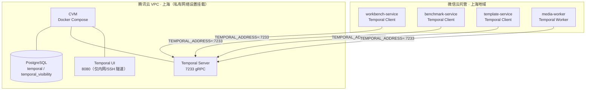

# ReelClone Temporal Server 部署方案

> **生成时间**: 2026-08-24
> **任务来源**: [18-深度重构方案-微信云托管版.md](18-深度重构方案-微信云托管版.md) R-NEW-2 / execute-cloud-run-refactor Task 14
> **部署目标**: 微信云托管（WeChat Cloud Run）
> **关键结论**: Temporal Server 不适合运行在云托管上，需独立部署于腾讯云上海地域 CVM + 同 VPC 内网互联

---

## 1. 背景与问题

### 1.1 为什么 Temporal 不能放进云托管

微信云托管是「容器即服务（CaaS）+ 无状态」形态，官方限制：

| 云托管限制                              | 对 Temporal 的影响                                         |
| --------------------------------------- | ---------------------------------------------------------- |
| 不支持部署有状态服务（数据库/Redis 等） | Temporal Server 本身是持久化有状态引擎，工作流历史必须落库 |
| 容器不支持持久化存储（扩缩容/重启还原） | 工作流执行状态无法在实例生命周期外存活                     |
| 不支持 Docker Compose 部署              | temporalio 官方部署链路为 compose/Helm，无法直接复用       |
| 一个服务仅开一个监听端口                | Temporal 需 7233（gRPC）+ 8233（metrics，可选）多端口      |
| 无固定公网出口 IP                       | 无法用 IP 白名单保护自托管 Server                          |

因此 Temporal Server 必须**独立部署**，云托管中的服务以**客户端/Worker 身份**连接它。

### 1.2 本项目中依赖 Temporal 的服务

| 服务                | 角色                        | 依赖                                                                    |
| ------------------- | --------------------------- | ----------------------------------------------------------------------- |
| `media-worker`      | Temporal Worker（长驻进程） | 监听任务队列，执行 Video/Benchmark 工作流                               |
| `workbench-service` | Temporal Client             | `startVideoGenerationWorkflow` 启动视频生成                             |
| `benchmark-service` | Temporal Client             | `startBenchmarkAnalysisWorkflow` 启动对标解析                           |
| `template-service`  | Temporal Client             | 模板生成工作流                                                          |
| CI（E2E）           | 测试基础设施                | docker-compose 内临时启动（`docker/.env.production.example` + CI 配置） |

SDK 版本：`@temporalio/* ^1.10.0`（TypeScript SDK），兼容 **Temporal Server ≥ 1.22**（现有 `docker-compose.prod.yml` 与 CI 均使用 `temporalio/auto-setup:1.22`）。

---

## 2. 部署方案对比与选型

| 方案                                  | 说明                                                                                      | 优点                                               | 缺点                                                               | 推荐度                 |
| ------------------------------------- | ----------------------------------------------------------------------------------------- | -------------------------------------------------- | ------------------------------------------------------------------ | ---------------------- |
| **A: CVM 独立部署（同 VPC 内网）**    | 腾讯云上海 CVM 上 Docker Compose 跑 Temporal + PostgreSQL，云托管通过私有网络设置内网互联 | 无需改代码；低延迟；内网互通安全；兼容现有眼动模式 | 增加一台 CVM 成本；需自运维（备份/升级）                           | ⭐⭐⭐（**短期推荐**） |
| B: CVM 独立部署（公网直连）           | 同上，但通过公网 IP + TLS 直连 7233                                                       | 无 VPC 配置门槛                                    | 暴露 gRPC 至公网有安全风险；云托管出口 IP 动态无法白名单；延迟略高 | ⭐⭐（仅容灾/过渡）    |
| C: Temporal Cloud（官方托管）         | Temporal 官方 SaaS                                                                        | 免运维、高可用                                     | 国内访问网络不稳定；按执行量计费成本不可控；数据出境合规风险       | ⭐                     |
| D: 改为消息队列（CMQ/Kafka + 任务表） | 重构移除 Temporal                                                                         | 云原生弹性好                                       | 需重写全部工作流编排/重试/状态管理逻辑（工作量大）                 | ⭐⭐（中期评估）       |

> 结论：**短期选方案 A**；中期当业务量上升、运维成本不可承受时评估方案 D。方案 C 在国内网络环境下不推荐。

---

## 3. 推荐架构（方案 A：同 VPC 内网互联）

### 3.1 网络拓扑



### 3.2 网络关键点

1. **微信云托管地域固定为上海**，VPC 互联不支持跨地域，故 CVM 必须选**上海地域**。
2. 微信云托管「服务设置 → 私有网络设置」仅需对**需要连 Temporal 的 4 个服务**开启并绑定同一 VPC（子网可不同，同一 VPC 内默认互通），其他服务（auth/user/asset 等）无需开启。
3. 云托管的「仅支持 HTTP 协议」限制针对**云托管入站网关**；**出站/内网 VPC 访问不受此限**（官方 Redis 内网调用文档即以 telnet/nc 验证 TCP 连通）。Temporal gRPC（HTTP/2 over TCP 7233）经 VPC 内网连接正常。
4. Temporal 官方强烈建议 **Server 不要暴露公网**，将其与数据库同等对待，方案 A 完全满足。

---

## 4. CVM 部署步骤（方案 A）

### 4.1 前置条件

- 腾讯云 CVM：**上海地域**，Ubuntu 22.04 LTS，规格建议 **2C4G**（Temporal Server + PostgreSQL 同机，视频类负载下 4G 起步），数据盘 ≥ 40GB（PostgreSQL 持久化）
- 安装 Docker Engine 24+ 与 Docker Compose v2
- 已创建上海地域 VPC（如 `vpc-temporal`，网段 `10.0.0.0/16`），CVM 加入该 VPC

### 4.2 docker-compose.yml（/opt/temporal）

> 与现有 `docker/docker-compose.prod.yml` 中 temporal 段保持一致，额外补充：独立 PostgreSQL、数据卷持久化、固定镜像 tag。**镜像 tag 一律固定**，禁止 `latest`。

```yaml
# /opt/temporal/docker-compose.yml
version: '3.8'

services:
  postgresql:
    image: postgres:16-alpine
    restart: unless-stopped
    environment:
      POSTGRES_USER: temporal
      POSTGRES_PASSWORD: ${TEMPORAL_DB_PASSWORD}
      POSTGRES_DB: temporal
    volumes:
      - temporal-pg:/var/lib/postgresql/data
    deploy:
      resources:
        limits: { memory: 1024M, cpus: '1.0' }

  temporal:
    image: temporalio/auto-setup:1.24
    restart: unless-stopped
    environment:
      DB: postgres16
      DB_PORT: 5432
      POSTGRES_USER: temporal
      POSTGRES_PWD: ${TEMPORAL_DB_PASSWORD}
      POSTGRES_SEEDS: postgresql
      DBNAME: temporal
      VISIBILITY_DBNAME: temporal_visibility
      LOG_LEVEL: error
      # 命令执行复制（默认 1）
      NUM_HISTORY_SHARDS: 16
    depends_on:
      - postgresql
    ports:
      - '7233:7233' # 仅内网可达（安全组约束），勿暴露公网
    volumes:
      - temporal-certs:/etc/temporal/certs # 启用 mTLS 时挂载证书

  temporal-admin-tools:
    image: temporalio/admin-tools:1.24
    depends_on:
      - temporal
    environment:
      TEMPORAL_CLI_ADDRESS: temporal:7233
    entrypoint: ['/bin/sh', '-c']
    command:
      - |
        echo "等待 Temporal Server 就绪..."
        until temporal operator cluster health 2>/dev/null | grep -q SERVING; do sleep 2; done
        echo "注册 reelclone namespace（保留 3 天）..."
        temporal operator namespace create reelclone --retention=3d || echo "namespace reelclone 已存在，跳过"
        echo "Temporal namespace 初始化完成"

  temporal-ui:
    image: temporalio/ui:2.31.6
    restart: unless-stopped
    environment:
      TEMPORAL_ADDRESS: temporal:7233
      # UI 无内置鉴权：仅允许内网访问，不映射公网
      TEMPORAL_AUTH_ENABLED: 'false'
    depends_on:
      - temporal
    ports:
      - '127.0.0.1:8080:8080' # 仅本机回环，通过 SSH 隧道访问

volumes:
  temporal-pg:
  temporal-certs:
```

### 4.3 部署与验证

```bash
# 1) 准备环境文件（密码必改）
cd /opt/temporal
echo 'TEMPORAL_DB_PASSWORD=<强密码>' > .env

# 2) 启动
docker compose up -d
docker compose logs -f temporal   # 等待 "Frontend service started"，首启 schema 初始化约 30-60s

# 3) 健康检查（返回 SERVING）
docker compose exec temporal-admin-tools temporal operator cluster health

# 4) 确认 namespace
docker compose exec temporal-admin-tools temporal operator namespace describe reelclone
```

> 云托管侧连通性验证（发布后 WebShell）：
>
> ```bash
> # 服务内执行（需安装工具包或自带），确认内网 7233 可达
> (echo > /dev/tcp/10.0.x.x/7233) &>/dev/null && echo "temporal 7233 OK" || echo "temporal 7233 FAIL"
> ```

### 4.4 数据库备份

Temporal 全部工作流状态在 PostgreSQL 中，**丢失数据库 = 丢失全部工作流历史**。每日 pg_dump + 保留策略：

```bash
# cron 每日 03:00（保留 30 天）
0 3 * * * docker compose -f /opt/temporal/docker-compose.yml exec -T postgresql \
  pg_dump -U temporal -d temporal -Fc > /backup/temporal_$(date +\%F).dump \
  && find /backup -name 'temporal_*.dump' -mtime +30 -delete
```

restore：`pg_restore -U temporal -d temporal -Fc <dump>`（需先停 temporal 容器）。

---

## 5. 安全加固

| 项     | 要求                                                                                                                                                                                                                                                                                                                                        |
| ------ | ------------------------------------------------------------------------------------------------------------------------------------------------------------------------------------------------------------------------------------------------------------------------------------------------------------------------------------------- |
| 安全组 | CVM 安全组仅放行 SSH(22，仅运维 IP)；**7233/8080 不对公网开放**；VPC 同网段默认放通内网 IP                                                                                                                                                                                                                                                  |
| mTLS   | 生产环境建议启用。Server 侧 `temporalio/server` 支持 `--tls-cert-path/--tls-key-path`（或 `temporal` 镜像的 `AUTO_SETUP` + TLS 环境变量）；SDK 侧已具备对接能力：`TEMPORAL_TLS_ENABLED=true` → [`temporal.client.ts`](../libs/temporal/src/client/temporal.client.ts) 传入空 `tls: {}`，Worker `NativeConnection.connect` 需补充 `tls` 选项 |
| Web UI | 无内置鉴权。仅 `127.0.0.1:8080` 回环 + SSH 隧道（`ssh -L 8080:127.0.0.1:8080 user@cvm`）访问；或前置反向代理 + Basic Auth（Caddy）                                                                                                                                                                                                          |
| 权限   | PostgreSQL 使用独立用户 `temporal`，不与其他业务库共享账号                                                                                                                                                                                                                                                                                  |
| 密钥   | `TEMPORAL_DB_PASSWORD` 仅存在于 CVM `.env`（权限 600），不要提交仓库                                                                                                                                                                                                                                                                        |

### 5.1 mTLS 落地清单（后续迭代，非本次提交内容）

1. Server：`temporalio/auto-setup` 挂载 CA/Server 证书，`temporal` 容器启用 TLS 监听
2. Client（workbench/benchmark/template）：`TEMPORAL_TLS_ENABLED=true` + `TEMPORAL_CA_CERT`/`TEMPORAL_CLIENT_CERT`/`TEMPORAL_CLIENT_KEY` 环境变量
3. Worker（media-worker）：`NativeConnection.connect({ address, tls: { serverRootCACertificate, clientCertificate, clientPrivateKey } })`
4. 近期若仍走 VPC 内网+隔离子网，可先以「安全组 + 内网」作为主要防线，mTLS 排期补齐

---

## 6. TEMPORAL_ADDRESS 云托管配置方式（Task 14.3）

### 6.1 需要配置的服务

| 云托管服务          | 环境变量必配项                                                   | 说明                                                    |
| ------------------- | ---------------------------------------------------------------- | ------------------------------------------------------- |
| `media-worker`      | `TEMPORAL_ADDRESS`、`TEMPORAL_NAMESPACE`、`TEMPORAL_TLS_ENABLED` | Worker 长连，实例数固定 ≥1（避免缩到 0 断开后重启重连） |
| `workbench-service` | 同上                                                             | Client 按需连接                                         |
| `benchmark-service` | 同上                                                             | Client 按需连接                                         |
| `template-service`  | 同上                                                             | Client 按需连接                                         |

### 6.2 配置步骤

1. 微信云托管控制台 → 对应服务 → **服务设置 → 私有网络设置** → 开启并选择 Temporal CVM 所在的**上海 VPC**（环境设置里的「资源互联」授权状态需为正常）。
2. 服务设置 → **环境变量**，逐项添加：

| 变量                   | 值（方案 A）                                          | 值（方案 B 公网，仅过渡）                    |
| ---------------------- | ----------------------------------------------------- | -------------------------------------------- |
| `TEMPORAL_ADDRESS`     | `10.0.x.x:7233`（CVM 内网 IP）                        | `temporal.example.com:7233`（域名或公网 IP） |
| `TEMPORAL_NAMESPACE`   | `reelclone`                                           | `reelclone`                                  |
| `TEMPORAL_TLS_ENABLED` | `false`（VPC 内网 + 安全组隔离）→ 启用 mTLS 后 `true` | `true`                                       |
| `TEMPORAL_MOCK_MODE`   | **`false`（生产必须）**                               | `false`                                      |

> ⚠️ `TEMPORAL_MOCK_MODE=false` 为生产硬性要求：设为 `true` 会跳过真实 Temporal 调用（见 [temporal.client.ts](../libs/temporal/src/client/temporal.client.ts) 与 [worker.bootstrap.ts](../apps/media-worker/src/worker/worker.bootstrap.ts)），工作流将不真正执行。

### 6.3 与本地/CI 的环境差异

| 环境       | TEMPORAL_ADDRESS        | 说明                                                                                                                           |
| ---------- | ----------------------- | ------------------------------------------------------------------------------------------------------------------------------ |
| 本地开发   | `localhost:7233`        | `docker compose -f docker/docker-compose.prod.yml up -d temporal temporal-admin-tools temporal-ui`（开发不需要 postgres 全栈） |
| CI（E2E）  | `temporal:7233`         | CI 作业内 docker-compose 服务名，见 `.github/workflows/ci.yml`                                                                 |
| 云托管生产 | `10.0.x.x:7233`（内网） | 本文方案 A                                                                                                                     |

### 6.4 更新后的根 .env.example（Temporal 分组）

```bash
# -------------------- Temporal 工作流引擎 --------------------
# 云托管部署：填写 CVM 内网 IP（需在服务设置-私有网络设置挂载同一上海 VPC）
# 本地开发：localhost:7233（docker compose 起 temporal 即可）
TEMPORAL_ADDRESS=localhost:7233
TEMPORAL_NAMESPACE=reelclone
# 是否启用 Mock 模式（生产环境必须 false，否则工作流不真正执行）
TEMPORAL_MOCK_MODE=true
# 是否启用 TLS（VPC 内网+安全组隔离可为 false；公网直连必须 true）
TEMPORAL_TLS_ENABLED=false
```

---

## 7. 运维要点

### 7.1 升级

- Temporal 官方建议**顺序升级**（不跨 minor 跳级），先备份 PostgreSQL 再升级
- `<1.24` 升级时 `auto-setup` 会自动执行 schema 迁移；升版前对照 [release notes](https://github.com/temporalio/temporal/releases) 检查破坏性变更
- 升级顺序：确认实例副本收敛（Worker 暂不消费新任务）→ 备份 PostgreSQL → `docker compose pull` → `docker compose up -d` → 健康检查 → 跑通一条 E2E 工作流（视频生成）→ 恢复流量

### 7.2 监控

- Server 指标：`prometheus` 采集端口（默认 9090）暴露 `service_requests/service_errors/service_latency`、`persistence_*`、`workflow_success/failed/timeout/terminate/cancel`
- 关键告警：`persistence_errors > 0`、`workflow_failed 突增`、`Serving 降级`、PostgreSQL 磁盘使用率
- Worker 侧：关注 `worker_task_queue_poll_latency`、activity 心跳超时日志

### 7.3 故障排查速查

| 症状                                 | 排查方向                                                                                           |
| ------------------------------------ | -------------------------------------------------------------------------------------------------- |
| 云托管服务启动报 `Unable to connect` | ① 私有网络是否已挂载且授权正常 ② CVM 安全组是否放行 7233 ③ 用 WebShell `/dev/tcp` 验证连通         |
| Worker 反复重启                      | 云托管实例数设为 ≥1 常驻；查看启动日志确认 NativeConnection 建立后 `startWorker` 返回              |
| namespace 不存在                     | admin-tools 启动脚本未执行成功，手动 `temporal operator namespace create reelclone --retention=3d` |
| 工作流卡在 PENDING                   | Worker 未监听对应 Task Queue（`reelclone-tasks`），确认 media-worker healthy                       |

---

## 8. 成本估算

| 项         | 规格                   | 月成本（预估）     |
| ---------- | ---------------------- | ------------------ |
| CVM        | 上海 2C4G + 40G 数据盘 | ¥200-300           |
| 公网带宽   | 1Mbps（仅运维/SSH）    | ¥30-50             |
| PostgreSQL | 与 CVM 同机（容器）    | 0（含在 CVM）      |
| **合计**   |                        | **约 ¥230-350/月** |

如后续视频生成负载显著上升（工作流并发 > 50/s），再评估：独立 PostgreSQL（TDSQL 等）、拆分 history/matching/frontend 多容器、或迁移 4C8G。

---

## 9. 风险与后续演进

| 风险                         | 等级             | 缓解                                                              |
| ---------------------------- | ---------------- | ----------------------------------------------------------------- |
| 单点故障（单 CVM）           | 中               | 现阶段业务量小；重要时升级多节点 + PostgreSQL 主从/托管库         |
| 自运维成本（升级/备份/告警） | 中               | 文档化升级 SOP（§7.1）+ 每日备份（§4.4）                          |
| 公网暴露导致安全事件         | 高（若走方案 B） | 默认方案 A；公网方案仅作过渡并强制 TLS                            |
| 中期替换成消息队列的重构成本 | 低（不影响上线） | 预留：保持 `libs/temporal` 作为唯一封装层，替换实现时业务代码不动 |

**演进路径**：方案 A 上线 →（负载↑）独立数据库 + mTLS →（运维成本不可承受）评估方案 D（CMQ/Kafka + 异步任务表）或 Temporal Cloud（如网络条件改善）。

---

## 10. 参考资料

- [Temporal 官方自托管部署指南](https://docs.temporal.io/self-hosted-guide/deployment)
- [Temporal samples-server compose 示例](https://github.com/temporalio/samples-server)
- [Temporal 生产就绪检查清单](https://docs.temporal.io/self-hosted-guide/production-checklist)
- [微信云托管开发常识（服务端限制）](https://developers.weixin.qq.com/minigame/dev/wxcloudrun/src/guide/debug/know.html)
- [微信云托管内网调用腾讯云资源（Redis 示例）](https://developers.weixin.qq.com/miniprogram/dev/wxcloudservice/wxcloudrun/src/practice/redis.html)
- [微信云托管开发指引：调用云托管服务（协议限制）](https://developers.weixin.qq.com/minigame/dev/wxcloudrun/src/development/call/)
- [腾讯云 CVM 文档](https://cloud.tencent.com/document/product/213) / [VPC 私有网络文档](https://cloud.tencent.com/document/product/215)
